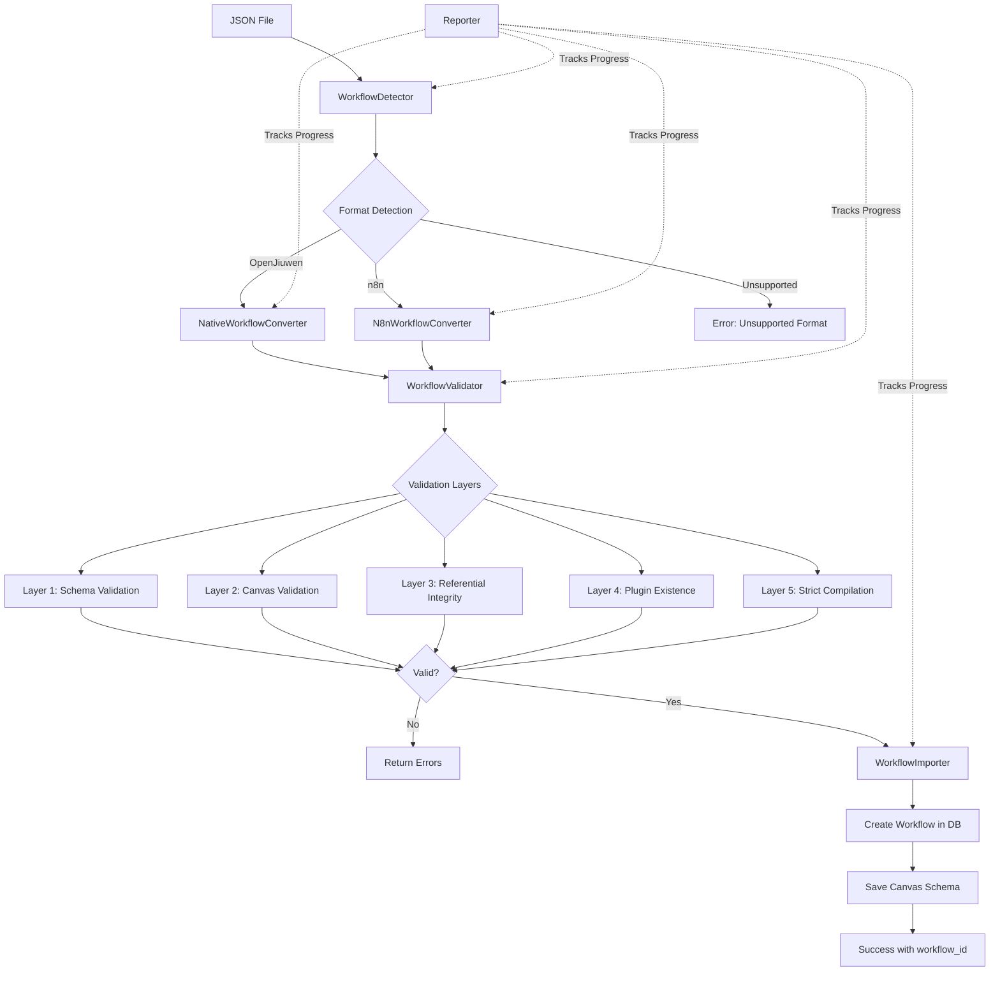
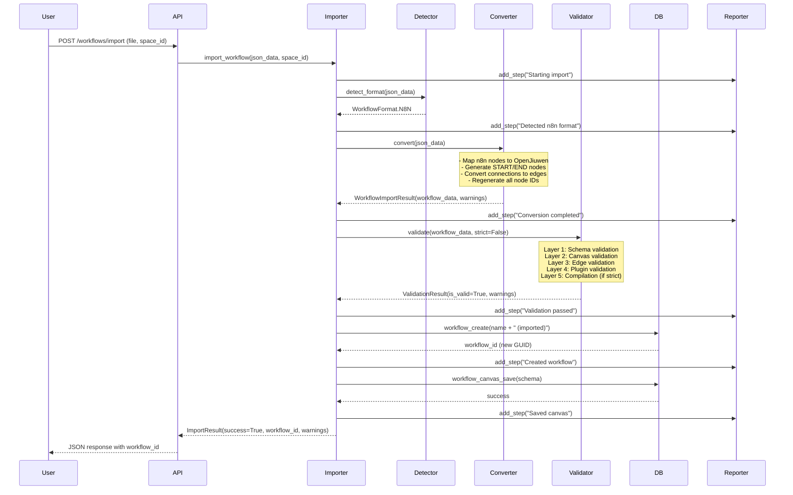

```mermaid
flowchart TD
    Start([User Uploads JSON File]) --> Upload[POST /workflows/import]
    Upload --> Init[Initialize WorkflowImporter]
    Init --> Report1[Reporter: Start Import]

    Report1 --> Detect[Detect Workflow Format]
    Detect --> CheckFormat{Format Supported?}

    CheckFormat -->|No| ErrorFormat[Error: Unsupported Format]
    CheckFormat -->|Yes| Report2[Reporter: Format Detected]

    Report2 --> Convert[Convert to OpenJiuwen Format]
    Convert --> ConvertStep1[Map nodes to components]
    ConvertStep1 --> ConvertStep2[Generate START/END if needed]
    ConvertStep2 --> ConvertStep3[Convert connections to edges]
    ConvertStep3 --> ConvertStep4[Regenerate all IDs]
    ConvertStep4 --> ConvertStep5[Extract input/output parameters]
    ConvertStep5 --> Report3[Reporter: Conversion Complete]

    Report3 --> Validate[Start Validation]
    Validate --> Layer1[Layer 1: Schema Validation]
    Layer1 --> L1Pass{Pass?}
    L1Pass -->|No| ErrorValidation[Return Validation Errors]
    L1Pass -->|Yes| Layer2[Layer 2: Canvas Validation]

    Layer2 --> L2Pass{Pass?}
    L2Pass -->|No| ErrorValidation
    L2Pass -->|Yes| Layer3[Layer 3: Referential Integrity]

    Layer3 --> L3Pass{Pass?}
    L3Pass -->|No| ErrorValidation
    L3Pass -->|Yes| Layer4[Layer 4: Plugin Existence]

    Layer4 --> L4Pass{Pass?}
    L4Pass -->|No| ErrorValidation
    L4Pass -->|Yes| StrictCheck{Strict Validation?}

    StrictCheck -->|Yes| Layer5[Layer 5: Compile Workflow]
    Layer5 --> L5Pass{Pass?}
    L5Pass -->|No| ErrorValidation
    L5Pass -->|Yes| Report4[Reporter: Validation Passed]

    StrictCheck -->|No| Report4

    Report4 --> CreateWorkflow[Create Workflow in DB]
    CreateWorkflow --> AddSuffix["Add ' (imported)' to name"]
    AddSuffix --> GetNewID[Generate new workflow_id]
    GetNewID --> SaveMeta[Save workflow metadata]
    SaveMeta --> Report5[Reporter: Workflow Created]

    Report5 --> SaveCanvas[Save Canvas Schema]
    SaveCanvas --> SaveNodes[Save with regenerated node IDs]
    SaveNodes --> Report6[Reporter: Canvas Saved]

    Report6 --> Success[Return ImportResult]
    Success --> End([Import Complete])

    ErrorFormat --> End
    ErrorValidation --> End

    style Start fill:#90EE90
    style End fill:#FFB6C1
    style ErrorFormat fill:#FF6B6B
    style ErrorValidation fill:#FF6B6B
    style Success fill:#90EE90
```

# Workflow Import System

**Version:** 2.0.0
**Last Updated:** April 2026

This module provides comprehensive functionality to import workflows from various automation platforms into OpenJiuwen Agent Studio. It supports multiple workflow formats with automatic detection, robust validation, and safe import mechanisms.

---

## Table of Contents

- [Features](#features)
- [Architecture](#architecture)
- [Supported Formats](#supported-formats)
- [Import Process](#import-process)
- [Usage Guide](#usage-guide)
- [Testing Guide](#testing-guide)
- [API Reference](#api-reference)
- [Advanced Topics](#advanced-topics)
- [Troubleshooting](#troubleshooting)

---

## Features

### ✅ **Multi-Format Support**
- **OpenJiuwen Native Format**: Import exported workflows back into the system
- **n8n Workflow Format**: Import workflows from n8n automation platform
- **Extensible Architecture**: Easy to add support for new formats (Zapier, Make, etc.)

### ✅ **Automatic Format Detection**
- Intelligent detection of workflow format from JSON structure
- No manual format specification needed
- Supports both legacy and modern format variations

### ✅ **Comprehensive Validation**
- **Layer 1**: Schema validation using Pydantic models
- **Layer 2**: Canvas structure validation (nodes, edges, connections)
- **Layer 3**: Referential integrity (edge source/target existence)
- **Layer 4**: Plugin existence validation (ensures all plugins are installed)
- **Layer 5**: Optional strict validation (workflow compilation and execution test)

### ✅ **Safe Import with ID Regeneration**
- Automatically generates new workflow_id (GUID) to avoid collisions
- Regenerates all canvas node IDs to prevent conflicts
- Preserves workflow structure and logic while ensuring uniqueness

### ✅ **Detailed Progress Tracking**
- Step-by-step import progress reporting
- Clear warnings for non-fatal issues
- Comprehensive error messages with actionable information

### ✅ **Flexible Integration**
- REST API endpoint for web UI integration
- Python API for programmatic use and automation
- Both synchronous and asynchronous interfaces

---

## Architecture

### System Overview

The workflow import system follows a modular, pipeline-based architecture with clear separation of concerns:

#### Mermaid Diagram



#### ASCII Diagram

```
                                JSON File
                                    |
                                    v
                          +-------------------+
                          | WorkflowDetector  |  <---- Identifies format
                          +-------------------+
                                    |
                    +---------------+---------------+
                    |               |               |
                    v               v               v
            OpenJiuwen Native      n8n       Unsupported
                    |               |               |
                    v               v               v
          +-------------------+ +-------------------+ +--------------+
          | NativeConverter   | | N8nConverter      | | Error Return |
          +-------------------+ +-------------------+ +--------------+
                    |               |
                    +-------+-------+
                            |
                            v
                  +-------------------+
                  | WorkflowValidator |  <---- Multi-layer validation
                  +-------------------+
                            |
        +-------------------+-------------------+
        |         |         |         |         |
        v         v         v         v         v
    Layer 1   Layer 2   Layer 3   Layer 4   Layer 5
    Schema    Canvas    Edges     Plugins   Compile
        |         |         |         |         |
        +----+----+----+----+----+----+----+----+
                            |
                    +-------+--------+
                    |                |
                    v                v
                Valid?           Invalid?
                    |                |
                    |                v
                    |         +--------------+
                    |         | Return Errors|
                    |         +--------------+
                    v
          +-------------------+
          | WorkflowImporter  |  <---- Orchestrates import
          +-------------------+
                    |
                    v
          +-------------------+
          | Create in DB      |  <---- Generates new IDs
          +-------------------+
                    |
                    v
          +-------------------+
          | Save Canvas       |  <---- Saves with new node IDs
          +-------------------+
                    |
                    v
          +-------------------+
          | Success Result    |  <---- Returns workflow_id
          +-------------------+

          Reporter tracks each step: ○○○●●●●○○ (progress indicator)
```

### Component Responsibilities

| Component | File | Responsibility |
|-----------|------|----------------|
| **WorkflowDetector** | `detector.py` | Analyzes JSON structure to identify workflow format |
| **ConverterFactory** | `converter.py` | Creates appropriate converter based on detected format |
| **NativeWorkflowConverter** | `converter_native.py` | Converts OpenJiuwen native format (handles partial workflows) |
| **N8nWorkflowConverter** | `converter_n8n.py` | Converts n8n workflows to OpenJiuwen format |
| **N8nMappings** | `n8n_mappings.py` | Maps n8n node types to OpenJiuwen components |
| **WorkflowValidator** | `validator.py` | Multi-layer validation of converted workflows |
| **WorkflowImporter** | `importer.py` | Orchestrates the entire import process |
| **Reporter** | `reporter.py` | Tracks import progress and collects errors/warnings |

### Data Flow

#### Mermaid Diagram



#### ASCII Diagram

```
User                API             Importer         Detector        Converter       Validator        DB
 |                   |                  |                |                |               |            |
 |-- Upload JSON --->|                  |                |                |               |            |
 |                   |--- import() ---->|                |                |               |            |
 |                   |                  |--- detect() -->|                |               |            |
 |                   |                  |<-- n8n format -|                |               |            |
 |                   |                  |                                 |               |            |
 |                   |                  |---------- convert() ----------->|               |            |
 |                   |                  |                                 | Map nodes     |            |
 |                   |                  |                                 | Add START/END |            |
 |                   |                  |                                 | Regen IDs     |            |
 |                   |                  |<-------- workflow_data ---------|               |            |
 |                   |                  |                                                 |            |
 |                   |                  |-------------- validate() --------------------->|            |
 |                   |                  |                                                 | Schema ✓   |
 |                   |                  |                                                 | Canvas ✓   |
 |                   |                  |                                                 | Edges  ✓   |
 |                   |                  |                                                 | Plugins ✓  |
 |                   |                  |<-------- ValidationResult (valid) --------------|            |
 |                   |                  |                                                              |
 |                   |                  |--- Create workflow "My Workflow (imported)" -------------->|
 |                   |                  |<------------- new workflow_id (GUID) ----------------------|
 |                   |                  |                                                              |
 |                   |                  |--- Save canvas with regenerated node IDs ----------------->|
 |                   |                  |<------------- success ----------------------------------------|
 |                   |                  |                                                              |
 |                   |<-- ImportResult -|
 |<-- JSON response -|
 |                   |
 |   Success! View imported workflow in UI
```

---

## Supported Formats

### 1. OpenJiuwen Native Format

The native format supports both **full workflows** (complete exports) and **partial workflows** (canvas-only).

#### Full Workflow Structure

**All fields are optional except `schema`:**

```json
{
  "workflow_id": "550e8400-e29b-41d4-a716-446655440000",
  "name": "My Workflow",
  "desc": "A sample workflow for demonstration",
  "space_id": "space-uuid",
  "url": "https://example.com",
  "icon_uri": "icon.png",
  "schema": "{\"nodes\":[...],\"edges\":[...]}",
  "input_parameters": [
    {
      "name": "user_input",
      "type": 1,
      "desc": "User query",
      "is_required": true
    }
  ],
  "output_parameters": [
    {
      "name": "result",
      "type": 1,
      "desc": "Workflow result"
    }
  ],
  "create_time": 1234567890,
  "update_time": 1234567890
}
```

#### Minimal Workflow Structure (Canvas Only)

**Only `schema` is required:**

```json
{
  "schema": {
    "nodes": [
      {
        "id": "start_1",
        "type": "1",
        "position": {"x": 100, "y": 200},
        "data": {
          "title": "Start",
          "outputs": {
            "user_input": {
              "title": "User Input",
              "type": 1
            }
          }
        }
      },
      {
        "id": "llm_1",
        "type": "3",
        "position": {"x": 400, "y": 200},
        "data": {
          "title": "LLM",
          "inputs": {
            "query": {
              "title": "Query",
              "value": "{{start_1.user_input}}"
            }
          }
        }
      },
      {
        "id": "end_1",
        "type": "2",
        "position": {"x": 700, "y": 200},
        "data": {
          "title": "End",
          "inputs": {
            "result": {
              "title": "Result",
              "value": "{{llm_1.output}}"
            }
          }
        }
      }
    ],
    "edges": [
      {
        "id": "edge_1",
        "sourceNodeID": "start_1",
        "targetNodeID": "llm_1"
      },
      {
        "id": "edge_2",
        "sourceNodeID": "llm_1",
        "targetNodeID": "end_1"
      }
    ]
  }
}
```

#### Default Values for Missing Fields

| Field | Default Value | Notes |
|-------|---------------|-------|
| `workflow_id` | Generated UUID | Always regenerated to avoid collisions |
| `space_id` | **ALWAYS CLEARED** | Set from import request, not from JSON |
| `name` | "Imported Workflow" | Suffix " (imported)" added during save |
| `desc` | "" | Empty string |
| `url` | "" | Empty string |
| `icon_uri` | "" | Empty string |
| `input_parameters` | `[]` | Empty array |
| `output_parameters` | `[]` | Empty array |
| `create_time` | Current timestamp | Milliseconds since epoch |
| `update_time` | Current timestamp | Milliseconds since epoch |

#### Important Notes for Native Format

1. **Space ID is Always Ignored**: The `space_id` from the imported JSON is never used. The workflow will be imported into the space specified in the import request.

2. **ID Regeneration**: During import:
   - `workflow_id` is regenerated (new GUID)
   - All node IDs in canvas are regenerated
   - Edge IDs are regenerated
   - Timestamps are updated to current time

3. **Version Fields Cleared**: The workflow is imported as a draft with no version history.

4. **Schema Format**: The `schema` field can be:
   - JSON string: `"{\"nodes\":[...],\"edges\":[...]}"`
   - JSON object: `{"nodes":[...], "edges":[...]}`

   Both formats are automatically handled.

### 2. n8n Workflow Format

n8n is a popular open-source workflow automation tool. The importer supports comprehensive n8n workflow conversion.

#### n8n Structure

```json
{
  "name": "My n8n Workflow",
  "nodes": [
    {
      "id": "550e8400-e29b-41d4-a716-446655440000",
      "type": "n8n-nodes-base.httpRequest",
      "name": "API Call",
      "typeVersion": 1,
      "position": [100, 200],
      "parameters": {
        "url": "https://api.example.com/data",
        "method": "GET"
      }
    },
    {
      "id": "660e8400-e29b-41d4-a716-446655440001",
      "type": "n8n-nodes-base.code",
      "name": "Process Data",
      "typeVersion": 1,
      "position": [400, 200],
      "parameters": {
        "code": "return items.map(item => ({ json: { result: item.json.data * 2 } }));"
      }
    }
  ],
  "connections": {
    "API Call": {
      "main": [
        [
          {
            "node": "Process Data",
            "type": "main",
            "index": 0
          }
        ]
      ]
    }
  },
  "settings": {
    "executionOrder": "v1"
  }
}
```

#### n8n Node Type Mapping

The converter uses comprehensive mapping tables to convert n8n nodes to OpenJiuwen components:

##### Core Node Mappings

| n8n Node Type | OpenJiuwen Component | Conversion Notes |
|---------------|----------------------|------------------|
| `manualTrigger`, `webhook`, `scheduleTrigger`, `formTrigger` | `START` | Merged into workflow input |
| `httpRequest` | `PLUGIN` | Converted to Restful API plugin |
| `code`, `function`, `functionItem` | `CODE` | JavaScript code preserved |
| `if`, `switch`, `filter` | `IF` | Condition logic converted |
| `merge` | `VARIABLE_MERGE` | Variable merging logic |
| `set`, `itemLists`, `aggregate` | `CODE` | Converted with transformation logic |
| `splitInBatches`, `loop` | `LOOP` | Loop logic preserved |
| `executeWorkflow` | `SUB_WORKFLOW` | References to other workflows |

##### AI/LangChain Node Mappings (Extensive Support)

| n8n AI Node Type | OpenJiuwen Component | Sub-Node Type | Notes |
|------------------|----------------------|---------------|-------|
| `agent`, `chainLlm`, `chainRetrievalQa` | `LLM` | Main node | Full agent/chain logic |
| `chainSummarization`, `informationExtractor` | `LLM` | Main node | Specialized AI tasks |
| `textClassifier`, `sentimentAnalysis` | `LLM` | Main node | Classification tasks |
| `openAiAssistant` | `LLM` | Main node | OpenAI Assistant API |
| `lmChatOpenAi`, `lmChatAnthropic` | `LLM` | Sub-node (embedded) | Language models |
| `lmChatGoogleGemini`, `lmChatOllama` | `LLM` | Sub-node (embedded) | Alternative LLM providers |
| `lmChatGroq`, `lmChatMistralCloud` | `LLM` | Sub-node (embedded) | Modern LLM providers |
| `memoryBufferWindow`, `memoryManager` | `LLM` | Sub-node (memory) | Chat memory |
| `embeddingsOpenAi`, `embeddingsCohere` | `LLM` | Sub-node (embedding) | Text embeddings |
| `toolCalculator`, `toolCode`, `toolHttpRequest` | `LLM` | Sub-node (tool) | Agent tools |
| `vectorStoreInMemory`, `vectorStorePinecone` | `LLM` | Vector storage | RAG support |

**Note**: Both `n8n-nodes-base.*` and `@n8n/n8n-nodes-langchain.*` prefixes are supported for all node types.

##### Application Integration Nodes

The converter automatically detects app integration nodes by substring matching. Over 80 popular services are detected including:

- **Communication**: Slack, Discord, Telegram, Gmail, Microsoft Teams
- **Project Management**: Jira, Notion, Asana, Trello, Monday, ClickUp
- **Development**: GitHub, GitLab, Jenkins, CircleCI, Docker
- **Cloud**: AWS, Azure, GCP, DigitalOcean, Heroku
- **Databases**: MySQL, PostgreSQL, MongoDB, Redis, Elasticsearch
- **CRM/Marketing**: Salesforce, HubSpot, Mailchimp, SendGrid
- **And many more...**

These are converted to `PLUGIN` nodes with preserved configuration.

#### n8n Connection Conversion

n8n uses a nested connection format that differs from OpenJiuwen's edge format:

**n8n Format:**
```json
{
  "connections": {
    "Node A": {
      "main": [
        [
          {"node": "Node B", "type": "main", "index": 0},
          {"node": "Node C", "type": "main", "index": 0}
        ]
      ]
    }
  }
}
```

**Converted to OpenJiuwen:**
```json
{
  "edges": [
    {"id": "edge_1", "sourceNodeID": "node_a_id", "targetNodeID": "node_b_id"},
    {"id": "edge_2", "sourceNodeID": "node_a_id", "targetNodeID": "node_c_id"}
  ]
}
```

**Important**: All edges use standardized field names:
- ✅ **`sourceNodeID`** - The ID of the source node
- ✅ **`targetNodeID`** - The ID of the target node
- ❌ NOT "source" or "target" (internal n8n format)

#### What Happens During n8n Import

1. **Format Detection**: Identifies n8n workflow by checking for `nodes` + `connections` + node types starting with `n8n-nodes-base.`

2. **Node Conversion**:
   - Each n8n node is mapped to an OpenJiuwen component type
   - Node parameters are converted to component inputs
   - Unsupported nodes are converted to CODE nodes with TODO comments

3. **START/END Node Generation**:
   - n8n doesn't have explicit START/END nodes
   - START node is automatically generated with workflow inputs
   - END node is automatically generated to collect outputs

4. **Connection Conversion**:
   - n8n's nested connection format is flattened
   - Each connection becomes an edge with `sourceNodeID` and `targetNodeID`
   - Node names are mapped to regenerated node IDs

5. **AI Sub-Node Embedding**:
   - LangChain sub-nodes (models, memory, tools) are embedded into parent AI nodes
   - Not converted as separate nodes in the canvas

6. **ID Regeneration**:
   - All node IDs are regenerated to avoid conflicts
   - Edge IDs are generated
   - Workflow ID is generated

---

## Import Process

### Complete Import Workflow

#### Mermaid Diagram



#### ASCII Diagram

```
┌─────────────────────────┐
│ User Uploads JSON File  │
└──────────┬──────────────┘
           │
           ▼
┌─────────────────────────────────────────────────────────────┐
│                  POST /workflows/import                      │
│  Parameters: file, space_id, validate_strict (optional)     │
└──────────┬──────────────────────────────────────────────────┘
           │
           ▼
┌─────────────────────────┐
│ Initialize Importer     │  Reporter: ○ Start import
└──────────┬──────────────┘
           │
           ▼
┌─────────────────────────┐
│ STEP 1: Detect Format   │  Reporter: ○ Detecting format
└──────────┬──────────────┘
           │
     ┌─────┴─────┐
     │ Supported?│
     └─────┬─────┘
           │
    ┌──────┴──────┐
    │             │
    NO           YES
    │             │
    │             ▼
    │    ┌─────────────────────┐
    │    │ STEP 2: Convert     │  Reporter: ○ Converting
    │    └──────────┬──────────┘
    │               │
    │        ┌──────┴──────┐
    │        │ Sub-steps:  │
    │        │ • Map nodes │
    │        │ • Add edges │
    │        │ • Regen IDs │
    │        └──────┬──────┘
    │               │
    │               ▼
    │    ┌─────────────────────┐
    │    │ STEP 3: Validate    │  Reporter: ○ Validating
    │    └──────────┬──────────┘
    │               │
    │        ┌──────┴──────────────────────┐
    │        │ Validation Layers:          │
    │        │ [1] Schema        ✓ or ✗    │
    │        │ [2] Canvas        ✓ or ✗    │
    │        │ [3] Edges         ✓ or ✗    │
    │        │ [4] Plugins       ✓ or ✗    │
    │        │ [5] Compile (opt) ✓ or ✗    │
    │        └──────┬──────────────────────┘
    │               │
    │         ┌─────┴─────┐
    │         │   Valid?  │
    │         └─────┬─────┘
    │               │
    │        ┌──────┴──────┐
    │        NO           YES
    │        │             │
    ▼        │             ▼
┌─────────┐ │  ┌─────────────────────┐
│  ERROR  │ │  │ STEP 4: Create in DB│  Reporter: ○ Creating workflow
│ RETURN  │ │  └──────────┬──────────┘
└─────────┘ │             │
            │      ┌──────┴──────┐
            │      │ • New GUID  │
            │      │ • Add suffix│
            │      │ • Timestamps│
            │      └──────┬──────┘
            │             │
            │             ▼
            │  ┌─────────────────────┐
            │  │ STEP 5: Save Canvas │  Reporter: ○ Saving canvas
            │  └──────────┬──────────┘
            │             │
            │      ┌──────┴──────┐
            │      │ • Save nodes│
            │      │ • Save edges│
            │      └──────┬──────┘
            │             │
            │             ▼
            │  ┌─────────────────────┐
            │  │ SUCCESS RESULT      │  Reporter: ● Complete
            │  │ • workflow_id       │
            │  │ • workflow_name     │
            │  │ • warnings          │
            │  └─────────────────────┘
            │
            └──────────────┘
```

### Step-by-Step Details

#### Step 1: Format Detection

**File:** `detector.py`
**Class:** `WorkflowDetector`

```python
format_type = detector.detect_format(json_data)
# Returns: WorkflowFormat.OPENJIUWEN_NATIVE, WorkflowFormat.N8N, or WorkflowFormat.UNSUPPORTED
```

**Detection Logic:**

1. **OpenJiuwen Detection**:
   - Check for `schema` field containing `nodes` and `edges`
   - OR check for top-level `nodes` and `edges`
   - Schema can be JSON string or object

2. **n8n Detection**:
   - Check for top-level `nodes` and `connections`
   - Check if node types start with `n8n-nodes-base.` or `@n8n/`

3. **Unsupported**:
   - If neither pattern matches

#### Step 2: Conversion

**Files:** `converter_native.py`, `converter_n8n.py`
**Classes:** `NativeWorkflowConverter`, `N8nWorkflowConverter`

**For OpenJiuwen Native:**
```python
result = NativeWorkflowConverter().convert(json_data)
# - Validates required 'schema' field exists
# - Applies default values for missing fields
# - Regenerates workflow_id
# - Clears space_id (set from request)
# - Returns: WorkflowImportResult
```

**For n8n:**
```python
result = N8nWorkflowConverter().convert(json_data)
# - Maps each n8n node to OpenJiuwen component
# - Generates START/END nodes
# - Converts connections to edges
# - Embeds AI sub-nodes into parent nodes
# - Regenerates all IDs
# - Returns: WorkflowImportResult with warnings
```

#### Step 3: Validation

**File:** `validator.py`
**Class:** `WorkflowValidator`

```python
validation_result = await validator.validate(
    workflow_data,
    space_id,
    current_user,
    strict=False  # Set True for compilation test
)
# Returns: ValidationResult(is_valid, errors, warnings)
```

**Validation Layers:**

| Layer | Check | Failure Impact |
|-------|-------|----------------|
| 1. Schema | Pydantic model validation | **Blocks import** |
| 2. Canvas | Canvas structure, START/END nodes | **Blocks import** |
| 3. Referential Integrity | Edge source/target existence | **Blocks import** |
| 4. Plugin Existence | All plugins installed in space | **Blocks import** |
| 5. Strict Compilation | Workflow compiles and can execute | **Blocks import** (if enabled) |

**Warnings (non-blocking):**
- Disconnected nodes (non-START/END)
- Missing resource references
- Unsupported node types converted to CODE

#### Step 4: Create Workflow in Database

**File:** `importer.py`
**Calls:** `workflow_mgr.workflow_create()`

```python
create_req = WorkflowCreate(
    name=f"{original_name} (imported)",  # IMPORTANT: Suffix added
    desc=workflow_data.get("desc", ""),
    space_id=space_id,
    icon_uri=workflow_data.get("icon_uri")
)
result = workflow_mgr.workflow_create(create_req, current_user)
workflow_id = result.data['workflow']["workflow_id"]  # NEW GUID
```

**What Gets Created:**
- New workflow record in database
- New workflow_id (GUID) - different from original
- Name with " (imported)" suffix
- Current timestamps
- Draft status (no version)
- Default permissions

#### Step 5: Save Canvas

**File:** `importer.py`
**Calls:** `workflow_mgr.workflow_canvas_save()`

```python
save_req = WorkflowSave(
    workflow_id=workflow_id,  # New ID from Step 4
    space_id=space_id,
    schema=workflow_data["schema"]  # JSON string with regenerated node IDs
)
result = workflow_mgr.workflow_canvas_save(save_req, current_user)
```

**What Gets Saved:**
- Canvas JSON with regenerated node IDs
- Edge connections with new IDs
- Node positions preserved
- Component configurations preserved

---

## Usage Guide

### 1. REST API Usage

#### Basic Import

```bash
curl -X POST "http://localhost:8000/workflows/import" \
  -H "Authorization: Bearer YOUR_TOKEN_HERE" \
  -F "file=@/path/to/workflow.json" \
  -F "space_id=your-space-id-guid"
```

**Screenshot Placeholder: API Import Basic**
```
[TODO: Add screenshot showing Postman/curl request]

ASCII Version:
┌──────────────────────────────────────────────────────┐
│ POST http://localhost:8000/workflows/import          │
├──────────────────────────────────────────────────────┤
│ Headers:                                             │
│   Authorization: Bearer eyJhbGc...                   │
│                                                       │
│ Body (form-data):                                    │
│   file:     [Choose File] workflow.json              │
│   space_id: 550e8400-e29b-41d4-a716-446655440000     │
│                                                       │
│ [Send]                                               │
└──────────────────────────────────────────────────────┘
```

#### Import with Strict Validation

```bash
curl -X POST "http://localhost:8000/workflows/import" \
  -H "Authorization: Bearer YOUR_TOKEN_HERE" \
  -F "file=@/path/to/workflow.json" \
  -F "space_id=your-space-id-guid" \
  -F "validate_strict=true"
```

**Note**: Strict validation compiles the workflow to ensure it can execute. This takes longer but catches more issues.

#### Success Response

```json
{
  "code": 200,
  "message": "success",
  "data": {
    "success": true,
    "workflow_id": "660e8400-e29b-41d4-a716-446655440001",
    "workflow_name": "My Workflow (imported)",
    "warnings": [
      "Disconnected nodes found: Debug Logger"
    ],
    "metadata": {
      "source_format": "n8n",
      "original_name": "My Workflow",
      "converted_nodes": 7,
      "original_nodes": 5,
      "saved_to_db": true,
      "published": false
    }
  }
}
```

#### Error Response

```json
{
  "code": 400,
  "message": "Import failed",
  "data": {
    "success": false,
    "workflow_id": null,
    "workflow_name": null,
    "errors": [
      "Detect workflow format n8n - ✓",
      "Validate format support - ✓",
      "Convert to OpenJiuwen format - ✓",
      "Validate workflow structure - ✗ Canvas validation failed: Workflow has no START node"
    ],
    "warnings": []
  }
}
```

### 2. Python API Usage

#### Basic Import

```python
import asyncio
import json
from openjiuwen_studio.core.dsl_converter.converter import (
    WorkflowImporter,
    ImportOptions
)


async def import_workflow():
    # Load workflow JSON from file
    with open('workflow.json') as f:
        json_data = json.load(f)

    # Create importer
    importer = WorkflowImporter()

    # Configure options
    options = ImportOptions(
        validate_strict=False  # Set True for compilation validation
    )

    # Import workflow
    result = await importer.import_workflow(
        json_data=json_data,
        space_id="550e8400-e29b-41d4-a716-446655440000",
        current_user={"user_id": "user123", "username": "testuser"},
        options=options
    )

    # Check result
    if result.success:
        print(f"✓ Imported successfully!")
        print(f"  Workflow ID: {result.workflow_id}")
        print(f"  Name: {result.workflow_name}")
        print(f"  Saved to DB: {result.metadata.get('saved_to_db')}")

        if result.warnings:
            print(f"  Warnings ({len(result.warnings)}):")
            for warning in result.warnings:
                print(f"    - {warning}")
    else:
        print(f"✗ Import failed!")
        for error in result.errors:
            print(f"  - {error}")

    return result


# Run the import
result = asyncio.run(import_workflow())
```

#### Batch Import

```python
import asyncio
from pathlib import Path
from openjiuwen_studio.core.dsl_converter.converter import WorkflowImporter, ImportOptions


async def batch_import(directory: Path, space_id: str, current_user: dict):
    """Import all JSON files from a directory"""
    importer = WorkflowImporter()
    options = ImportOptions(validate_strict=False)

    results = []
    json_files = list(directory.glob("*.json"))

    print(f"Found {len(json_files)} JSON files to import")

    for json_file in json_files:
        print(f"\nImporting: {json_file.name}")

        try:
            # Load JSON
            with open(json_file) as f:
                json_data = json.load(f)

            # Import
            result = await importer.import_workflow(
                json_data=json_data,
                space_id=space_id,
                current_user=current_user,
                options=options
            )

            results.append({
                'file': json_file.name,
                'success': result.success,
                'workflow_id': result.workflow_id,
                'workflow_name': result.workflow_name,
                'errors': result.errors,
                'warnings': result.warnings
            })

            if result.success:
                print(f"  ✓ Success: {result.workflow_name}")
            else:
                print(f"  ✗ Failed: {result.errors[0] if result.errors else 'Unknown error'}")

        except Exception as e:
            print(f"  ✗ Exception: {e}")
            results.append({
                'file': json_file.name,
                'success': False,
                'error': str(e)
            })

    # Summary
    successful = sum(1 for r in results if r['success'])
    print(f"\n{'='*60}")
    print(f"Import Summary: {successful}/{len(results)} successful")
    print(f"{'='*60}")

    return results


# Example usage
results = asyncio.run(batch_import(
    directory=Path("/path/to/workflows"),
    space_id="your-space-id",
    current_user={"user_id": "user123", "username": "admin"}
))
```

#### Import with Custom Validation

```python
import asyncio
from openjiuwen_studio.core.dsl_converter.converter import (
    WorkflowImporter,
    WorkflowValidator,
    ImportOptions
)


async def import_with_custom_validation(json_data, space_id, current_user):
    """Import with custom pre-validation checks"""

    # Custom pre-checks
    if 'schema' not in json_data:
        print("✗ ERROR: No schema field found")
        return None

    # Parse schema if it's a string
    import json as json_lib
    schema = json_lib.loads(json_data['schema']) if isinstance(json_data['schema'], str) else json_data['schema']

    # Custom check: Ensure workflow has at least 3 nodes
    nodes = schema.get('nodes', [])
    if len(nodes) < 3:
        print(f"✗ WARNING: Workflow only has {len(nodes)} nodes (minimum recommended: 3)")

    # Custom check: List all node types
    node_types = {}
    for node in nodes:
        node_type = node.get('type')
        node_title = node.get('data', {}).get('title', 'Unknown')
        node_types[node_title] = node_type

    print(f"Node types found: {node_types}")

    # Proceed with normal import
    importer = WorkflowImporter()
    options = ImportOptions(validate_strict=True)  # Use strict validation

    result = await importer.import_workflow(
        json_data=json_data,
        space_id=space_id,
        current_user=current_user,
        options=options
    )

    return result


# Example usage
with open('workflow.json') as f:
    data = json.load(f)

result = asyncio.run(import_with_custom_validation(
    json_data=data,
    space_id="your-space-id",
    current_user={"user_id": "user123"}
))
```

---

## UI Flow and Screenshots

This section describes the complete user interface flow for importing workflows, with detailed screenshot placeholders showing the actual UI components.

### Step 1: Access Workflows Page and Click Import

**Location**: `/dashboard/workflows`

**Screenshot 1: Workflows List Page**

```
[SCREENSHOT NEEDED: Workflows page showing list view with Import button]

Description: Show the main workflows page with:
- Page title "Workflows" in top left
- Toolbar with Search input, Sort dropdown (Grid view only)
- Right side toolbar with "Import Workflow" button (purple, upload icon) and "Create Workflow" button (purple, plus icon)
- Workflow cards in grid view or table rows in table view
- Empty state or existing workflows displayed

UI Elements:
┌─────────────────────────────────────────────────────────────────────┐
│ Workflows                                  [Grid/Table Toggle]       │
├─────────────────────────────────────────────────────────────────────┤
│ [Search workflows...] [Sort: Update Time ↓]  [Import][+ Create]    │
├─────────────────────────────────────────────────────────────────────┤
│                                                                       │
│  ┌──────────────┐  ┌──────────────┐  ┌──────────────┐              │
│  │ Workflow 1   │  │ Workflow 2   │  │ Workflow 3   │              │
│  │ [Draft]      │  │ [Draft]      │  │ [Draft]      │              │
│  │              │  │              │  │              │              │
│  │ Updated 2h   │  │ Updated 1d   │  │ Updated 3d   │              │
│  └──────────────┘  └──────────────┘  └──────────────┘              │
│                                                                       │
│ Pagination: [1][2][3]... 20 items                                   │
└─────────────────────────────────────────────────────────────────────┘
```

**Action**: User clicks the "Import Workflow" button (purple button with Upload icon)

---

### Step 2: Import Dialog Opens

**Screenshot 2: Import Workflow Dialog (Empty State)**

```
[SCREENSHOT NEEDED: Import dialog showing empty file upload area]

Description: Modal dialog that appears over the workflows page with:
- White rounded modal (max-width: 2xl, rounded-2xl)
- Semi-transparent black backdrop
- Close button (X) in top-right corner
- Purple gradient icon circle with Upload icon
- Title "Import Workflow" (text-2xl font-bold)
- Subtitle explaining supported formats
- Drag-and-drop upload area (dashed border, rounded)
- "Select File" button (purple, inside upload area)
- Hidden "Validate Strict" checkbox section
- Cancel and Import buttons (disabled until file selected)

UI Elements:
┌─────────────────────────────────────────────────────────────┐
│                 Import Workflow                        [X]  │
│ ┌───┐                                                       │
│ │ ↑ │  Import Workflow                                      │
│ └───┘  Supports OpenJiuwen and n8n formats                  │
│                                                               │
│ File *                                                        │
│ ┌───────────────────────────────────────────────────────┐  │
│ │                    ↑                                   │  │
│ │              [Upload Icon]                             │  │
│ │                                                         │  │
│ │     Drag and drop your JSON file here                  │  │
│ │              or                                         │  │
│ │         [Select File]                                   │  │
│ │                                                         │  │
│ │     JSON files only (.json)                            │  │
│ └───────────────────────────────────────────────────────┘  │
│                                                               │
│                                                               │
│  [Cancel]                              [Import] (disabled)   │
└─────────────────────────────────────────────────────────────┘
```

**Action**: User drags a JSON file into the upload area OR clicks "Select File" to browse

---

### Step 3: File Selected

**Screenshot 3: Import Dialog with File Selected**

```
[SCREENSHOT NEEDED: Import dialog showing selected file with green checkmark]

Description: Same modal but upload area now shows:
- Green border instead of gray dashed
- Green background (bg-green-50)
- Green checkmark icon (CheckCircle)
- File name and file size displayed
- Remove button (X icon) to clear file
- Import button now enabled (purple gradient)

UI Elements:
┌─────────────────────────────────────────────────────────────┐
│                 Import Workflow                        [X]  │
│ ┌───┐                                                       │
│ │ ↑ │  Import Workflow                                      │
│ └───┘  Supports OpenJiuwen and n8n formats                  │
│                                                               │
│ File *                                                        │
│ ┌───────────────────────────────────────────────────────┐  │
│ │                                                         │  │
│ │   ✓  workflow-export-20260413.json                [X]  │  │
│ │      15.34 KB                                           │  │
│ │                                                         │  │
│ └───────────────────────────────────────────────────────┘  │
│                                                               │
│                                                               │
│  [Cancel]                              [Import]              │
└─────────────────────────────────────────────────────────────┘
```

**Action**: User clicks "Import" button

---

### Step 4: Import in Progress

**Screenshot 4: Import Dialog with Loading State**

```
[SCREENSHOT NEEDED: Import dialog showing loading spinner and "Importing..." text]

Description: Modal with loading state:
- File upload area still shows selected file (readonly)
- Import button shows spinning loader icon (Loader2 with animate-spin)
- Button text changed to "Importing..."
- Button disabled during import
- Cancel button disabled during import

UI Elements:
┌─────────────────────────────────────────────────────────────┐
│                 Import Workflow                        [X]  │
│ ┌───┐                                                       │
│ │ ↑ │  Import Workflow                                      │
│ └───┘  Supports OpenJiuwen and n8n formats                  │
│                                                               │
│ File *                                                        │
│ ┌───────────────────────────────────────────────────────┐  │
│ │                                                         │  │
│ │   ✓  workflow-export-20260413.json                [X]  │  │
│ │      15.34 KB                                           │  │
│ │                                                         │  │
│ └───────────────────────────────────────────────────────┘  │
│                                                               │
│                                                               │
│  [Cancel] (disabled)          [⟳ Importing...] (disabled)   │
└─────────────────────────────────────────────────────────────┘
```

**Backend Progress**: During this time, backend processes:
1. Detect format → Convert → Validate → Create in DB → Save canvas
2. Reporter tracks each step (not shown in UI, but logged in browser console)

---

### Step 5: Import Success

**Screenshot 5: Import Dialog with Success Message**

```
[SCREENSHOT NEEDED: Import dialog showing green success banner and checkmark button]

Description: Modal showing success state:
- Green success banner appears above buttons (bg-green-50, border-green-200)
- Success banner shows green CheckCircle icon + "Workflow imported successfully"
- Import button turns green with checkmark icon and "Workflow imported successfully" text
- Dialog automatically closes after 1.5 seconds

UI Elements:
┌─────────────────────────────────────────────────────────────┐
│                 Import Workflow                        [X]  │
│ ┌───┐                                                       │
│ │ ↑ │  Import Workflow                                      │
│ └───┘  Supports OpenJiuwen and n8n formats                  │
│                                                               │
│ File *                                                        │
│ ┌───────────────────────────────────────────────────────┐  │
│ │                                                         │  │
│ │   ✓  workflow-export-20260413.json                [X]  │  │
│ │      15.34 KB                                           │  │
│ │                                                         │  │
│ └───────────────────────────────────────────────────────┘  │
│                                                               │
│ ┌────────────────────────────────────────────────────────┐ │
│ │ ✓  Workflow imported successfully                      │ │
│ └────────────────────────────────────────────────────────┘ │
│                                                               │
│  [Cancel]              [✓ Workflow imported successfully]    │
└─────────────────────────────────────────────────────────────┘

Note: Dialog closes automatically in 1.5 seconds
```

---

### Step 6: Import Failed (Alternative Flow)

**Screenshot 6: Import Dialog with Error Message**

```
[SCREENSHOT NEEDED: Import dialog showing red error banner with error details]

Description: Modal showing error state:
- Red error banner appears above buttons (bg-red-50, border-red-200)
- Error banner shows red AlertCircle icon + error message
- If detailed errors available, shows bulleted list of error trace
- Import button remains enabled to retry
- Cancel button enabled to close dialog

UI Elements:
┌─────────────────────────────────────────────────────────────┐
│                 Import Workflow                        [X]  │
│ ┌───┐                                                       │
│ │ ↑ │  Import Workflow                                      │
│ └───┘  Supports OpenJiuwen and n8n formats                  │
│                                                               │
│ File *                                                        │
│ ┌───────────────────────────────────────────────────────┐  │
│ │                                                         │  │
│ │   ✓  invalid-workflow.json                         [X]  │  │
│ │      2.14 KB                                            │  │
│ │                                                         │  │
│ └───────────────────────────────────────────────────────┘  │
│                                                               │
│ ┌────────────────────────────────────────────────────────┐ │
│ │ ⚠  Import failed                                        │ │
│ │    • Starting import workflow - ✓                       │ │
│ │    • Detect workflow format openjiuwen - ✓              │ │
│ │    • Validate format support - ✓                        │ │
│ │    • Convert to OpenJiuwen format - ✓                   │ │
│ │    • Validate workflow structure - ✗ Workflow has no    │ │
│ │      END node                                            │ │
│ └────────────────────────────────────────────────────────┘ │
│                                                               │
│  [Cancel]                              [Import]              │
└─────────────────────────────────────────────────────────────┘
```

---

### Step 7: Return to Workflows List

**Screenshot 7: Workflows Page with Newly Imported Workflow**

```
[SCREENSHOT NEEDED: Workflows page showing the newly imported workflow highlighted/badged]

Description: User returns to workflows list and sees:
- Success snackbar notification at bottom of screen (green, "Workflow imported successfully")
- Newly imported workflow appears in the list
- Newly imported workflow may have special styling (stored in localStorage)
- Workflow name has " (imported)" suffix
- Workflow shows [Draft] status

UI Elements:
┌─────────────────────────────────────────────────────────────────────┐
│ Workflows                                  [Grid/Table Toggle]       │
├─────────────────────────────────────────────────────────────────────┤
│ [Search workflows...] [Sort: Update Time ↓]  [Import][+ Create]    │
├─────────────────────────────────────────────────────────────────────┤
│                                                                       │
│  ┌──────────────┐  ┌──────────────┐  ┌──────────────┐              │
│  │ My Workflow  │  │ Workflow 2   │  │ Workflow 3   │              │
│  │ (imported)   │  │ [Draft]      │  │ [Draft]      │              │
│  │ [Draft] NEW  │  │              │  │              │              │
│  │              │  │              │  │              │              │
│  │ Just now     │  │ Updated 1d   │  │ Updated 3d   │              │
│  └──────────────┘  └──────────────┘  └──────────────┘              │
│                                                                       │
└─────────────────────────────────────────────────────────────────────┘

└─────────────────────────────────────────────┐
│ ✓  Workflow imported successfully           │  (Snackbar - auto-hides)
└──────────────────────────────────────────────┘
```

---

### Step 8: Open Imported Workflow

**Screenshot 8: Workflow Editor with Imported Workflow**

```
[SCREENSHOT NEEDED: Workflow canvas editor showing imported workflow nodes and edges]

Description: User clicks "Edit" on imported workflow and sees:
- Workflow canvas editor
- Workflow name in top bar (with " (imported)" suffix)
- All nodes from imported workflow displayed on canvas
- Edges connecting nodes
- Node IDs are regenerated (different from source workflow)
- [Draft] status indicator

UI Elements:
┌─────────────────────────────────────────────────────────────────────┐
│ ← My Workflow (imported)            [Save] [Debug] [Publish] [···]  │
│                                                            [Draft]   │
├─────────────────────────────────────────────────────────────────────┤
│                                                                       │
│  Canvas Area:                                                        │
│                                                                       │
│     ┌─────────┐              ┌─────────┐           ┌─────────┐     │
│     │ START   │─────────────>│  LLM    │──────────>│  END    │     │
│     │         │              │         │           │         │     │
│     └─────────┘              └─────────┘           └─────────┘     │
│                                                                       │
│                                                                       │
│  [+ Add Node]                                                        │
│                                                                       │
└─────────────────────────────────────────────────────────────────────┘
```

**Note**: When user opens the imported workflow for the first time:
- The "newly imported" flag is cleared from localStorage
- Workflow no longer shows "NEW" badge on subsequent visits

---

### Additional UI States

#### Drag and Drop Active

**Screenshot 9: Import Dialog with Active Drag State**

```
[SCREENSHOT NEEDED: Import dialog showing purple border when dragging file over upload area]

Description: When user drags file over upload area:
- Upload area border changes to purple (border-purple-500)
- Background changes to light purple (bg-purple-50)
- Visual feedback that drop area is active

UI Elements:
┌─────────────────────────────────────────────────────────────┐
│                 Import Workflow                        [X]  │
│ ┌───┐                                                       │
│ │ ↑ │  Import Workflow                                      │
│ └───┘  Supports OpenJiuwen and n8n formats                  │
│                                                               │
│ File *                                                        │
│ ┌═══════════════════════════════════════════════════════┐  │
│ ║                    ↑                                   ║  │
│ ║              [Upload Icon]                             ║  │
│ ║                                                         ║  │
│ ║     Drop your JSON file here                           ║  │
│ ║                                                         ║  │  (Purple border)
│ ║                                                         ║  │  (Purple bg)
│ ║                                                         ║  │
│ ║                                                         ║  │
│ └═══════════════════════════════════════════════════════┘  │
│                                                               │
│  [Cancel]                              [Import] (disabled)   │
└─────────────────────────────────────────────────────────────┘
```

---

## Testing Guide

### Test Environment Setup

#### Prerequisites

1. **Backend running**:
   ```bash
   cd backend
   python -m openjiuwen_studio.main
   ```

2. **Database initialized** with a test space and user

3. **Authentication token** obtained (see authentication documentation)

#### Test Data Preparation

Create a test directory:
```bash
mkdir -p backend/openjiuwen_studio/core/dsl_converter/tests/test_data
```

Place test workflow files:
- `simple_native.json` - Minimal OpenJiuwen workflow
- `full_native.json` - Complete OpenJiuwen workflow with all fields
- `simple_n8n.json` - Basic n8n workflow (HTTP + Code)
- `ai_n8n.json` - n8n workflow with LangChain nodes

### Manual Testing Procedures

#### Test Case 1: Import OpenJiuwen Native Workflow (Minimal)

**Objective**: Verify that minimal workflows with only `schema` field import successfully.

**Test File**: `simple_native.json`
```json
{
  "schema": {
    "nodes": [
      {
        "id": "start_1",
        "type": "1",
        "position": {"x": 100, "y": 200},
        "data": {
          "title": "Start",
          "outputs": {
            "user_input": {"title": "User Input", "type": 1}
          }
        }
      },
      {
        "id": "end_1",
        "type": "2",
        "position": {"x": 400, "y": 200},
        "data": {
          "title": "End",
          "inputs": {
            "result": {"title": "Result", "value": "{{start_1.user_input}}"}
          }
        }
      }
    ],
    "edges": [
      {
        "id": "edge_1",
        "sourceNodeID": "start_1",
        "targetNodeID": "end_1"
      }
    ]
  }
}
```

**Steps**:
1. Save the JSON above to `simple_native.json`
2. Execute import:
   ```bash
   curl -X POST "http://localhost:8000/workflows/import" \
     -H "Authorization: Bearer YOUR_TOKEN" \
     -F "file=@simple_native.json" \
     -F "space_id=YOUR_SPACE_ID"
   ```
3. **Expected Result**:
   - HTTP 200 response
   - `success: true`
   - `workflow_name: "Imported Workflow (imported)"` (default name + suffix)
   - `workflow_id` is a new GUID
   - No errors, may have warnings

**Screenshot Placeholder: Simple Native Import Success**
```
[TODO: Add screenshot showing successful import response]

ASCII Version:
┌──────────────────────────────────────────────────────┐
│ Response: 200 OK                                     │
├──────────────────────────────────────────────────────┤
│ {                                                     │
│   "code": 200,                                        │
│   "message": "success",                               │
│   "data": {                                           │
│     "success": true,                                  │
│     "workflow_id": "660e8400-...-446655440001",       │
│     "workflow_name": "Imported Workflow (imported)",  │
│     "warnings": [],                                   │
│     "metadata": {                                     │
│       "source_format": "openjiuwen",                  │
│       "saved_to_db": true,                            │
│       "published": false                              │
│     }                                                 │
│   }                                                   │
│ }                                                     │
└──────────────────────────────────────────────────────┘
```

4. **Verification in UI**:
   - Navigate to workflow list in UI
   - Find "Imported Workflow (imported)"
   - Open the workflow
   - Verify 2 nodes (START and END) are present
   - Verify 1 edge connects them

**Screenshot Placeholder: Workflow in UI**
```
[TODO: Add screenshot showing workflow canvas in UI]

ASCII Version:
┌────────────────────────────────────────────────────────────┐
│ Workflow: Imported Workflow (imported)            [Draft]  │
├────────────────────────────────────────────────────────────┤
│                                                             │
│   ┌───────┐                        ┌───────┐              │
│   │START  │─────────────────────> │ END   │              │
│   └───────┘                        └───────┘              │
│                                                             │
│                                                             │
└────────────────────────────────────────────────────────────┘
```

#### Test Case 2: Import OpenJiuwen Native Workflow (Full)

**Objective**: Verify that complete workflows with all fields import correctly and that IDs are regenerated.

**Test File**: `full_native.json`
```json
{
  "workflow_id": "ORIGINAL-GUID-WILL-BE-REPLACED",
  "name": "Complete Test Workflow",
  "desc": "A test workflow with all fields",
  "space_id": "ORIGINAL-SPACE-WILL-BE-IGNORED",
  "schema": {
    "nodes": [
      {
        "id": "original_start_id",
        "type": "1",
        "position": {"x": 100, "y": 200},
        "data": {
          "title": "Start",
          "outputs": {
            "query": {"title": "Query", "type": 1}
          }
        }
      },
      {
        "id": "original_llm_id",
        "type": "3",
        "position": {"x": 400, "y": 200},
        "data": {
          "title": "LLM Node",
          "inputs": {
            "query": {"title": "Query", "value": "{{start_1.query}}"}
          }
        }
      },
      {
        "id": "original_end_id",
        "type": "2",
        "position": {"x": 700, "y": 200},
        "data": {
          "title": "End",
          "inputs": {
            "result": {"title": "Result", "value": "{{llm_1.output}}"}
          }
        }
      }
    ],
    "edges": [
      {
        "id": "original_edge_1",
        "sourceNodeID": "original_start_id",
        "targetNodeID": "original_llm_id"
      },
      {
        "id": "original_edge_2",
        "sourceNodeID": "original_llm_id",
        "targetNodeID": "original_end_id"
      }
    ]
  },
  "input_parameters": [
    {"name": "query", "type": 1, "desc": "User query", "is_required": true}
  ],
  "output_parameters": [
    {"name": "result", "type": 1, "desc": "LLM response"}
  ]
}
```

**Steps**:
1. Save the JSON above to `full_native.json`
2. Execute import:
   ```bash
   curl -X POST "http://localhost:8000/workflows/import" \
     -H "Authorization: Bearer YOUR_TOKEN" \
     -F "file=@full_native.json" \
     -F "space_id=YOUR_SPACE_ID"
   ```
3. **Expected Result**:
   - HTTP 200 response
   - `success: true`
   - `workflow_name: "Complete Test Workflow (imported)"` (original name + suffix)
   - `workflow_id` is a **NEW GUID** (different from "ORIGINAL-GUID-WILL-BE-REPLACED")
   - Canvas node IDs are regenerated (not "original_start_id" etc.)

4. **Verification**:
   - Check that `workflow_id` in response is different from the original
   - Open workflow in UI
   - Inspect canvas JSON (Developer Tools → Network → workflow_canvas_save)
   - Verify node IDs are regenerated (new GUIDs, not "original_*")
   - Verify edge `sourceNodeID` and `targetNodeID` reference the new node IDs

**Screenshot Placeholder: ID Regeneration Verification**
```
[TODO: Add screenshot showing Developer Tools with canvas JSON]

ASCII Version:
┌────────────────────────────────────────────────────────────┐
│ Network Tab → workflow_canvas_save Response                │
├────────────────────────────────────────────────────────────┤
│ {                                                           │
│   "nodes": [                                                │
│     {                                                       │
│       "id": "a1b2c3d4-...",  ← NEW GUID (not original_*)   │
│       "type": "1",                                          │
│       "data": { "title": "Start" }                          │
│     },                                                      │
│     {                                                       │
│       "id": "e5f6g7h8-...",  ← NEW GUID                     │
│       "type": "3",                                          │
│       "data": { "title": "LLM Node" }                       │
│     }                                                       │
│   ],                                                        │
│   "edges": [                                                │
│     {                                                       │
│       "id": "i9j0k1l2-...",  ← NEW GUID                     │
│       "sourceNodeID": "a1b2c3d4-...",  ← References new ID  │
│       "targetNodeID": "e5f6g7h8-..."                        │
│     }                                                       │
│   ]                                                         │
│ }                                                           │
└────────────────────────────────────────────────────────────┘
```

#### Test Case 3: Import n8n Workflow (Basic)

**Objective**: Verify n8n workflow conversion with HTTP Request and Code nodes.

**Test File**: `simple_n8n.json`
```json
{
  "name": "n8n API Processing",
  "nodes": [
    {
      "id": "n8n-node-1",
      "type": "n8n-nodes-base.httpRequest",
      "name": "Fetch Data",
      "typeVersion": 1,
      "position": [100, 200],
      "parameters": {
        "url": "https://api.example.com/data",
        "method": "GET",
        "responseFormat": "json"
      }
    },
    {
      "id": "n8n-node-2",
      "type": "n8n-nodes-base.code",
      "name": "Process Data",
      "typeVersion": 1,
      "position": [400, 200],
      "parameters": {
        "code": "return items.map(item => ({ json: { result: item.json.value * 2 } }));"
      }
    }
  ],
  "connections": {
    "Fetch Data": {
      "main": [
        [
          {
            "node": "Process Data",
            "type": "main",
            "index": 0
          }
        ]
      ]
    }
  }
}
```

**Steps**:
1. Save the JSON above to `simple_n8n.json`
2. Execute import:
   ```bash
   curl -X POST "http://localhost:8000/workflows/import" \
     -H "Authorization: Bearer YOUR_TOKEN" \
     -F "file=@simple_n8n.json" \
     -F "space_id=YOUR_SPACE_ID"
   ```
3. **Expected Result**:
   - HTTP 200 response
   - `success: true`
   - `workflow_name: "n8n API Processing (imported)"`
   - `metadata.source_format: "n8n"`
   - `metadata.original_nodes: 2` (n8n nodes)
   - `metadata.converted_nodes: 4` (START + 2 converted + END)

4. **Verification in UI**:
   - Open imported workflow
   - Verify 4 nodes:
     - START node (auto-generated)
     - PLUGIN node (from httpRequest) titled "Fetch Data"
     - CODE node (from code) titled "Process Data"
     - END node (auto-generated)
   - Verify connections flow: START → PLUGIN → CODE → END

**Screenshot Placeholder: n8n Workflow Converted**
```
[TODO: Add screenshot showing n8n workflow in OpenJiuwen UI]

ASCII Version:
┌─────────────────────────────────────────────────────────────────┐
│ Workflow: n8n API Processing (imported)               [Draft]   │
├─────────────────────────────────────────────────────────────────┤
│                                                                  │
│  ┌───────┐     ┌────────────┐     ┌────────────┐     ┌───────┐ │
│  │START  │────>│PLUGIN      │────>│CODE        │────>│ END   │ │
│  │       │     │Fetch Data  │     │Process Data│     │       │ │
│  └───────┘     └────────────┘     └────────────┘     └───────┘ │
│                                                                  │
│  Node Types: START(1) → PLUGIN(19) → CODE(16) → END(2)         │
└─────────────────────────────────────────────────────────────────┘
```

5. **Verify Node Configuration**:
   - Click on PLUGIN node
   - Check that URL is preserved: `https://api.example.com/data`
   - Check that method is `GET`
   - Click on CODE node
   - Check that JavaScript code is preserved

#### Test Case 4: Import n8n Workflow with AI Nodes

**Objective**: Verify n8n LangChain node conversion.

**Test File**: `ai_n8n.json`
```json
{
  "name": "n8n AI Chat",
  "nodes": [
    {
      "id": "trigger-1",
      "type": "n8n-nodes-langchain.chatTrigger",
      "name": "Chat Trigger",
      "typeVersion": 1,
      "position": [100, 200],
      "parameters": {}
    },
    {
      "id": "agent-1",
      "type": "n8n-nodes-langchain.agent",
      "name": "AI Agent",
      "typeVersion": 1,
      "position": [400, 200],
      "parameters": {
        "promptType": "define",
        "text": "You are a helpful assistant."
      }
    },
    {
      "id": "llm-sub-1",
      "type": "@n8n/n8n-nodes-langchain.lmChatOpenAi",
      "name": "OpenAI GPT-4",
      "typeVersion": 1,
      "position": [400, 300],
      "parameters": {
        "model": "gpt-4"
      }
    }
  ],
  "connections": {
    "Chat Trigger": {
      "main": [
        [
          {
            "node": "AI Agent",
            "type": "main",
            "index": 0
          }
        ]
      ]
    },
    "OpenAI GPT-4": {
      "ai_languageModel": [
        [
          {
            "node": "AI Agent",
            "type": "ai_languageModel",
            "index": 0
          }
        ]
      ]
    }
  }
}
```

**Steps**:
1. Save the JSON above to `ai_n8n.json`
2. Execute import:
   ```bash
   curl -X POST "http://localhost:8000/workflows/import" \
     -H "Authorization: Bearer YOUR_TOKEN" \
     -F "file=@ai_n8n.json" \
     -F "space_id=YOUR_SPACE_ID"
   ```
3. **Expected Result**:
   - HTTP 200 response
   - `success: true`
   - `workflow_name: "n8n AI Chat (imported)"`
   - Converted nodes include:
     - START node (from chatTrigger)
     - LLM node (from agent, with embedded lmChatOpenAi)
     - END node (auto-generated)

4. **Verification**:
   - Open imported workflow
   - Find LLM node titled "AI Agent"
   - Click on LLM node
   - Verify configuration contains OpenAI model information
   - Verify that `lmChatOpenAi` sub-node is **not** a separate node (embedded)

**Screenshot Placeholder: AI Workflow Structure**
```
[TODO: Add screenshot showing AI workflow with embedded sub-nodes]

ASCII Version:
┌─────────────────────────────────────────────────────────────┐
│ Workflow: n8n AI Chat (imported)                   [Draft]  │
├─────────────────────────────────────────────────────────────┤
│                                                              │
│  ┌───────┐              ┌────────────────┐       ┌───────┐ │
│  │START  │─────────────>│LLM             │──────>│ END   │ │
│  │Chat   │              │AI Agent        │       │       │ │
│  │Trigger│              │                │       │       │ │
│  └───────┘              │ Embedded:      │       └───────┘ │
│                         │ • GPT-4 Model  │                 │
│                         └────────────────┘                 │
│                                                              │
│  Note: lmChatOpenAi sub-node is embedded, not separate     │
└─────────────────────────────────────────────────────────────┘
```

#### Test Case 5: Validation Errors

**Objective**: Verify that invalid workflows are rejected with clear error messages.

**Test File**: `invalid_no_end.json`
```json
{
  "schema": {
    "nodes": [
      {
        "id": "start_1",
        "type": "1",
        "position": {"x": 100, "y": 200},
        "data": {
          "title": "Start",
          "outputs": {
            "user_input": {"title": "User Input", "type": 1}
          }
        }
      }
    ],
    "edges": []
  }
}
```

**Steps**:
1. Save the JSON above to `invalid_no_end.json`
2. Execute import:
   ```bash
   curl -X POST "http://localhost:8000/workflows/import" \
     -H "Authorization: Bearer YOUR_TOKEN" \
     -F "file=@invalid_no_end.json" \
     -F "space_id=YOUR_SPACE_ID"
   ```
3. **Expected Result**:
   - HTTP 400 or 200 (application-level error)
   - `success: false`
   - `errors` contains: `"Validate workflow structure - ✗ Workflow has no END node"`

**Screenshot Placeholder: Validation Error Response**
```
[TODO: Add screenshot showing validation error]

ASCII Version:
┌──────────────────────────────────────────────────────────────┐
│ Response: 200 OK (Application Error)                         │
├──────────────────────────────────────────────────────────────┤
│ {                                                             │
│   "code": 200,                                                │
│   "message": "Import failed",                                 │
│   "data": {                                                   │
│     "success": false,                                         │
│     "workflow_id": null,                                      │
│     "workflow_name": null,                                    │
│     "errors": [                                               │
│       "Starting import workflow - ✓",                         │
│       "Detect workflow format openjiuwen - ✓",                │
│       "Validate format support - ✓",                          │
│       "Convert to OpenJiuwen format - ✓",                     │
│       "Validate workflow structure - ✗ Workflow has no END node" │
│     ],                                                        │
│     "warnings": []                                            │
│   }                                                           │
│ }                                                             │
└──────────────────────────────────────────────────────────────┘
```

4. **Verification**:
   - Check that `success` is `false`
   - Check that `errors` list shows progress trace
   - Check that the last error message clearly indicates the problem
   - Verify workflow was NOT created in database

#### Test Case 6: Plugin Validation

**Objective**: Verify that workflows referencing missing plugins are rejected.

**Test File**: `workflow_with_missing_plugin.json`
```json
{
  "schema": {
    "nodes": [
      {
        "id": "start_1",
        "type": "1",
        "position": {"x": 100, "y": 200},
        "data": {
          "title": "Start",
          "outputs": {"input": {"title": "Input", "type": 1}}
        }
      },
      {
        "id": "plugin_1",
        "type": "19",
        "position": {"x": 400, "y": 200},
        "data": {
          "title": "Missing Plugin",
          "inputs": {
            "pluginParam": {
              "pluginID": "non-existent-plugin-id-12345",
              "pluginName": "Imaginary API",
              "apiParam": {}
            }
          }
        }
      },
      {
        "id": "end_1",
        "type": "2",
        "position": {"x": 700, "y": 200},
        "data": {
          "title": "End",
          "inputs": {"result": {"title": "Result", "value": "{{plugin_1.output}}"}}
        }
      }
    ],
    "edges": [
      {"id": "edge_1", "sourceNodeID": "start_1", "targetNodeID": "plugin_1"},
      {"id": "edge_2", "sourceNodeID": "plugin_1", "targetNodeID": "end_1"}
    ]
  }
}
```

**Steps**:
1. Save the JSON above to `workflow_with_missing_plugin.json`
2. Execute import:
   ```bash
   curl -X POST "http://localhost:8000/workflows/import" \
     -H "Authorization: Bearer YOUR_TOKEN" \
     -F "file=@workflow_with_missing_plugin.json" \
     -F "space_id=YOUR_SPACE_ID"
   ```
3. **Expected Result**:
   - HTTP 200 (application-level error)
   - `success: false`
   - `errors` contains: `"Plugin 'Imaginary API' (ID: non-existent-plugin-id-12345) is not installed. Please install the plugin before importing this workflow."`

4. **Verification**:
   - Check that error message includes plugin name and ID
   - Check that error message suggests action (install plugin)
   - Verify workflow was NOT created in database

#### Test Case 7: Strict Validation (Compilation Test)

**Objective**: Verify that strict validation catches configuration errors.

**Test File**: `workflow_incomplete_config.json`
```json
{
  "name": "Workflow with Invalid LLM Config",
  "schema": {
    "nodes": [
      {
        "id": "start_1",
        "type": "1",
        "position": {"x": 100, "y": 200},
        "data": {
          "title": "Start",
          "outputs": {"query": {"title": "Query", "type": 1}}
        }
      },
      {
        "id": "llm_1",
        "type": "3",
        "position": {"x": 400, "y": 200},
        "data": {
          "title": "LLM",
          "inputs": {
            "query": {"title": "Query", "value": "{{start_1.query}}"}
          }
        }
      },
      {
        "id": "end_1",
        "type": "2",
        "position": {"x": 700, "y": 200},
        "data": {
          "title": "End",
          "inputs": {"result": {"title": "Result", "value": "{{llm_1.output}}"}}
        }
      }
    ],
    "edges": [
      {"id": "edge_1", "sourceNodeID": "start_1", "targetNodeID": "llm_1"},
      {"id": "edge_2", "sourceNodeID": "llm_1", "targetNodeID": "end_1"}
    ]
  }
}
```

**Steps**:
1. Save the JSON above to `workflow_incomplete_config.json`
2. Execute import **WITHOUT** strict validation:
   ```bash
   curl -X POST "http://localhost:8000/workflows/import" \
     -H "Authorization: Bearer YOUR_TOKEN" \
     -F "file=@workflow_incomplete_config.json" \
     -F "space_id=YOUR_SPACE_ID" \
     -F "validate_strict=false"
   ```
3. **Expected Result**: SUCCESS (imports as draft, LLM config incomplete)

4. Execute import **WITH** strict validation:
   ```bash
   curl -X POST "http://localhost:8000/workflows/import" \
     -H "Authorization: Bearer YOUR_TOKEN" \
     -F "file=@workflow_incomplete_config.json" \
     -F "space_id=YOUR_SPACE_ID" \
     -F "validate_strict=true"
   ```
5. **Expected Result**: FAILURE (LLM node missing model configuration)
   - `success: false`
   - `errors` contains: `"Workflow compilation failed: ..."`

6. **Verification**:
   - Compare results with/without `validate_strict`
   - Understand that strict=false allows incomplete configs (for later manual completion)
   - Understand that strict=true requires workflow to be fully executable

### Automated Testing

#### Unit Tests

```bash
cd backend
pytest openjiuwen_studio/core/dsl_converter/tests/ -v
```

**Test Coverage**:
- `test_detector.py`: Format detection logic
- `test_converter_native.py`: Native format conversion
- `test_converter_n8n.py`: n8n format conversion (if exists)
- `test_validator.py`: Validation layers
- `test_importer.py`: End-to-end import process
- `test_reporter.py`: Progress reporting

#### Integration Tests

```bash
cd backend
pytest openjiuwen_studio/core/dsl_converter/tests/test_integration.py -v
```

**Integration test scenarios**:
- Full import pipeline (detect → convert → validate → save)
- Database transaction rollback on errors
- Concurrent imports
- Large workflow handling

#### Running Tests with Coverage

```bash
cd backend
pytest --cov=openjiuwen_studio.core.dsl_converter \
       --cov-report=html \
       --cov-report=term \
       openjiuwen_studio/core/dsl_converter/tests/
```

**Screenshot Placeholder: Test Coverage Report**
```
[TODO: Add screenshot of coverage report]

ASCII Version:
┌────────────────────────────────────────────────────────────┐
│ Coverage Report                                             │
├────────────────────────────────────────────────────────────┤
│ Name                               Stmts   Miss  Cover      │
│ ────────────────────────────────────────────────────────   │
│ converter/detector.py                 45      2    95%      │
│ converter/converter.py                23      0   100%      │
│ converter/converter_native.py        112      5    96%      │
│ converter/converter_n8n.py           456     23    95%      │
│ converter/validator.py               134      8    94%      │
│ converter/importer.py                 89      3    97%      │
│ converter/reporter.py                 24      0   100%      │
│ ────────────────────────────────────────────────────────   │
│ TOTAL                                883     41    95%      │
└────────────────────────────────────────────────────────────┘
```

### Performance Testing

#### Test Large Workflows

Create a workflow with 100+ nodes:

```python
import json

# Generate large workflow
nodes = [{"id": f"node_{i}", "type": "16", "position": {"x": i*200, "y": 200}, "data": {"title": f"Node {i}"}} for i in range(100)]
nodes.insert(0, {"id": "start", "type": "1", "position": {"x": 0, "y": 200}, "data": {"title": "Start"}})
nodes.append({"id": "end", "type": "2", "position": {"x": 20000, "y": 200}, "data": {"title": "End"}})

edges = [{"id": f"edge_{i}", "sourceNodeID": f"node_{i}" if i > 0 else "start", "targetNodeID": f"node_{i+1}" if i < 99 else "end"} for i in range(100)]

large_workflow = {
    "name": "Large Workflow Test",
    "schema": {
        "nodes": nodes,
        "edges": edges
    }
}

with open('large_workflow.json', 'w') as f:
    json.dump(large_workflow, f)
```

**Test import time**:
```bash
time curl -X POST "http://localhost:8000/workflows/import" \
  -H "Authorization: Bearer YOUR_TOKEN" \
  -F "file=@large_workflow.json" \
  -F "space_id=YOUR_SPACE_ID"
```

**Expected**: Import completes in < 10 seconds for 100 nodes

---

## API Reference

### REST API Endpoint

#### POST /workflows/import

Import a workflow from JSON file.

**Request**:
- **Method**: POST
- **Content-Type**: multipart/form-data
- **Headers**:
  - `Authorization: Bearer {token}` (required)

**Form Parameters**:

| Parameter | Type | Required | Description |
|-----------|------|----------|-------------|
| `file` | File | Yes | JSON file containing workflow |
| `space_id` | string (GUID) | Yes | Target space ID for import |
| `validate_strict` | boolean | No | Enable strict validation (compilation test). Default: `false` |

**Response**:

```json
{
  "code": 200,
  "message": "success",
  "data": {
    "success": true,
    "workflow_id": "string (GUID)",
    "workflow_name": "string",
    "warnings": ["string"],
    "errors": ["string"],
    "metadata": {
      "source_format": "openjiuwen | n8n",
      "original_name": "string",
      "converted_nodes": 0,
      "original_nodes": 0,
      "saved_to_db": true,
      "published": false
    }
  }
}
```

**Status Codes**:
- `200`: Success (check `data.success` for actual status)
- `400`: Invalid request (missing parameters)
- `401`: Unauthorized (invalid token)
- `500`: Server error

**Error Response Example**:
```json
{
  "code": 200,
  "message": "Import failed",
  "data": {
    "success": false,
    "workflow_id": null,
    "workflow_name": null,
    "errors": [
      "Starting import workflow - ✓",
      "Detect workflow format n8n - ✓",
      "Validate format support - ✓",
      "Convert to OpenJiuwen format - ✓",
      "Validate workflow structure - ✗ Canvas validation failed: Workflow has no END node"
    ],
    "warnings": []
  }
}
```

### Python API

#### WorkflowImporter Class

**Location**: `openjiuwen_studio.core.dsl_converter.converter.importer`

##### import_workflow()

```python
async def import_workflow(
    self,
    json_data: Dict[str, Any],
    space_id: str,
    current_user: Dict[str, Any],
    options: Optional[ImportOptions] = None
) -> ImportResult:
    """
    Import workflow from JSON data.

    Args:
        json_data: Workflow JSON data (dict)
        space_id: Target space ID (GUID)
        current_user: User info dict with 'user_id' key
        options: Import options (ImportOptions instance)

    Returns:
        ImportResult with success status, workflow_id, warnings, errors
    """
```

#### ImportOptions Class

```python
@dataclass
class ImportOptions:
    """Options for workflow import"""
    validate_strict: bool = False     # Compile + validate
    auto_fix: bool = True             # Try to fix issues (not implemented yet)
```

#### ImportResult Class

```python
@dataclass
class ImportResult:
    """Result of workflow import"""
    success: bool                     # Import succeeded?
    workflow_id: Optional[str]        # Generated workflow ID (GUID)
    workflow_name: Optional[str]      # Workflow name with " (imported)" suffix
    warnings: List[str]               # Non-fatal issues
    errors: List[str]                 # Fatal errors (or progress trace if failed)
    metadata: Dict[str, Any]          # Additional info
```

---

## Advanced Topics

### Adding Support for New Workflow Formats

To add support for a new automation platform (e.g., Zapier, Make, Microsoft Power Automate):

#### Step 1: Define Format Enum

**File**: `detector.py`

```python
class WorkflowFormat(str, Enum):
    OPENJIUWEN_NATIVE = "openjiuwen"
    N8N = "n8n"
    ZAPIER = "zapier"  # Add new format
    # ...
```

#### Step 2: Implement Detection Logic

**File**: `detector.py`

```python
class WorkflowDetector:
    def detect_format(self, json_data: Dict[str, Any]) -> WorkflowFormat:
        # ... existing checks ...

        # Add Zapier detection
        if self.is_zapier_format(json_data):
            logger.info("Detected Zapier workflow format")
            return WorkflowFormat.ZAPIER

        # ...

    @staticmethod
    def is_zapier_format(data: Dict[str, Any]) -> bool:
        """
        Check if data matches Zapier workflow format.

        Zapier signature:
        - Has 'zap' field
        - Has 'steps' array
        - Steps have 'app' and 'action' fields
        """
        if "zap" not in data or "steps" not in data:
            return False

        steps = data.get("steps", [])
        if not isinstance(steps, list) or len(steps) == 0:
            return False

        # Check if at least one step has Zapier structure
        for step in steps[:3]:
            if isinstance(step, dict) and "app" in step and "action" in step:
                return True

        return False
```

#### Step 3: Create Converter

**File**: `converter_zapier.py`

```python
#!/usr/bin/env python
# -*- coding: UTF-8 -*-

"""
Zapier Workflow Converter

Converts Zapier workflows to OpenJiuwen format.
"""

import uuid
from typing import Dict, Any, List
from openjiuwen_studio.core.dsl_converter.converter.converter import (
    WorkflowConverter,
    WorkflowImportResult
)
from openjiuwen_studio.core.common.dsl import ComponentType


class ZapierWorkflowConverter(WorkflowConverter):
    """Converts Zapier workflows to OpenJiuwen format"""

    def convert(self, json_data: Dict[str, Any]) -> WorkflowImportResult:
        """
        Convert Zapier workflow to OpenJiuwen format.

        Args:
            json_data: Zapier workflow JSON

        Returns:
            WorkflowImportResult with converted workflow
        """
        warnings = []

        # Extract Zapier data
        zap = json_data.get("zap", {})
        steps = json_data.get("steps", [])

        # Initialize OpenJiuwen workflow
        nodes = []
        edges = []
        node_id_map = {}  # Zapier step ID -> OpenJiuwen node ID

        # Generate START node
        start_id = str(uuid.uuid4())
        nodes.append({
            "id": start_id,
            "type": str(ComponentType.COMPONENT_TYPE_START.value),
            "position": {"x": 100, "y": 200},
            "data": {
                "title": "Start",
                "outputs": {
                    "trigger_data": {
                        "title": "Trigger Data",
                        "type": 1
                    }
                }
            }
        })

        # Convert Zapier steps to nodes
        x_position = 400
        prev_node_id = start_id

        for i, step in enumerate(steps):
            step_id = step.get("id", f"step_{i}")
            app = step.get("app", "Unknown")
            action = step.get("action", "")

            # Determine OpenJiuwen component type
            component_type = self._map_zapier_step_to_component(app, action)

            # Generate node
            node_id = str(uuid.uuid4())
            node_id_map[step_id] = node_id

            node = {
                "id": node_id,
                "type": str(component_type.value),
                "position": {"x": x_position, "y": 200},
                "data": {
                    "title": f"{app} - {action}",
                    "inputs": self._convert_step_inputs(step),
                    "outputs": self._convert_step_outputs(step)
                }
            }
            nodes.append(node)

            # Create edge from previous node
            edges.append({
                "id": str(uuid.uuid4()),
                "sourceNodeID": prev_node_id,
                "targetNodeID": node_id
            })

            prev_node_id = node_id
            x_position += 300

        # Generate END node
        end_id = str(uuid.uuid4())
        nodes.append({
            "id": end_id,
            "type": str(ComponentType.COMPONENT_TYPE_END.value),
            "position": {"x": x_position, "y": 200},
            "data": {
                "title": "End",
                "inputs": {
                    "result": {
                        "title": "Result",
                        "value": f"{{{{{prev_node_id}.output}}}}"
                    }
                }
            }
        })

        # Edge from last step to END
        edges.append({
            "id": str(uuid.uuid4()),
            "sourceNodeID": prev_node_id,
            "targetNodeID": end_id
        })

        # Build workflow data
        import json
        workflow_data = {
            "workflow_id": str(uuid.uuid4()),
            "name": zap.get("name", "Imported Zapier Workflow"),
            "desc": zap.get("description", ""),
            "schema": json.dumps({"nodes": nodes, "edges": edges}),
            "input_parameters": [],
            "output_parameters": []
        }

        return WorkflowImportResult(
            workflow_data=workflow_data,
            warnings=warnings,
            metadata={
                "source_format": "zapier",
                "original_nodes": len(steps),
                "converted_nodes": len(nodes)
            }
        )

    def _map_zapier_step_to_component(self, app: str, action: str) -> ComponentType:
        """Map Zapier app/action to OpenJiuwen component type"""
        app_lower = app.lower()
        action_lower = action.lower()

        # HTTP/API apps
        if "webhook" in app_lower or "http" in app_lower:
            return ComponentType.COMPONENT_TYPE_PLUGIN

        # Code/scripting
        if "code" in app_lower or "python" in app_lower or "javascript" in app_lower:
            return ComponentType.COMPONENT_TYPE_CODE

        # Filters/conditions
        if "filter" in app_lower or "path" in action_lower:
            return ComponentType.COMPONENT_TYPE_IF

        # Formatting/data manipulation
        if "format" in action_lower or "formatter" in app_lower:
            return ComponentType.COMPONENT_TYPE_CODE

        # Default to plugin for app integrations
        return ComponentType.COMPONENT_TYPE_PLUGIN

    def _convert_step_inputs(self, step: Dict[str, Any]) -> Dict[str, Any]:
        """Convert Zapier step inputs to OpenJiuwen inputs"""
        # Implementation depends on Zapier's input structure
        return {}

    def _convert_step_outputs(self, step: Dict[str, Any]) -> Dict[str, Any]:
        """Convert Zapier step outputs to OpenJiuwen outputs"""
        # Implementation depends on Zapier's output structure
        return {}
```

#### Step 4: Register in Factory

**File**: `converter.py`

```python
class ConverterFactory:
    @staticmethod
    def create(format_type: WorkflowFormat) -> WorkflowConverter:
        if format_type == WorkflowFormat.OPENJIUWEN_NATIVE:
            from openjiuwen_studio.core.dsl_converter.converter.converter_native import NativeWorkflowConverter
            return NativeWorkflowConverter()

        elif format_type == WorkflowFormat.N8N:
            from openjiuwen_studio.core.dsl_converter.converter.converter_n8n import N8nWorkflowConverter
            return N8nWorkflowConverter()

        elif format_type == WorkflowFormat.ZAPIER:  # Add new format
            from openjiuwen_studio.core.dsl_converter.converter.converter_zapier import ZapierWorkflowConverter
            return ZapierWorkflowConverter()

        else:
            raise ValueError(f"Unsupported workflow format: {format_type}")
```

#### Step 5: Add Tests

**File**: `tests/test_converter_zapier.py`

```python
import pytest
from openjiuwen_studio.core.dsl_converter.converter.converter_zapier import ZapierWorkflowConverter


def test_zapier_conversion():
    """Test Zapier workflow conversion"""
    zapier_data = {
        "zap": {
            "name": "Test Zap",
            "description": "A test Zapier workflow"
        },
        "steps": [
            {
                "id": "step1",
                "app": "Webhook",
                "action": "Catch Hook"
            },
            {
                "id": "step2",
                "app": "Gmail",
                "action": "Send Email"
            }
        ]
    }

    converter = ZapierWorkflowConverter()
    result = converter.convert(zapier_data)

    assert result.workflow_data is not None
    assert result.metadata["source_format"] == "zapier"
    # ... more assertions
```

### Customizing Node Mappings

To customize how specific node types are converted (e.g., mapping n8n HTTP Request to a specific plugin):

**File**: `converter_n8n.py` (or your custom converter)

```python
def _convert_node(self, n8n_node: Dict[str, Any]) -> Dict[str, Any]:
    """Convert individual n8n node to OpenJiuwen node"""

    node_type = n8n_node.get("type", "")

    # Custom mapping for HTTP Request
    if node_type == "n8n-nodes-base.httpRequest":
        # Extract URL
        url = n8n_node.get("parameters", {}).get("url", "")

        # If URL matches specific pattern, use specific plugin
        if "api.openai.com" in url:
            return self._create_openai_plugin_node(n8n_node)
        elif "api.anthropic.com" in url:
            return self._create_anthropic_plugin_node(n8n_node)
        else:
            return self._create_generic_http_plugin_node(n8n_node)

    # ... rest of conversion logic
```

### Error Handling Best Practices

When implementing converters, follow these error handling guidelines:

1. **Collect Warnings Instead of Failing**:
   ```python
   warnings = []

   # Instead of raising exception for unsupported node
   if node_type not in SUPPORTED_NODES:
       warnings.append(f"Unsupported node type '{node_type}', converted to CODE component")
       # Create fallback CODE node
   ```

2. **Provide Actionable Error Messages**:
   ```python
   # Bad
   raise ValueError("Invalid node")

   # Good
   raise ValueError(
       f"Node '{node_id}' has invalid configuration: "
       f"Missing required field 'parameters'. "
       f"Please check the source workflow and ensure all nodes are properly configured."
   )
   ```

3. **Use Try-Except for Individual Nodes**:
   ```python
   for node in nodes:
       try:
           converted_node = self._convert_node(node)
           openjiuwen_nodes.append(converted_node)
       except Exception as e:
           warnings.append(f"Failed to convert node '{node.get('name')}': {e}")
           # Create fallback node
           openjiuwen_nodes.append(self._create_fallback_node(node))
   ```

### Performance Optimization

For large workflows (100+ nodes):

1. **Use Batch Operations**:
   ```python
   # Instead of multiple DB calls
   for node in nodes:
       save_node_to_db(node)

   # Use bulk insert
   bulk_save_nodes_to_db(nodes)
   ```

2. **Lazy Load Mappings**:
   ```python
   # Load mapping tables once
   _NODE_MAPPING_CACHE = None

   def get_node_mappings():
       global _NODE_MAPPING_CACHE
       if _NODE_MAPPING_CACHE is None:
           _NODE_MAPPING_CACHE = load_mappings()
       return _NODE_MAPPING_CACHE
   ```

3. **Stream Large Files**:
   ```python
   import ijson

   # Instead of json.load() for large files
   with open('large_workflow.json', 'rb') as f:
       nodes = ijson.items(f, 'nodes.item')
       for node in nodes:
           process_node(node)
   ```

---

## Troubleshooting

### Common Issues and Solutions

#### Issue 1: "Unsupported workflow format"

**Symptoms**:
- Import fails immediately
- Error: `"Validate format support - ✗ Unsupported workflow format"`

**Causes**:
1. JSON file is not a valid workflow
2. JSON structure doesn't match any supported format
3. File is corrupted or incomplete

**Solutions**:

1. **Verify JSON is valid**:
   ```bash
   python -m json.tool workflow.json
   # Should pretty-print JSON without errors
   ```

2. **Check file structure**:
   ```bash
   # For OpenJiuwen: should have "schema" or "nodes" + "edges"
   cat workflow.json | grep -E '"schema"|"nodes"|"edges"'

   # For n8n: should have "nodes" + "connections"
   cat workflow.json | grep -E '"nodes"|"connections"'
   ```

3. **Inspect first few lines**:
   ```bash
   head -20 workflow.json
   ```

4. **Try manual format detection**:
   ```python
   import json
   from openjiuwen_studio.core.dsl_converter.converter import WorkflowDetector

   with open('workflow.json') as f:
       data = json.load(f)

   detector = WorkflowDetector()
   format_type = detector.detect_format(data)
   print(f"Detected format: {format_type}")
   ```

#### Issue 2: "Validation failed: Workflow has no START/END node"

**Symptoms**:
- Import fails after conversion
- Error: `"Workflow has no START node"` or `"Workflow has no END node"`

**Causes**:
1. For OpenJiuwen native: Original workflow is missing START/END nodes
2. For n8n: Converter failed to generate START/END nodes

**Solutions**:

1. **For OpenJiuwen native workflows**:
   - Manually add START and END nodes to the JSON:
   ```json
   {
     "schema": {
       "nodes": [
         {
           "id": "start_1",
           "type": "1",
           "position": {"x": 100, "y": 200},
           "data": {
             "title": "Start",
             "outputs": {
               "input": {"title": "Input", "type": 1}
             }
           }
         },
         // ... your other nodes ...
         {
           "id": "end_1",
           "type": "2",
           "position": {"x": 1000, "y": 200},
           "data": {
             "title": "End",
             "inputs": {
               "output": {"title": "Output", "value": "{{last_node.output}}"}
             }
           }
         }
       ],
       "edges": [
         {"id": "edge_start", "sourceNodeID": "start_1", "targetNodeID": "first_node_id"},
         // ... your other edges ...
         {"id": "edge_end", "sourceNodeID": "last_node_id", "targetNodeID": "end_1"}
       ]
     }
   }
   ```

2. **For n8n workflows**:
   - Check converter logs for errors
   - Report issue if converter should have generated START/END but didn't

#### Issue 3: "Plugin 'X' is not installed"

**Symptoms**:
- Import fails during validation
- Error: `"Plugin 'X' (ID: ...) is not installed. Please install the plugin before importing this workflow."`

**Causes**:
- Workflow references a plugin that doesn't exist in the target space

**Solutions**:

1. **Install the plugin** before importing:
   - Go to Plugin Marketplace in UI
   - Search for the plugin by name
   - Click "Install"
   - Retry import

2. **Import without the plugin node** (manual editing):
   - Open JSON in editor
   - Find the plugin node (type "19")
   - Replace with a CODE node (type "16") as placeholder
   - Import successfully
   - Manually configure plugin later in UI

3. **Skip plugin validation** (for testing only):
   - Modify `validator.py` temporarily to skip plugin check
   - NOT recommended for production

**Screenshot Placeholder: Installing Missing Plugin**
```
[TODO: Add screenshot showing plugin installation UI]

ASCII Version:
┌─────────────────────────────────────────────────────────────┐
│ Plugin Marketplace                                   [Search]│
├─────────────────────────────────────────────────────────────┤
│                                                              │
│  ┌────────────────────────────────────────────────┐         │
│  │ OpenAI API                                      │         │
│  │ Call OpenAI models (GPT-4, GPT-3.5, etc.)     │         │
│  │                                                 │         │
│  │ [Install]                           Installed ✓│         │
│  └────────────────────────────────────────────────┘         │
│                                                              │
│  ┌────────────────────────────────────────────────┐         │
│  │ Slack Integration                               │         │
│  │ Send messages and interact with Slack          │         │
│  │                                                 │         │
│  │ [Install]                              [Details]│         │
│  └────────────────────────────────────────────────┘         │
│                                                              │
└─────────────────────────────────────────────────────────────┘
```

#### Issue 4: "Edge references missing source/target node"

**Symptoms**:
- Import fails during validation
- Error: `"Edge edge_X references missing source node: node_Y"`

**Causes**:
- Edge `sourceNodeID` or `targetNodeID` doesn't match any node `id`
- Typo in node IDs
- Incomplete JSON editing

**Solutions**:

1. **Validate edge references**:
   ```python
   import json

   with open('workflow.json') as f:
       data = json.load(f)

   schema = json.loads(data['schema']) if isinstance(data['schema'], str) else data['schema']
   nodes = schema['nodes']
   edges = schema['edges']

   # Get all node IDs
   node_ids = {node['id'] for node in nodes}

   # Check each edge
   for edge in edges:
       source = edge.get('sourceNodeID')
       target = edge.get('targetNodeID')

       if source not in node_ids:
           print(f"❌ Edge {edge['id']}: source '{source}' not found")
       if target not in node_ids:
           print(f"❌ Edge {edge['id']}: target '{target}' not found")
   ```

2. **Fix manually**:
   - Identify correct node IDs from error message
   - Update edge `sourceNodeID` or `targetNodeID` in JSON
   - Retry import

3. **Regenerate edges**:
   - If edges are completely broken, delete all edges
   - Import workflow (may fail validation)
   - Manually connect nodes in UI

#### Issue 5: Import Succeeds but Workflow Doesn't Run

**Symptoms**:
- Import returns `success: true`
- Workflow appears in UI
- Workflow fails to execute or produces errors

**Causes**:
- Component configurations are incomplete (imported with `validate_strict=false`)
- Missing credentials/API keys
- Incorrect variable references

**Solutions**:

1. **Re-import with strict validation**:
   ```bash
   curl -X POST "http://localhost:8000/workflows/import" \
     -F "file=@workflow.json" \
     -F "space_id=YOUR_SPACE_ID" \
     -F "validate_strict=true"
   ```
   - This will catch configuration issues before import

2. **Check component configurations**:
   - Open workflow in UI
   - Click on each node
   - Verify all required fields are filled
   - Especially check:
     - LLM nodes: model, prompt configured
     - PLUGIN nodes: API endpoint, authentication
     - CODE nodes: valid JavaScript/Python code

3. **Run in Debug Mode**:
   - Execute workflow in debug mode
   - Check execution logs for specific errors
   - Fix configurations based on error messages

4. **Verify credentials**:
   - Check that all API keys/tokens are set
   - Test API connections individually

#### Issue 6: Slow Import Performance

**Symptoms**:
- Import takes > 30 seconds for medium workflows
- Timeout errors for large workflows

**Causes**:
- Large number of nodes (100+)
- Strict validation enabled (compiles workflow)
- Slow database connection
- Inefficient converter implementation

**Solutions**:

1. **Disable strict validation**:
   ```bash
   # Import without strict validation
   curl ... -F "validate_strict=false"
   ```

2. **Check database performance**:
   - Verify database server is running
   - Check network latency
   - Optimize database indexes

3. **Import in batches** (for multiple workflows):
   ```python
   # Instead of sequential imports
   for workflow in workflows:
       await importer.import_workflow(workflow, ...)

   # Use parallel imports (for independent workflows)
   import asyncio
   tasks = [importer.import_workflow(wf, ...) for wf in workflows]
   results = await asyncio.gather(*tasks)
   ```

4. **Profile converter performance**:
   ```python
   import cProfile
   import pstats

   profiler = cProfile.Profile()
   profiler.enable()

   result = converter.convert(json_data)

   profiler.disable()
   stats = pstats.Stats(profiler)
   stats.sort_stats('cumulative')
   stats.print_stats(20)  # Top 20 slowest functions
   ```

### Debug Mode

Enable detailed logging for troubleshooting:

```python
import logging
from openjiuwen.core.common.logging import logger

# Set log level to DEBUG
logger.setLevel(logging.DEBUG)

# Add console handler
console_handler = logging.StreamHandler()
console_handler.setLevel(logging.DEBUG)
logger.addHandler(console_handler)

# Now run import - will see detailed logs
result = await importer.import_workflow(...)
```

### Getting Help

If you encounter issues not covered here:

1. **Check logs**:
   ```bash
   # Backend logs
   tail -f backend/logs/app.log
   ```

2. **Enable debug mode** (see above)

3. **Create minimal reproduction**:
   - Create the smallest workflow JSON that reproduces the issue
   - Share the JSON (remove sensitive data)

4. **Report issue**:
   - Include error messages
   - Include workflow JSON (sanitized)
   - Include import command/code used
   - Include environment info (OS, Python version, database)

---

## Future Enhancements

### Planned Features

- [ ] **Additional Format Support**:
  - Zapier workflow import
  - Microsoft Power Automate import
  - Make (Integromat) import
  - IFTTT applet import

- [ ] **Auto-Fix Capability**:
  - Implement `auto_fix=True` option
  - Automatically repair common issues:
    - Add missing START/END nodes
    - Fix disconnected nodes
    - Suggest plugin alternatives for missing plugins

- [ ] **Bulk Import**:
  - Import multiple workflows from directory
  - Import from ZIP archive
  - Batch processing with progress reporting

- [ ] **Import History**:
  - Track all imports (source, timestamp, user)
  - View import history in UI
  - Re-import from history

- [ ] **Conflict Resolution UI**:
  - Detect duplicate workflows
  - Show diff between existing and imported
  - Allow merge or replace

- [ ] **Credential Migration Helper**:
  - Detect credentials in source workflows
  - Prompt for credential values during import
  - Securely store credentials for imported workflows

- [ ] **Workflow Comparison Tool**:
  - Visual diff between two workflows
  - Highlight differences in nodes, edges, configurations
  - Useful for reviewing imports before finalizing

- [ ] **Import Templates**:
  - Pre-configured mappings for common workflows
  - Community-contributed conversion templates

- [ ] **Dry Run Mode**:
  - Preview import without saving to database
  - Show what would be created
  - Useful for testing conversions

### Contributing

To contribute to the workflow import system:

1. **Review Architecture**: Understand the detector → converter → validator → importer pipeline

2. **Follow Patterns**: Use existing converters as templates

3. **Add Tests**: Write unit and integration tests for new features

4. **Document**: Update this README with new formats, features, or troubleshooting steps

5. **Submit PR**: Include test data (sample workflows) with your changes

---

## License

Copyright (c) Huawei Technologies Co., Ltd. 2025-2025. All rights reserved.

---

## Appendix: Complete Examples

### Example 1: Full OpenJiuwen Workflow Export

```json
{
  "workflow_id": "550e8400-e29b-41d4-a716-446655440000",
  "name": "Customer Support Bot",
  "desc": "AI-powered customer support workflow",
  "space_id": "space-550e8400-e29b-41d4-a716",
  "url": "https://example.com/workflows/support-bot",
  "icon_uri": "customer-support.png",
  "schema": "{\"nodes\":[{\"id\":\"start_1\",\"type\":\"1\",\"position\":{\"x\":100,\"y\":200},\"data\":{\"title\":\"Start\",\"outputs\":{\"customer_query\":{\"title\":\"Customer Query\",\"type\":1}}}},{\"id\":\"llm_1\",\"type\":\"3\",\"position\":{\"x\":400,\"y\":200},\"data\":{\"title\":\"Support LLM\",\"inputs\":{\"query\":{\"title\":\"Query\",\"value\":\"{{start_1.customer_query}}\"},\"system_prompt\":{\"title\":\"System Prompt\",\"value\":\"You are a helpful customer support agent. Answer questions clearly and professionally.\"}},\"outputs\":{\"response\":{\"title\":\"Response\",\"type\":1}}}},{\"id\":\"end_1\",\"type\":\"2\",\"position\":{\"x\":700,\"y\":200},\"data\":{\"title\":\"End\",\"inputs\":{\"final_response\":{\"title\":\"Final Response\",\"value\":\"{{llm_1.response}}\"}}}}],\"edges\":[{\"id\":\"edge_1\",\"sourceNodeID\":\"start_1\",\"targetNodeID\":\"llm_1\"},{\"id\":\"edge_2\",\"sourceNodeID\":\"llm_1\",\"targetNodeID\":\"end_1\"}]}",
  "input_parameters": [
    {
      "name": "customer_query",
      "type": 1,
      "desc": "Customer's question or issue",
      "is_required": true
    }
  ],
  "output_parameters": [
    {
      "name": "final_response",
      "type": 1,
      "desc": "AI-generated support response"
    }
  ],
  "create_time": 1704067200000,
  "update_time": 1704153600000
}
```

### Example 2: n8n Workflow with Multiple Node Types

```json
{
  "name": "GitHub Issue Tracker",
  "nodes": [
    {
      "id": "webhook-1",
      "type": "n8n-nodes-base.webhook",
      "name": "Webhook Trigger",
      "typeVersion": 1,
      "position": [100, 200],
      "parameters": {
        "path": "github-webhook",
        "responseMode": "onReceived"
      }
    },
    {
      "id": "if-1",
      "type": "n8n-nodes-base.if",
      "name": "Check Issue Type",
      "typeVersion": 1,
      "position": [400, 200],
      "parameters": {
        "conditions": {
          "string": [
            {
              "value1": "={{$json[\"action\"]}}",
              "operation": "equals",
              "value2": "opened"
            }
          ]
        }
      }
    },
    {
      "id": "http-1",
      "type": "n8n-nodes-base.httpRequest",
      "name": "Fetch Issue Details",
      "typeVersion": 1,
      "position": [700, 100],
      "parameters": {
        "url": "={{$json[\"issue\"][\"url\"]}}",
        "method": "GET",
        "authentication": "genericCredentialType",
        "genericAuthType": "httpHeaderAuth"
      }
    },
    {
      "id": "code-1",
      "type": "n8n-nodes-base.code",
      "name": "Format Message",
      "typeVersion": 1,
      "position": [1000, 100],
      "parameters": {
        "code": "const issue = items[0].json;\nreturn [{\n  json: {\n    message: `New issue: ${issue.title}\\nCreated by: ${issue.user.login}`\n  }\n}];"
      }
    },
    {
      "id": "slack-1",
      "type": "n8n-nodes-base.slack",
      "name": "Send to Slack",
      "typeVersion": 1,
      "position": [1300, 100],
      "parameters": {
        "channel": "#engineering",
        "text": "={{$json[\"message\"]}}"
      }
    }
  ],
  "connections": {
    "Webhook Trigger": {
      "main": [
        [
          {
            "node": "Check Issue Type",
            "type": "main",
            "index": 0
          }
        ]
      ]
    },
    "Check Issue Type": {
      "main": [
        [
          {
            "node": "Fetch Issue Details",
            "type": "main",
            "index": 0
          }
        ],
        []
      ]
    },
    "Fetch Issue Details": {
      "main": [
        [
          {
            "node": "Format Message",
            "type": "main",
            "index": 0
          }
        ]
      ]
    },
    "Format Message": {
      "main": [
        [
          {
            "node": "Send to Slack",
            "type": "main",
            "index": 0
          }
        ]
      ]
    }
  },
  "settings": {
    "executionOrder": "v1"
  }
}
```

**After Import**: This becomes:
- START node (from webhook)
- IF node (Check Issue Type)
- PLUGIN node (HTTP Request)
- CODE node (Format Message)
- PLUGIN node (Slack - if plugin exists, otherwise CODE with TODO)
- END node (auto-generated)

---

**End of Documentation**
