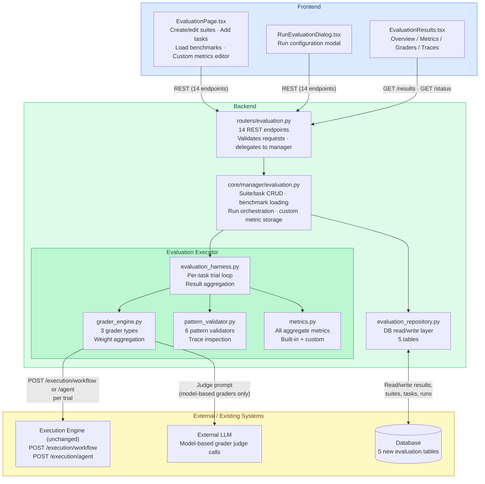
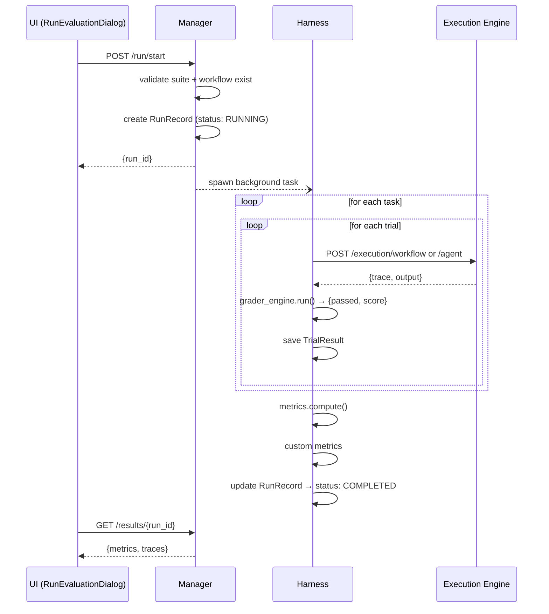
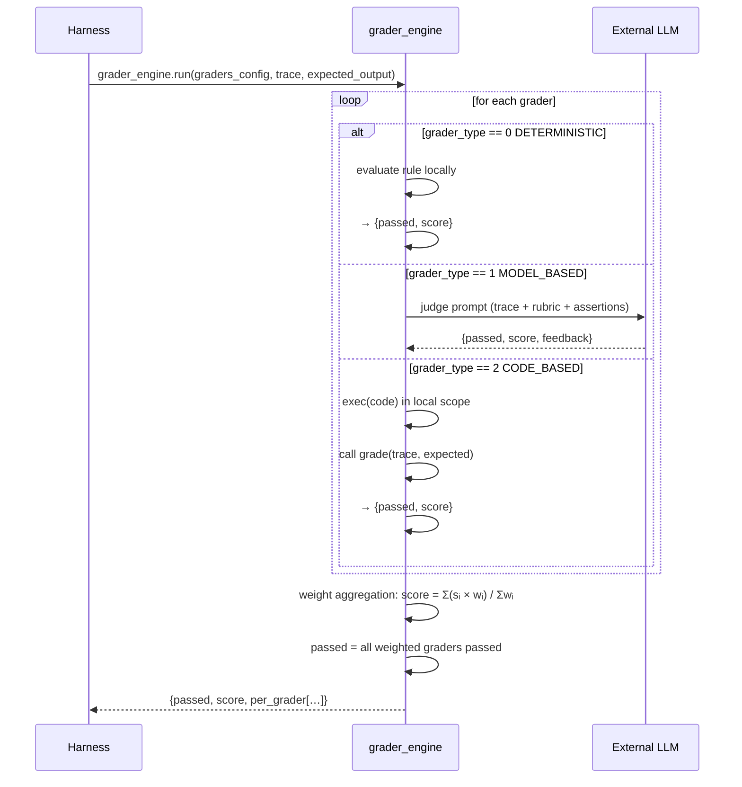
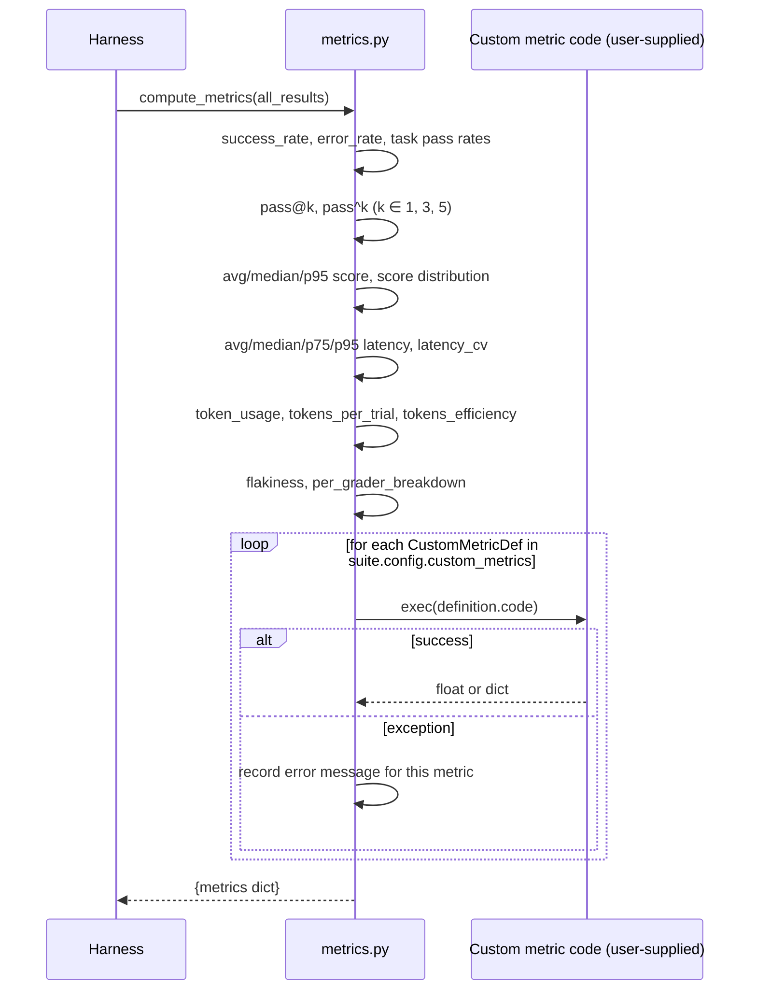

# System Investigation — Evaluation System for Agents and Workflows

**Related document:** RAT.md — product requirements and business background.
This document covers architecture, decomposition, technical constraints, system impact,
and external dependencies for the same feature.

---

## Feature Scope

The `evaluation` module adds a pattern-aware benchmarking and evaluation system to
OpenJiuwen. It consists of two layers:

1. **Backend** — database models, Pydantic schemas, evaluation harness, grader
   engine, pattern validator, metrics engine, and 14 REST API endpoints.
2. **Frontend** — evaluation suite management pages, run dialog, 4-tab results view
   (Overview / Metrics / Graders / Traces), and a Zustand store slice.

The evaluation harness reuses the existing workflow and agent execution engine
without modifying it. All new code lives in self-contained modules.

---

## Architecture



```
                   ┌──────────────────────────────────────────┐
                   │  Frontend — EvaluationPage.tsx           │
                   │  Create/edit suites · Add tasks          │
                   │  Load benchmarks · Custom metrics editor │
                   └────────────────┬─────────────────────────┘
                                    │ REST (14 endpoints)
                                    ▼
             ┌──────────────────────────────────────────────┐
             │  routers/evaluation.py                       │
             │  Validates requests · delegates to manager   │
             └──────────────────────┬───────────────────────┘
                                    │
              ┌─────────────────────┴──────────────────────┐
              │  core/manager/evaluation.py                 │
              │  Suite/task CRUD · benchmark loading        │
              │  Run orchestration · custom metric storage  │
              └──────┬──────────────────────┬──────────────┘
                     │                      │
        ┌────────────▼──────────┐  ┌────────▼─────────────────┐
        │  evaluation_harness   │  │  evaluation_repository   │
        │  per-task trial loop  │  │  DB read/write layer     │
        │  result aggregation   │  │  (5 tables)              │
        └───────┬───────────────┘  └──────────────────────────┘
                │
    ┌───────────┴─────────────────────────────────┐
    │                                             │
┌───▼───────────────┐  ┌────────────────────┐  ┌─▼────────────────┐
│  grader_engine.py │  │ pattern_validator  │  │  metrics.py      │
│  3 grader types   │  │ 6 pattern checks   │  │  all aggregate   │
│  weight agg.      │  │ trace inspection   │  │  metrics         │
└───────────────────┘  └────────────────────┘  └──────────────────┘
                │
                ▼
    ┌──────────────────────┐
    │  Existing execution  │
    │  engine (unchanged)  │
    │  POST /execution/    │
    │  workflow or /agent  │
    └──────────────────────┘
```

### Design Principles

**Harness is execution-engine agnostic.**
The evaluation harness calls the existing execution endpoints over the same internal
API contract used by the web UI. It does not import execution engine internals and
does not require any changes to the execution layer.

**Graders are stateless functions.**
Each grader receives `(trace, expected_output)` and returns `{passed, score}`.
There is no shared state between graders or between trials. This makes grader
logic easy to test in isolation.

**Metrics are computed post-hoc.**
The `metrics.py` module is a pure function `compute_metrics(results: list[dict]) →
dict`. It runs after all trials complete. Custom aggregate metrics (user-supplied
Python functions) run in the same pass, after built-in metrics.

**Frontend is additive.**
The evaluation UI lives under a new `/evaluation` route. It introduces one new
Zustand store slice (`useEvaluationStore`) and five new React component files.
No existing page, component, or store is modified.

---

### Module Layout

```
backend/openjiuwen_studio/
├── models/
│   └── evaluation.py                      # 5 SQLAlchemy tables (see Component Breakdown)
├── schemas/
│   └── evaluation.py                      # Pydantic schemas + enums
│                                          # EvaluationSuite, Task, Run, Result, RunStatus
│                                          # CustomMetricDef, EvaluationUpdate
├── core/
│   ├── executor/evaluation/
│   │   ├── evaluation_harness.py          # Run orchestrator: task loop, trial loop,
│   │   │                                  # result collection, metric dispatch
│   │   ├── grader_engine.py               # 3 grader implementations + weight aggregation
│   │   ├── pattern_validator.py           # 6 pattern validators (trace-based detection)
│   │   └── metrics.py                     # All aggregate metrics (built-in + custom)
│   └── manager/
│       ├── evaluation.py                  # CRUD ops, benchmark loading, run trigger
│       └── repositories/
│           └── evaluation_repository.py   # DB layer: session management, query helpers
└── routers/
    └── evaluation.py                      # 14 REST endpoints (see Component Breakdown)

frontend/src/
├── pages/Evaluation/
│   ├── EvaluationPage.tsx                 # Main page: suite list, task table,
│   │                                      # custom metrics dialog (Σ button)
│   ├── RunEvaluationDialog.tsx            # Run configuration modal
│   ├── EvaluationResults.tsx             # 4-tab results view container
│   ├── MetricsPanel.tsx                   # Overview tab: stat cards
│   └── TraceViewer.tsx                    # Traces tab: per-trial expandable detail
└── stores/
    └── useEvaluationStore.ts              # Zustand slice: suite list, active run,
                                           # results, CustomMetricDef type
```

---

## Key Sequence Diagrams

### 1. Evaluation run — task and trial loop

The harness iterates tasks sequentially. Within each task it runs `N` trials
(controlled by `task.trials`). Each trial calls the execution engine, then runs
all configured graders. Metrics are computed once after all tasks and trials finish.



```
UI (RunEvaluationDialog)      Manager               Harness             Execution Engine
         │                       │                     │                       │
         │  POST /run/start       │                     │                       │
         │───────────────────────►│                     │                       │
         │                       │  validate suite +    │                       │
         │                       │  workflow exist      │                       │
         │                       │  create RunRecord    │                       │
         │◄── {run_id} ──────────│                     │                       │
         │                       │  spawn background task                       │
         │                       │────────────────────►│                       │
         │                       │                     │  for each task:        │
         │                       │                     │  for each trial:       │
         │                       │                     │  POST /execution/…    │
         │                       │                     │───────────────────────►│
         │                       │                     │◄── {trace, output} ───│
         │                       │                     │  grader_engine.run()   │
         │                       │                     │  → {passed, score}     │
         │                       │                     │  save TrialResult      │
         │                       │                     │                        │
         │                       │                     │  after all trials:     │
         │                       │                     │  metrics.compute()     │
         │                       │                     │  custom metrics        │
         │                       │                     │  update RunRecord      │
         │                       │                     │  status → COMPLETED    │
         │  GET /results/{run_id} │                     │                       │
         │───────────────────────►│                     │                       │
         │◄── {metrics, traces} ─│                     │                       │
```

The `POST /run/start` endpoint returns the `run_id` immediately. The evaluation
run executes in the background. The UI polls `GET /results/{run_id}` until status
is `COMPLETED` or `FAILED`.

---

### 2. Grader execution — deterministic, model-based, code-based

All three grader types share the same call interface: `grader.run(trace, expected)`.
The grader engine selects the implementation based on `grader_type`.



```
Harness                grader_engine              External LLM (model-based only)
   │                        │                              │
   │  grader_engine.run(    │                              │
   │    graders_config,     │                              │
   │    trace,              │                              │
   │    expected_output)    │                              │
   │───────────────────────►│                              │
   │                        │  for each grader:            │
   │                        │                              │
   │                        │  [grader_type == 0 DETERMINISTIC]
   │                        │  evaluate rule locally       │
   │                        │  → {passed, score}           │
   │                        │                              │
   │                        │  [grader_type == 1 MODEL_BASED]
   │                        │  build judge prompt          │
   │                        │─────────────────────────────►│
   │                        │◄── {passed, score, feedback}─│
   │                        │                              │
   │                        │  [grader_type == 2 CODE_BASED]
   │                        │  exec(code) in local scope   │
   │                        │  call grade(trace, expected) │
   │                        │  → {passed, score}           │
   │                        │                              │
   │                        │  weight aggregation:         │
   │                        │  score = Σ(s_i × w_i)/Σw_i  │
   │                        │  passed = all weighted pass  │
   │◄── {passed, score,     │                              │
   │     per_grader[…]} ───│                              │
```

---

### 3. Custom aggregate metrics execution

After all trial results are collected, the harness calls `metrics.compute_metrics()`.
Built-in metrics run first. Then each `CustomMetricDef` in `suite.config.custom_metrics`
is executed via `exec()`.



```
Harness               metrics.py             Custom metric code (user-supplied)
   │                      │                              │
   │  compute_metrics(    │                              │
   │    all_results)      │                              │
   │─────────────────────►│                              │
   │                      │  built-in metrics:           │
   │                      │  success_rate, pass@k,       │
   │                      │  latency stats, token usage, │
   │                      │  flakiness, score dist …     │
   │                      │                              │
   │                      │  for each CustomMetricDef:   │
   │                      │  exec(definition.code)       │
   │                      │──────────────────────────────►│
   │                      │◄── float or dict ────────────│
   │                      │  on exception: record error  │
   │◄── {metrics dict} ───│                              │
```

Custom metric errors do not fail the run. The metric entry records the exception
message instead of a numeric value.

---

## Component Breakdown

### Database — 5 tables (`models/evaluation.py`)

| Table | Description |
|---|---|
| `EvaluationSuiteDB` | Named collection of tasks; holds `config` JSON (incl. `custom_metrics`) |
| `EvaluationTaskDB` | Single test case: `input_data`, `expected_output`, `graders_config`, `trials`, `pattern_type` |
| `EvaluationRunDB` | A single execution of a suite against a workflow/agent; holds status, `run_config` |
| `EvaluationResultDB` | One trial result: `passed`, `score`, `latency_ms`, `token_usage`, `grader_results`, `trace` |
| `EvaluationMetricsDB` | Computed aggregate metrics for a completed run; stored as JSON blob |

---

### REST API — 14 endpoints (`routers/evaluation.py`)

| Method | Path | Description |
|---|---|---|
| `POST` | `/evaluation/create` | Create evaluation suite |
| `GET` | `/evaluation/list` | List suites in a space |
| `GET` | `/evaluation/{id}` | Get suite with tasks |
| `PUT` | `/evaluation/update` | Update suite name, description, or config (custom metrics) |
| `DELETE` | `/evaluation/{id}` | Delete suite and all tasks |
| `POST` | `/evaluation/task/add` | Add task to suite |
| `PUT` | `/evaluation/task/update` | Update task definition |
| `DELETE` | `/evaluation/task/{id}` | Delete task |
| `POST` | `/evaluation/run/start` | Start evaluation run (background); returns `run_id` |
| `GET` | `/evaluation/run/status/{run_id}` | Poll run status |
| `GET` | `/evaluation/results/{run_id}` | Get full results: metrics + per-trial traces |
| `GET` | `/evaluation/runs/{suite_id}` | List all runs for a suite |
| `POST` | `/evaluation/benchmark/load` | Load pre-built benchmark YAML into a suite |
| `DELETE` | `/evaluation/run/{run_id}` | Delete a completed run |

---

### Grader Engine (`grader_engine.py`)

**Deterministic grader — 5 check types:**

| Check type | What it tests |
|---|---|
| `output_check` | Compares final output (or a dot-path inside it) against `expected_value` using a condition |
| `state_check` | Navigates a nested path into output and applies a condition |
| `tool_call_check` | Verifies that specific tool names appear in the execution trace |
| `pattern_check` | Runs a regex against the full trace JSON string |
| `transcript_check` | Counts tool calls or component spans and applies a numeric condition |

**10 supported conditions:** `eq`, `ne`, `gt`, `lt`, `ge`, `le`, `contains`,
`not_contains`, `regex`, `is_not_empty`

**Model-based grader:**
Constructs a structured judge prompt containing the trace, the rubric, and optional
assertion list. The LLM responds with `{"passed": bool, "score": float, "feedback": str}`.
The `passing_score` threshold overrides the LLM's `passed` field when the score
is below threshold.

**Code-based grader:**
Executes user-supplied Python via `exec()`. Expects a function with signature
`grade(trace: dict, expected: dict) → dict | bool`. Returns `{"passed", "score"}`.
A plain `bool` return is normalised to `{"passed": bool, "score": 1.0 or 0.0}`.

**Weight aggregation:**
- `passed` = every grader with `weight > 0` returned `passed: True`
- `score` = `Σ(score_i × weight_i) / Σ(weight_i)`
- Graders with `weight: 0` are run and recorded, but excluded from both

---

### Pattern Validator (`pattern_validator.py`)

The validator inspects the execution trace to determine which structural pattern
the workflow used during a trial. Detection is trace-based.

| Pattern | Value | Detection logic |
|---|---|---|
| ROUTING | 0 | IF component present in execution trace |
| CHAINING | 1 | ≥ 2 sequential component spans |
| PARALLELIZATION | 2 | Overlapping execution time windows |
| ORCHESTRATOR_WORKER | 3 | SUB_WORKFLOW component used |
| EVALUATOR_OPTIMIZER | 4 | LOOP component used |
| MEMORY_USAGE | 5 | SET_VARIABLE or VARIABLE_MERGE used |

Tasks specify their expected `pattern_type`. The validator confirms the workflow
exhibited that pattern and records a pattern-adherence result alongside the grader
results.

---

### Metrics Engine (`metrics.py`)

All metrics are computed as a pure function `compute_metrics(results) → dict`.

**Pass / Fail metrics:**
`success_rate`, `passed`, `total_results`, `error_rate`, `total_tasks`,
`task_pass_rate`, `tasks_fully_passed_rate`, `tasks_never_passed_rate`

**Sampling metrics:**
`pass_at_k` and `pass_pow_k` dictionaries keyed by k ∈ {1, 3, 5}.
- `pass@k`: probability that at least 1 of k random draws passes
- `pass^k`: probability that all k draws pass

**Score quality:**
`avg_score`, `median_score`, `score_std`, `score_min`, `score_max`,
`perfect_score_rate`, `score_distribution` (5 × 20% buckets)

**Latency:** `avg_latency_ms`, `median_latency_ms`, `p75_latency_ms`,
`p95_latency_ms`, `min_latency_ms`, `max_latency_ms`, `total_latency_ms`,
`latency_std_ms`, `latency_cv`

**Token usage:** `token_usage` (aggregate), `tokens_per_trial` (per-trial avg),
`tokens_efficiency` (split by pass/fail outcome)

**Reliability:** `flakiness` (mean std-dev of per-task pass/fail across trials;
`null` for single-trial runs), `tasks_never_passed_rate`, `tasks_fully_passed_rate`

**Per-grader breakdown:** `per_grader_breakdown` — `{grader_name: {pass_rate,
avg_score, count}}`

**Custom aggregate metrics:** user-defined `compute(results)` functions stored in
`suite.config.custom_metrics`; results appear under `custom_metrics` key

---

### Frontend Components

| Component | Description |
|---|---|
| `EvaluationPage.tsx` | Main page: suite selector, task table, action buttons; opens custom metrics dialog via **Σ** button in suite header |
| `RunEvaluationDialog.tsx` | Modal: select target workflow/agent, configure trial count, launch run |
| `EvaluationResults.tsx` | 4-tab container: Overview / Metrics / Graders / Traces |
| `MetricsPanel.tsx` | Overview tab: stat cards for success rate, pass/fail counts, avg score, avg latency, total tokens |
| `TraceViewer.tsx` | Traces tab: expandable per-trial rows with grader verdicts, score, latency, output |
| `useEvaluationStore.ts` | Zustand slice: suite list, current run state, results, `CustomMetricDef` type definition |

**Results view tab visibility rules:**
- Overview: always shown
- Metrics: shown when `pass@k` data or custom metric data exists
- Graders: shown when `per_grader_breakdown` has entries
- Traces: always shown; trial rows expandable individually

**`total_tasks` family of metrics** is only displayed in the GUI when
`total_tasks < total_results` (i.e., multi-trial runs). Single-trial runs show
only the simpler pass/fail counts.

---

### Pre-Built Benchmark Suites

Seven YAML benchmark files ship with the platform:

```
backend/openjiuwen_studio/marketplace/benchmarks/
├── routing_benchmark.yaml
├── chaining_benchmark.yaml
├── parallelization_benchmark.yaml
├── orchestrator_worker_benchmark.yaml
├── evaluator_optimizer_benchmark.yaml
├── memory_usage_benchmark.yaml
└── calculator_benchmark.yaml
```

Each YAML file defines a list of tasks conforming to the task schema (task_id,
task_name, difficulty, pattern_type, trials, input_data, expected_output,
graders_config). Teams load them via the **Load Benchmark** button in the UI
or via `POST /evaluation/benchmark/load`.

---

### Testing

| Area | Approach |
|---|---|
| Evaluation harness | Unit tests: mock execution engine responses; verify trial loop, result collection, status transitions |
| Grader engine | Unit tests per grader type and check type; cover all 10 conditions; weight aggregation edge cases |
| Pattern validator | Unit tests per pattern; synthetic trace fixtures with and without the expected signature |
| Metrics engine | Unit tests for each metric category; edge cases: zero trials, all-fail, single-task, single-trial |
| Custom metrics | Unit tests: valid function, exception path, dict return, float return |
| REST API | Integration tests for all 14 endpoints: happy path, validation errors, missing resource |
| Frontend store | Unit tests for `useEvaluationStore` state transitions |
| Test infrastructure | `conftest.py` stubs the `openjiuwen` core library; tests run standalone without the full runtime |

Run backend tests:
```bash
cd backend
pytest openjiuwen_studio/core/executor/evaluation/tests/ -v
```

---

## Technical Constraints

**Evaluation runs in the background:**
`POST /run/start` returns immediately with a `run_id`. The trial loop runs in a
background task. The UI must poll `GET /run/status/{run_id}` for progress. There
is no streaming of intermediate trial results to the frontend.

**Code-based graders run in the same process without sandboxing:**
`exec()` is used to execute user-supplied Python grading functions and custom
aggregate metric functions. There is no OS-level sandbox, memory limit, or
CPU timeout beyond the background task timeout. Poorly written grader code can
affect evaluation run stability. This is an accepted constraint for the initial
release; production hardening (subprocess isolation, resource limits) is a future
improvement.

**Model-based graders depend on a configured model:**
The model referenced by `model_id` in the grader config must be accessible via the
existing model registry. If the model is unavailable or the API call fails, the
grader result is recorded as an error with `passed: False` and `score: 0.0`. The
trial continues; only the affected grader is marked as errored.

**Pattern detection is heuristic:**
Pattern detection inspects the trace for specific component types. A workflow that
implements a routing pattern using custom logic (without an IF component) will not
be detected as ROUTING. Teams must set `pattern_type` explicitly on the task if
their workflow does not leave the expected trace signature.

**`pass@k` and `pass^k` require sufficient trials:**
For `k = 5`, the task must have `trials ≥ 5`. When `k > trials`, the metric is
computed from available data and noted as approximate. For reliable estimates,
`trials` should be set to at least the maximum k value of interest.

**Run results are immutable after completion:**
Once a run reaches `COMPLETED` or `FAILED` status, its results cannot be updated.
To re-evaluate, a new run must be started. Previous runs are preserved in the
run history for comparison.

**Large suites may produce large results payloads:**
For a suite with 50 tasks × 5 trials = 250 trials, the results payload includes
250 trace records. For suites with very large trace outputs, the
`GET /results/{run_id}` response can be several megabytes. Pagination of results
is not implemented in this release.

---

## Impact on Existing Systems

### OpenJiuwen Backend

No existing endpoints, models, or business logic are modified. The evaluation
module is entirely additive:

| Addition | Detail |
|---|---|
| 5 new DB tables | `evaluation_suite`, `evaluation_task`, `evaluation_run`, `evaluation_result`, `evaluation_metrics` |
| 1 new router | `routers/evaluation.py` — 14 endpoints under `/api/v1/evaluation/` |
| 1 new manager | `core/manager/evaluation.py` |
| 1 new DB repository | `core/manager/repositories/evaluation_repository.py` |
| 4 new executor modules | `evaluation_harness`, `grader_engine`, `pattern_validator`, `metrics` |
| 7 new benchmark YAML files | `marketplace/benchmarks/` |

The execution engine is called via its existing internal API. No changes to
`/execution/workflow` or `/execution/agent` endpoints or their underlying logic.

### Frontend

| Addition | Detail |
|---|---|
| 1 new route | `/evaluation` |
| 5 new React components | `EvaluationPage`, `RunEvaluationDialog`, `EvaluationResults`, `MetricsPanel`, `TraceViewer` |
| 1 new Zustand slice | `useEvaluationStore` |

No existing pages, components, or store slices are modified.

### Performance

Each evaluation trial issues one call to the execution engine (identical to a
manual run from the UI) plus one or more LLM calls for model-based graders.
Total additional load on the backend is:
- `N_tasks × N_trials` execution calls
- `N_model_based_graders_per_trial` LLM judge calls per trial

All evaluation traffic is initiated by an authenticated user action. Load scales
linearly with suite size and trial count. No background polling or scheduled jobs
are introduced.

### Security

| Surface | Risk | Mitigation |
|---|---|---|
| Code-based grader `exec()` | Arbitrary Python execution in server process | Scoped to authenticated team members who author evaluation suites; no external input path; future: subprocess isolation |
| Custom metric `exec()` | Same as above | Same |
| Model API calls from grader | API key exposure | Uses existing model registry credential management; no new credential storage |
| Run results storage | Trial traces may contain sensitive workflow outputs | Stored in existing DB under existing access control; accessible only to authenticated space members |

---

## End-to-End Scenarios

### Scenario A — Engineer adds evaluation to a routing workflow

**Context:** An engineer has built a sentiment-routing workflow. It receives a
text message and routes to a `positive`, `neutral`, or `negative` handler branch.
They want to verify that the workflow routes correctly across a range of inputs.

**Step-by-step:**

```
1. ENGINEER opens Evaluation page → clicks "New Suite"
   UI:      POST /evaluation/create {suite_name: "Sentiment Routing Tests"}
   BACKEND: creates EvaluationSuiteDB record → returns {evaluation_id: "eval-01"}

2. ENGINEER clicks "Load Benchmark" → selects "Routing Benchmark"
   UI:      POST /evaluation/benchmark/load
              {evaluation_id: "eval-01", benchmark: "routing_benchmark.yaml"}
   BACKEND: parses YAML → creates EvaluationTaskDB records for each task
            (e.g. 10 tasks: positive/neutral/negative examples at Easy/Medium/Hard)
   UI:      task table populates with 10 rows

3. ENGINEER clicks "Run" → RunEvaluationDialog opens
   - selects target: "Sentiment Router v2" (workflow_id: "wf-55")
   - trials per task: 3 (from task definition)
   - clicks "Start"
   UI:      POST /evaluation/run/start
              {evaluation_id: "eval-01", workflow_id: "wf-55"}
   BACKEND: creates EvaluationRunDB {status: RUNNING} → returns {run_id: "run-07"}
   UI:      polls GET /evaluation/run/status/run-07 every 3 s

4. BACKEND (background):
   for task in [10 tasks]:
     for trial in [3 trials]:
       POST /execution/workflow {workflow_id: "wf-55", inputs: task.input_data}
       ← trace: {final_output: {branch: "positive"}, token_usage: …}

       grader_engine.run(task.graders_config, trace, task.expected_output):
         [deterministic output_check]
           path: "branch"
           condition: "eq"
           expected_value: "positive"
           → trace.final_output.branch == "positive" → {passed: True, score: 1.0}

       save TrialResult {passed: True, score: 1.0, latency_ms: 2340}

   metrics.compute_metrics(all_30_results):
     success_rate: 0.87
     pass@3: {1: 0.91, 3: 0.72, 5: …}
     avg_latency_ms: 2180
     flakiness: 0.12
     per_grader_breakdown: {output_check: {pass_rate: 0.87, avg_score: 0.87}}

   update EvaluationRunDB → status: COMPLETED, metrics: {…}

5. UI poll returns status: COMPLETED
   ENGINEER clicks "View Results"
   UI:      GET /evaluation/results/run-07
   BACKEND: returns {metrics: {…}, results: [30 trial records]}

6. UI renders EvaluationResults:
   [Overview tab]  success rate: 87% · passed: 26/30 · avg score: 0.87
                   avg latency: 2180 ms · total tokens: 48 200
   [Metrics tab]   pass@1: 0.91 · pass@3: 0.72 · pass^3: 0.61
   [Graders tab]   output_check: pass_rate 87% · avg_score 0.87 · 30 trials
   [Traces tab]    30 expandable rows; 4 failing rows highlighted
                   expand failing row → final_output: {branch: "neutral"}
                                         expected: {branch: "positive"}
                                         grader verdict: failed · score: 0.0
```

**What the engineer concludes:**
The 4 failing trials are all Medium-difficulty ambiguous-sentiment inputs. The routing
logic needs refinement for edge cases. The engineer updates the workflow prompt and
starts a new run to confirm improvement.

---

### Scenario B — Team adds a model-based quality gate to an agent

**Context:** A team has built a research assistant agent. They want to verify that
the agent's responses are coherent, cite evidence, and address the user's question.
Rule-based checks are insufficient — they need semantic quality assessment.

**Step-by-step:**

```
1. TEAM creates a new suite "Research Agent Quality" and adds a task:
   {
     task_name: "Climate research query",
     trials: 5,
     pattern_type: 1,  // CHAINING
     input_data: {query: "What are the main drivers of Arctic ice loss?"},
     expected_output: {topic: "climate"},
     graders_config: [
       {
         name: "has_json_structure",
         grader_type: 0,
         config: {check_type: "output_check", condition: "is_not_empty"},
         weight: 0.2
       },
       {
         name: "content_quality",
         grader_type: 1,
         config: {
           model_id: "claude-opus-4-6",
           rubric: "The response addresses Arctic ice loss, cites at least
                    one causal factor (temperature, albedo, circulation), and
                    is coherent and factually grounded.",
           passing_score: 0.7
         },
         weight: 0.8
       }
     ]
   }

2. TEAM adds a custom aggregate metric via Σ button:
   {
     name: "high_quality_rate",
     description: "Fraction of trials scoring above 0.85",
     code: "def compute(results):\n
              return sum(1 for r in results if r.get('score',0) > 0.85) / len(results)"
   }

3. TEAM starts run: 5 trials of the research agent

4. BACKEND (background):
   trial 1:
     POST /execution/agent {agent_id: "agent-12", input: {query: "…"}}
     ← trace: {final_output: "Arctic ice loss is driven by …", token_usage: …}

     grader_engine:
       has_json_structure (weight 0.2):
         is_not_empty check on final_output → {passed: True, score: 1.0}
       content_quality (weight 0.8):
         judge prompt → claude-opus-4-6
         ← {passed: True, score: 0.92, feedback: "Mentions albedo, temperature…"}

       aggregate: score = (1.0×0.2 + 0.92×0.8) / 1.0 = 0.936
                  passed = True (both weighted graders passed)

   [trials 2-5 similar; trial 4 scores 0.61 from model grader → passed: False]

5. metrics.compute():
   success_rate: 0.80 (4/5 trials passed)
   avg_score: 0.857
   pass@k: {1: 0.80, 3: 0.896, 5: 0.672}
   per_grader: {has_json_structure: pass 100%, content_quality: pass 80%}
   custom_metrics: {high_quality_rate: 0.60}

6. TEAM reviews results:
   - content_quality grader is the discriminating factor
   - high_quality_rate of 0.60 below target of 0.80
   - Traces tab: trial 4 feedback "Does not cite a specific causal mechanism"
   - Team refines agent system prompt to require explicit causal citations
```

---

## External Dependencies

### Python packages (backend)

| Package | Used by | Notes |
|---|---|---|
| SQLAlchemy | `evaluation_repository.py` | Existing project dependency; 5 new table definitions |
| Pydantic | `schemas/evaluation.py` | Existing project dependency; new schema models |
| PyYAML | `manager/evaluation.py` (benchmark loading) | Existing project dependency; parses benchmark YAML files |
| Python stdlib (`exec`, `json`, `statistics`, `math`) | `grader_engine`, `metrics` | No additional packages |

No new third-party packages are introduced. All dependencies are already present in
the project's existing requirements.

### Python packages (frontend)

| Package | Used by | Notes |
|---|---|---|
| Zustand | `useEvaluationStore.ts` | Existing project dependency |
| React | All new components | Existing project dependency |

No new npm packages are introduced.

### Internal services

| Service | Used for | Interface |
|---|---|---|
| Workflow execution engine | Running workflow trials | `POST /execution/workflow` (existing, unchanged) |
| Agent execution engine | Running agent trials | `POST /execution/agent` (existing, unchanged) |
| Model registry | Model-based grader judge calls | Existing model API; model must be configured by team |
| Database | 5 new tables | Existing DB connection; migration adds tables only |
