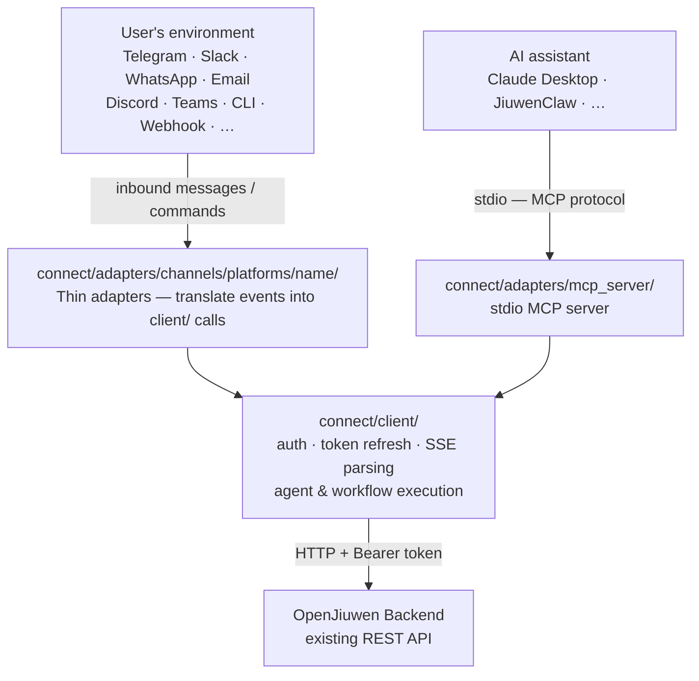
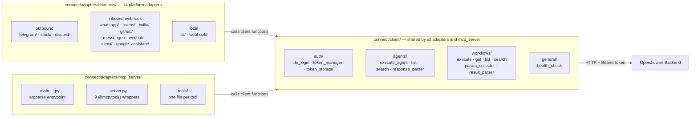
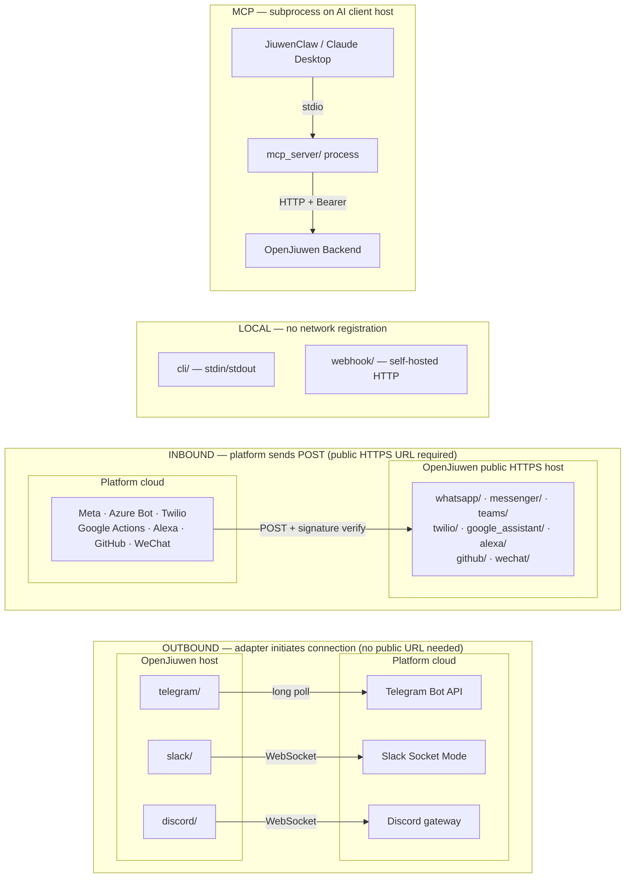
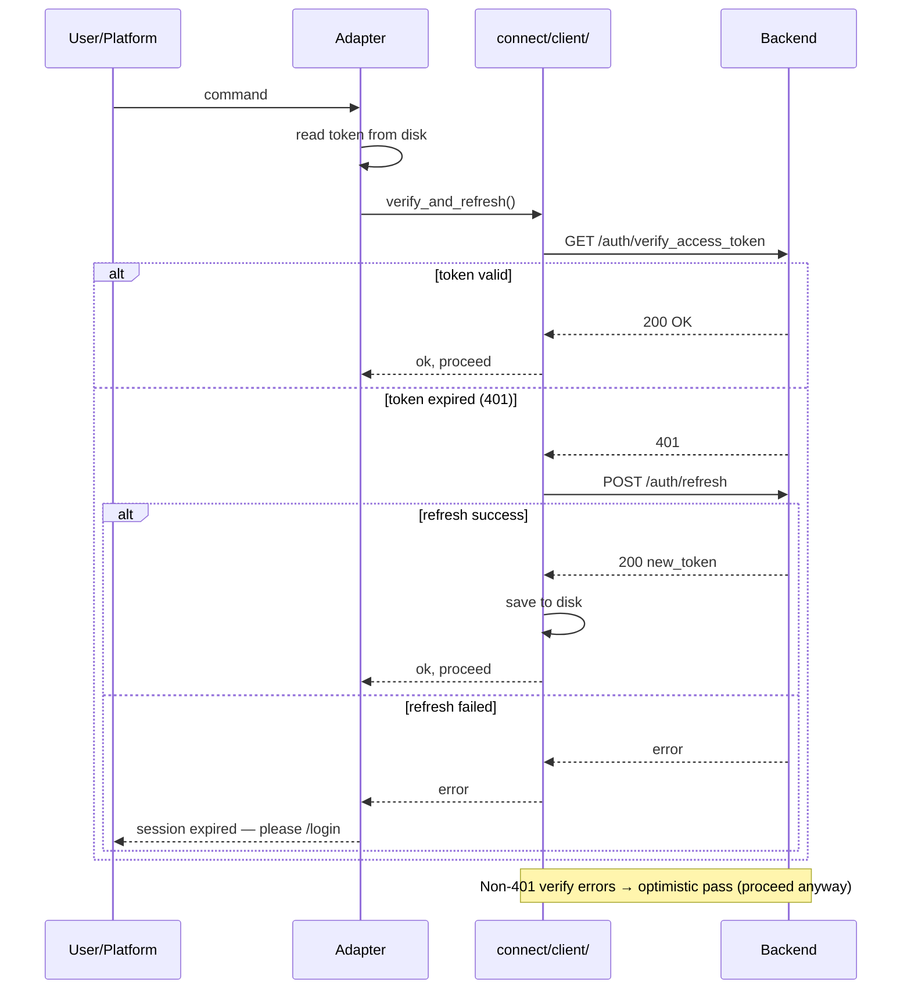
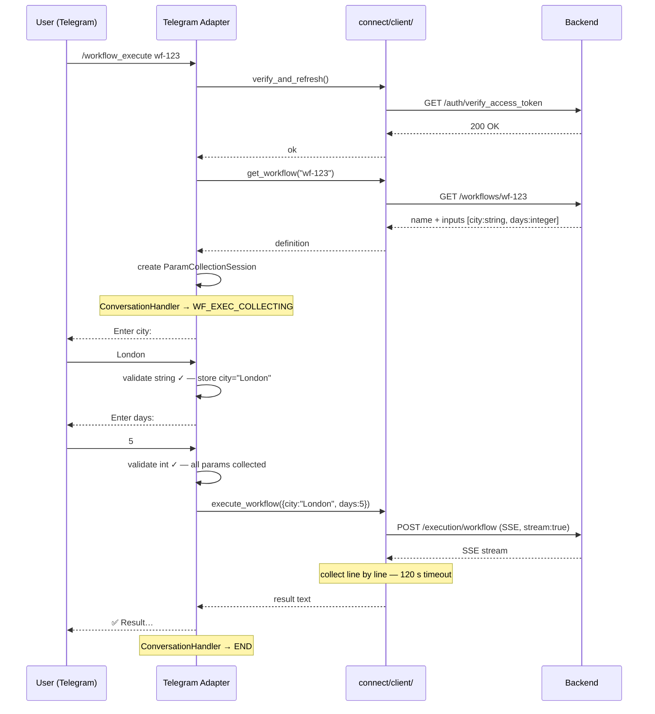
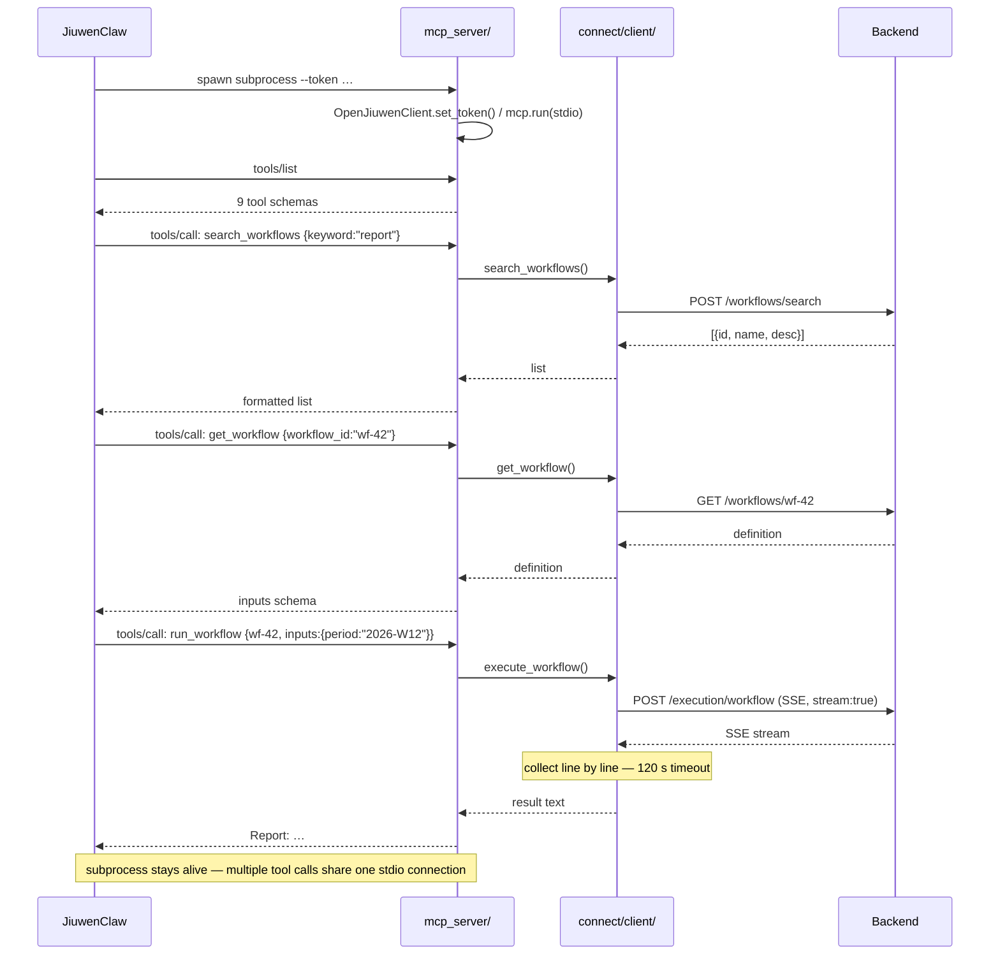

# System Investigation — OpenJiuwen Anywhere (Connect)

**Related document:** RAT.md — product requirements and business background.
This document covers architecture, decomposition, technical constraints, system impact,
and external dependencies for the same feature.

---

## Feature Scope

The `connect/` module adds two inbound connection layers to OpenJiuwen:

1. **Channels** — 14 platform adapters that let users interact with OpenJiuwen agents
   and workflows from messaging apps, the terminal, email, and voice assistants.
2. **MCP Server** — a Model Context Protocol server that exposes OpenJiuwen as a tool
   library callable by AI assistants (Claude Desktop, JiuwenClaw, others).

Both components share a common client library that handles all communication with the
OpenJiuwen backend.

---

## Architecture



```
                    ┌──────────────────────────────────────┐
                    │           User's environment          │
                    │  Telegram · Slack · WhatsApp · Email  │
                    │  Discord · Teams · CLI · Webhook · …  │
                    └──────────────┬───────────────────────┘
                                   │ inbound messages / commands
                                   ▼
┌──────────────────────────────────────────────────────────────────┐
│  connect/adapters/channels/platforms/<name>/                     │
│  Thin adapters — translate platform events into client/ calls,   │
│  format responses back to the platform                           │
└──────────────────────────────┬───────────────────────────────────┘
                               │
                    ┌──────────────────────┐
                    │  connect/client/      │  ← shared by channels + MCP server
                    │  All business logic:  │
                    │  auth, token refresh, │
                    │  agent execution,     │
                    │  workflow execution,  │
                    │  SSE parsing          │
                    └──────────┬───────────┘
                               │ HTTP + Bearer token
                               ▼
                    ┌──────────────────────┐
                    │  OpenJiuwen Backend   │
                    │  (existing REST API)  │
                    └──────────────────────┘
                               ▲
                               │ HTTP + Bearer token
                    ┌──────────┴───────────┐
                    │  connect/adapters/    │
                    │  mcp_server/          │
                    │  stdio MCP server     │
                    └──────────────────────┘
                               ▲
                               │ stdio (MCP protocol)
                    ┌──────────────────────┐
                    │  AI assistant         │
                    │  (Claude Desktop,     │
                    │   JiuwenClaw, …)      │
                    └──────────────────────┘
```

### Design principles

**Strict client/adapter separation.**
`connect/client/` contains zero platform-specific imports. It knows nothing about
Telegram, Slack, or MCP. Adapters call client functions; client functions call the
backend. Business logic (auth, token refresh, SSE parsing, param collection) is fixed
in one place and all adapters benefit automatically.

**Thin adapters.**
Each platform adapter does exactly three things per handler: extract the user ID and
message from the platform event, call the relevant `client/` function, format and return
the result. No business logic lives in adapters.

**Single entry point.**
All platforms are started via `python -m channels.run <platform> [args...]`. The runner
dynamically imports `channels.platforms.<platform>.launcher` and calls `main()`.

---

### Module layout

The full `connect/` folder annotated by role:

```
connect/
├── client/                        ← shared by all adapters and mcp_server
│   ├── client.py                  ← OpenJiuwenClient (requests.Session + Bearer)
│   ├── auth/
│   │   ├── do_login.py            ← POST /auth/login → GET /spaces/
│   │   ├── token_manager.py       ← verify_and_refresh()
│   │   └── token_storage.py       ← JSON file; path via OJ_TOKEN_STORAGE env var
│   ├── agents/
│   │   ├── execute_agent.py       ← POST /execution/agent (SSE, 120 s timeout)
│   │   ├── list_agents.py         ← GET /agents/
│   │   ├── search_agents.py       ← POST /agents/search
│   │   └── response_parser.py     ← extract text, conversation_id, error
│   ├── workflows/
│   │   ├── execute_workflow.py    ← POST /execution/workflow (SSE, 120 s timeout)
│   │   ├── get_workflow.py        ← GET /workflows/<id>
│   │   ├── list_workflows.py      ← GET /workflows/
│   │   ├── search_workflows.py    ← POST /workflows/search
│   │   ├── param_collector.py     ← ParamCollectionSession state machine
│   │   └── result_parser.py       ← extract outputs dict, error
│   └── general/
│       └── health_check.py        ← GET /health
│
└── adapters/
    ├── channels/
    │   └── platforms/
    │       ├── telegram/           ← python-telegram-bot, long polling
    │       ├── slack/              ← slack-bolt, Socket Mode WebSocket
    │       ├── discord/            ← discord.py, WebSocket gateway
    │       ├── cli/                ← argparse, stdin/stdout
    │       ├── webhook/            ← FastAPI + uvicorn, stateless HTTP
    │       ├── email/              ← imaplib + smtplib, IMAP polling loop
    │       ├── whatsapp/           ← aiohttp, Meta webhook
    │       ├── teams/              ← botbuilder-core, Azure Bot webhook
    │       ├── google_assistant/   ← FastAPI + uvicorn, Actions SDK webhook
    │       ├── twilio/             ← aiohttp, Twilio webhook
    │       ├── github/             ← FastAPI + uvicorn, GitHub webhook
    │       ├── messenger/          ← aiohttp, Meta webhook
    │       ├── wechat/             ← aiohttp, WeChat XML webhook
    │       └── alexa/              ← FastAPI + uvicorn, Alexa webhook
    │
    └── mcp_server/
        ├── __main__.py             ← argparse entrypoint
        ├── _server.py              ← FastMCP instance; 9 @mcp.tool() wrappers
        └── tools/                  ← one file per tool; plain functions; no MCP dependency
```

Each platform adapter follows the same internal layout:
```
platforms/<name>/
├── launcher.py              ← framework init, handler registration, event loop
├── client_session.py        ← @require_login decorator or get_backend_client()
├── handlers_registrator.py  ← wires handlers to framework
├── auth/handlers/           ← login, logout, status
├── agents/handlers/         ← list, search, execute, chat
├── workflows/handlers/      ← list, search, execute, param collection, cancel
└── general/handlers/        ← start, help, health
```



---

### Deployment topology

Platform adapters split into three deployment classes based on their connection model:



```
OUTBOUND — adapter initiates connection to platform (no public URL required)

  OpenJiuwen host                         Platform cloud
  ┌───────────────────────┐               ┌───────────────────────┐
  │  telegram/            │──long poll───►│  Telegram Bot API     │
  │  slack/               │──WebSocket───►│  Slack Socket Mode    │
  │  discord/             │──WebSocket───►│  Discord gateway      │
  └───────────────────────┘               └───────────────────────┘

INBOUND — platform sends HTTP requests to adapter (public HTTPS URL required)

  Platform cloud                          OpenJiuwen host / public URL
  ┌───────────────────────┐               ┌───────────────────────┐
  │  Meta (WhatsApp)      │──POST────────►│  whatsapp/            │
  │  Meta (Messenger)     │──POST────────►│  messenger/           │
  │  Azure Bot (Teams)    │──POST────────►│  teams/               │
  │  Twilio               │──POST────────►│  twilio/              │
  │  Google Actions       │──POST────────►│  google_assistant/    │
  │  Amazon Alexa         │──POST────────►│  alexa/               │
  │  GitHub               │──POST────────►│  github/              │
  │  WeChat               │──POST────────►│  wechat/              │
  └───────────────────────┘               └───────────────────────┘

LOCAL — no network registration needed

  ┌──────────────────────────────────────────────────────────────────┐
  │  cli/      stdin/stdout; no network at all                       │
  │  webhook/  self-hosted HTTP; optional WEBHOOK_API_KEY guard      │
  └──────────────────────────────────────────────────────────────────┘

MCP — server subprocess runs on the AI client's host

  AI client host
  ┌─────────────────────────────────────────────────────┐
  │  JiuwenClaw / Claude Desktop                        │
  │    └── spawns:  python -m mcp_server --token ...    │
  │                        │ stdio (MCP protocol)       │
  │                  mcp_server process                 │
  └────────────────────────│────────────────────────────┘
                           │ HTTP + Bearer token
                           ▼
                  OpenJiuwen Backend
                  (any reachable URL)
```

All inbound webhook adapters implement platform-specific signature verification to
reject requests from any source other than the registered platform.

---

## Key Sequence Diagrams

### 1. Token verify and refresh (all protected handlers)

Every handler that requires authentication runs through this flow before doing any
real work. The `verify_and_refresh()` function in `client/auth/token_manager.py`
implements it; the adapter decorators (`@require_login`, `get_backend_client()`)
call it. The adapter never talks to the backend directly — all HTTP calls go through
`connect/client/`.



```
User/Platform      Adapter              connect/client/          Backend
       │               │                     │                      │
       │  command       │                     │                      │
       │──────────────►│                     │                      │
       │               │  read token from    │                      │
       │               │  disk ─── (local)   │                      │
       │               │                     │                      │
       │               │  verify_and_refresh()                      │
       │               │────────────────────►│                      │
       │               │                     │  GET /auth/verify    │
       │               │                     │─────────────────────►│
       │               │                     │◄── 200 OK ───────────│  token valid
       │               │◄── ok, proceed ─────│                      │
       │               │                     │                      │
       │               │                [on 401 — token expired]    │
       │               │                     │◄── 401 ──────────────│
       │               │                     │  POST /auth/refresh  │
       │               │                     │─────────────────────►│
       │               │                     │◄── 200 new_token ────│
       │               │                     │  save to disk        │
       │               │◄── ok, proceed ─────│                      │
       │               │                     │                      │
       │               │           [on refresh failure]             │
       │               │                     │◄── error ────────────│
       │◄── "session expired, please /login" ─│                      │
```

On non-401 errors from the verify call (e.g. network timeout), `verify_and_refresh()`
applies an **optimistic pass**: the request proceeds under the assumption that the
backend is temporarily unreachable, not that the token is invalid.

---

### 2. Telegram — workflow execution with interactive parameter collection

The Telegram adapter uses a `ConversationHandler` to collect required workflow inputs
one by one. All HTTP calls are delegated to `connect/client/`; the adapter's role is
event extraction, state management, and message formatting only.



```
User (Telegram)   Telegram Adapter     connect/client/          Backend
       │                 │                   │                      │
       │ /workflow_execute│                  │                      │
       │   wf-123        │                   │                      │
       │────────────────►│                   │                      │
       │                 │ verify_and_refresh()                     │
       │                 │──────────────────►│                      │
       │                 │                   │── GET /auth/verify ──►│
       │                 │                   │◄── 200 OK ───────────│
       │                 │◄── ok ────────────│                      │
       │                 │                   │                      │
       │                 │ get_workflow("wf-123")                   │
       │                 │──────────────────►│                      │
       │                 │                   │── GET /workflows/wf-123►│
       │                 │                   │◄── {name,            │
       │                 │                   │     inputs:[         │
       │                 │                   │      {city:string},  │
       │                 │                   │      {days:integer}]}│
       │                 │◄── definition ────│                      │
       │                 │                   │                      │
       │                 │  create ParamCollectionSession (client/) │
       │                 │  ConversationHandler → WF_EXEC_COLLECTING│
       │                 │                   │                      │
       │◄─ "Enter city:" ─│                  │                      │
       │   "London"      │                   │                      │
       │────────────────►│                   │                      │
       │                 │  validate string ✓ store city="London"   │
       │◄─ "Enter days:" ─│                  │                      │
       │   "5"           │                   │                      │
       │────────────────►│                   │                      │
       │                 │  validate int ✓ — all params collected   │
       │                 │                   │                      │
       │                 │ execute_workflow({city:"London",days:5}) │
       │                 │──────────────────►│                      │
       │                 │                   │── POST /execution/workflow►│
       │                 │                   │   {wf_id,inputs,stream:true}
       │                 │                   │◄── SSE stream ────────│
       │                 │                   │   (collect, 120 s)   │
       │                 │◄── result text ───│                      │
       │◄─ "✅ Result..." ─│                  │                      │
       │                 │  ConversationHandler → END               │
```

At any point during param collection the user can send `/workflow_cancel` to abort.
Type validation errors prompt re-entry without advancing state.

---

### 3. MCP — JiuwenClaw using OpenJiuwen as a tool library

The MCP server is spawned once per session as a child process. JiuwenClaw discovers
tools at startup and calls them during its reasoning loop. All backend communication
goes through `connect/client/` — the mcp_server itself holds no HTTP logic.



```
JiuwenClaw         mcp_server/           connect/client/         Backend
    │                   │                      │                     │
    │ spawn subprocess  │                      │                     │
    │ python -m mcp_server --token ...         │                     │
    │──────────────────►│                      │                     │
    │                   │ OpenJiuwenClient.set_token()               │
    │                   │ mcp.run(stdio)        │                     │
    │                   │                      │                     │
    │ tools/list ───────►                      │                     │
    │◄── {9 tool schemas}                      │                     │
    │                   │                      │                     │
    │ tools/call        │                      │                     │
    │ search_workflows  │                      │                     │
    │ {keyword:"report"}►                      │                     │
    │                   │ search_workflows()   │                     │
    │                   │─────────────────────►│                     │
    │                   │                      │── POST /workflows/search►│
    │                   │                      │◄── [{id,name}] ─────│
    │                   │◄── formatted list ───│                     │
    │◄── result text ───│                      │                     │
    │                   │                      │                     │
    │ tools/call        │                      │                     │
    │ get_workflow      │                      │                     │
    │ {workflow_id:"wf-42"}►                   │                     │
    │                   │ get_workflow()        │                     │
    │                   │─────────────────────►│                     │
    │                   │                      │── GET /workflows/wf-42►│
    │                   │                      │◄── {definition} ────│
    │◄── inputs schema ─│                      │                     │
    │                   │                      │                     │
    │ tools/call        │                      │                     │
    │ run_workflow      │                      │                     │
    │ {wf-42,inputs:{period:"2026-W12"}}►      │                     │
    │                   │ execute_workflow()    │                     │
    │                   │─────────────────────►│                     │
    │                   │                      │── POST /execution/workflow►│
    │                   │                      │◄── SSE stream ───────│
    │                   │                      │   (collect, 120 s)  │
    │                   │◄── result text ───────│                     │
    │◄── "Report: ..." ─│                      │                     │
```

The mcp_server subprocess lives for the entire JiuwenClaw session. Multiple tool
calls happen over the same stdio connection. The backend sees normal Bearer-authenticated
HTTP requests — it has no visibility into the MCP layer above.

---

## Component Breakdown

### `connect/client/` — Shared client library

| Sub-component | Description | Notes |
|---|---|---|
| `OpenJiuwenClient` | HTTP wrapper holding base URL, token, space-id; `requests.Session` with Bearer header | Prerequisite for everything else |
| `auth/do_login` | POST /auth/login → GET /spaces/ → returns token + space_id + refresh_token | |
| `auth/token_manager` | `verify_and_refresh()` — verify token, silent refresh on 401, optimistic pass on other errors | Used by every protected handler |
| `auth/token_storage` | JSON file persistence; one entry per user_id; file path set via `OJ_TOKEN_STORAGE` env var | |
| `agents/execute_agent` | POST /execution/agent with stream=True; collects SSE line by line | 120 s timeout |
| `agents/response_parser` | Extracts text + conversation_id + error from SSE event list | |
| `workflows/execute_workflow` | POST /execution/workflow with stream=True; collects SSE | |
| `workflows/result_parser` | Extracts output dict + error from SSE event list | |
| `workflows/param_collector` | `ParamCollectionSession` — state machine for multi-step input collection; type-validates each value | Shared by all interactive platforms |
| `general/health_check` | GET /health | |

---

### `connect/adapters/channels/` — Platform adapters

All 14 adapters follow an identical internal layout:
```
platforms/<name>/
├── launcher.py              ← framework init, handler registration, event loop start
├── client_session.py        ← per-user auth helper (@require_login or get_backend_client())
├── handlers_registrator.py  ← wires all handlers to the framework
├── auth/handlers/           ← login, logout, status, cancel
├── agents/handlers/         ← list, search, execute, chat start/message/end
├── workflows/handlers/      ← list, search, execute, collect params, cancel
└── general/handlers/        ← start, help, health
```

| Adapter | Framework | Connection model | Auth in adapter | Key complexity |
|---|---|---|---|---|
| Telegram | `python-telegram-bot` v20+ | Long polling | `@require_login` decorator + per-user `context.user_data` | `ConversationHandler` for login flow and workflow param collection |
| Slack | `slack-bolt` | Socket Mode WebSocket | `get_backend_client(user_id, respond)` | `ack()` must be called within 3 s; work done after |
| Discord | `discord.py` v2+ | WebSocket gateway | `get_backend_client(user_id)` | Slash command tree sync on startup; `interaction.response.defer()` for long ops |
| CLI | `argparse` | stdin/stdout | Direct token read | Interactive param collection via `ParamCollectionSession` |
| HTTP Webhook | FastAPI + uvicorn | Stateless HTTP | Per-request token or static token | Optional `WEBHOOK_API_KEY` guard |
| Email | stdlib (`imaplib`, `smtplib`) | IMAP polling loop | Per-user (sender email as user_id) | RFC 2047 decode; quoted reply stripping; `In-Reply-To` threading |
| WhatsApp | `aiohttp` | Meta webhook | Static token | Meta webhook verification handshake (GET challenge) |
| Teams | `botbuilder-core` | Azure webhook | Shared Azure identity | Azure OAuth token validation per request via Bot Framework adapter |
| Google Assistant | FastAPI + uvicorn | Actions SDK webhook | Per-session (session.id as user_id) | Voice output: no markdown; 10 s hard deadline |
| Twilio SMS | `aiohttp` | Twilio webhook | Per-user (phone number as user_id) | TwiML empty response; reply via REST API asynchronously; optional HMAC signature check |
| GitHub | FastAPI + uvicorn | GitHub webhook | Per-user (GitHub username) | HMAC `X-Hub-Signature-256` verification; `say()` closure bound to issue/PR |
| Facebook Messenger | `aiohttp` | Meta webhook | Per-user (PSID) | Echo filtering; `urllib` for replies (no SDK) |
| WeChat | `aiohttp` | WeChat XML webhook | Per-user (OpenID) | XML protocol; SHA1 signature; first reply in HTTP response body; Customer Service API for subsequent replies; `get_access_token()` with in-process cache |
| Amazon Alexa | FastAPI + uvicorn | Alexa webhook | Per-user (`session.user.userId`) | Voice output; `shouldEndSession` control; Pydantic request models for 3 Alexa request types |

**Note on adapter code sharing with JiuwenClaw:** JiuwenClaw also has a Telegram
adapter (`jiuwenclaw/channel/telegram_channel.py`) using the same `python-telegram-bot`
library. The two serve different purposes, so they are designed differently: OpenJiuwen's
is a command-driven menu with per-user JWT auth and `ConversationHandler` state machines;
JiuwenClaw's is a direct pipe to an integrated ReAct agent with allowlist access. Each
design is the right fit for its product. The overlap at the SDK boundary is 3 lines of
attribute access (`user_id`, `chat_id`, `text`) — not enough surface to justify a shared
library that would add cross-repo coupling to two independent release cycles. The
conclusion was to keep them separate. Full analysis:
`connect/adapters/channels/platforms/telegram/TELEGRAM_COMPARISON.md`.

---

### `connect/adapters/mcp_server/` — MCP server

| Component | Description |
|---|---|
| `__main__.py` | argparse entrypoint: `--token`, `--backend-url`, `--space-id`; creates `OpenJiuwenClient`; calls `mcp.run(transport="stdio")` |
| `_server.py` | `FastMCP` instance; 9 `@mcp.tool()` wrappers; one global `OpenJiuwenClient` |
| `tools/<name>.py` | One file per tool; plain functions `tool_name_tool(client, ...) → str`; no MCP dependency |
| `tools/_formatters.py` | Pure formatting functions that convert JSON responses to human-readable strings |

Transport: stdio only. The MCP client (Claude Desktop, JiuwenClaw, etc.) spawns the
server as a subprocess. stdin carries MCP requests; stdout carries MCP responses; stderr
is used for startup logging.

Tool discovery: the client sends `tools/list` immediately after startup. FastMCP responds
with the full schema of all 9 tools (names, descriptions, parameter schemas). The client
then calls tools via `tools/call` messages for the lifetime of the session.

---

### Testing

| Area | Approach |
|---|---|
| Client library | Unit tests per function; mock `requests.Session` responses |
| MCP tools | 36 unit tests (already implemented); each tool mocked at the `client.*` call boundary |
| Platform adapters | Integration smoke tests: start adapter against a test backend instance, send a command, verify response |
| Token flow | Unit tests for `verify_and_refresh()` covering: valid token, 401 + refresh success, 401 + refresh fail, non-401 error (optimistic pass) |

---

## Technical Constraints

**SSE collected synchronously:**
`execute_agent` and `execute_workflow` consume the SSE stream line by line in a blocking
loop, collecting all events before returning. There is no real-time streaming to the chat
platform. A 120-second timeout is enforced on the stream. Partial/streaming delivery is
out of scope.

**Token storage at rest:**
Per-user tokens are stored as plaintext JSON files. Default paths are inside the
platform directory (e.g. `platforms/telegram/.telegram_bot_tokens.json`). In production,
file permissions must be restricted (`chmod 600`). Migration to an encrypted secrets
store or secrets manager is recommended for production deployments but is out of scope.

**MCP token — no automatic refresh:**
The MCP server holds a single static token set at startup. There is no re-authentication
mechanism. When the token expires, all tool calls return `ERROR: 401`. The operator must
update the token in the client config and restart the MCP client. Long-lived API tokens
are strongly preferred for MCP deployments.

**MCP transport — stdio only:**
The MCP server communicates only over stdio. HTTP and WebSocket MCP transports are not
implemented. The MCP client must be capable of spawning the server as a subprocess.

**Webhook platform deployment:**
WhatsApp, Teams, Google Assistant, Twilio, GitHub, Messenger, WeChat, and Alexa all
require the adapter to be reachable via a public HTTPS URL. Local development requires
ngrok or equivalent. The connect module does not include deployment infrastructure.

**Platform-specific hard limits:**

| Platform | Limit | Enforced by |
|---|---|---|
| Twilio SMS | 1600 characters per message | Twilio |
| Facebook Messenger | 2000 characters per message | Meta |
| Google Assistant | 10-second response deadline | Google |
| Amazon Alexa | 8-second response deadline | Amazon |
| WeChat | 5-second synchronous response window | WeChat |

Responses exceeding character limits are truncated. Agent/workflow calls that exceed
time limits on voice platforms will result in a timeout error visible to the user.

**Race condition — token refresh:**
When multiple concurrent requests arrive from the same Telegram user, two handlers may
simultaneously attempt a token refresh. The Telegram adapter serialises refresh attempts
per user using `asyncio.Lock` stored in `context.user_data`. Other platforms with lower
concurrency per user do not currently implement this guard.

---

## Impact on Existing Systems

### OpenJiuwen backend

No changes required. The connect layer uses only existing API endpoints:

| Endpoint | Used for |
|---|---|
| `POST /auth/login` | User login |
| `GET /auth/verify_access_token` | Token verification |
| `POST /auth/refresh` | Token refresh |
| `GET /spaces/` | Space list after login |
| `GET /agents/` | List agents |
| `POST /agents/search` | Search agents |
| `POST /execution/agent` | Agent execution (SSE stream) |
| `GET /workflows/` | List workflows |
| `POST /workflows/search` | Search workflows |
| `GET /workflows/<id>` | Get workflow definition |
| `POST /execution/workflow` | Workflow execution (SSE stream) |
| `GET /health` | Health check |

All requests use existing Bearer token authentication. No new endpoints, no schema
changes, no database changes.

### Architecture

`connect/` is a fully independent module. It imports nothing from the backend or
frontend codebases. There is no shared state with the OpenJiuwen web UI. It can be
deployed on a separate host from the backend.

### Performance

Each user command results in 1–3 HTTP requests to the OpenJiuwen backend (e.g. token
verification + API call + optional token save). No caching layer is introduced.
Additional load scales linearly with active platform connections and users. No backend
changes are needed to handle this load, but backend capacity planning should account
for it when multiple channels are active simultaneously.

### Security

| Surface | Risk | Mitigation |
|---|---|---|
| Token files on disk | Plaintext tokens readable by OS users with file access | `chmod 600`; secrets manager recommended for production |
| Webhook endpoints | Public HTTPS endpoints callable by anyone | Platform-specific HMAC signature verification (GitHub: `X-Hub-Signature-256`; Twilio: `X-Twilio-Signature`; WeChat: SHA1; Teams: Azure OAuth validation) |
| MCP token in config | Static token in plaintext config file | Long-lived API token preferred; config file access restricted to the developer |
| Token in memory | Token held in `requests.Session` headers for process lifetime | Process-level memory only; never written to logs or returned in tool call results |

The security model of the connect layer is identical to the existing web UI: Bearer token
authentication, no new privilege model.

### Maintainability

The shared `client/` library means that a bug in token refresh logic, SSE parsing, or
workflow execution is fixed in one place and all 14 adapters benefit. Adding a new
platform requires creating one new directory following the established structure;
no existing adapter or client code needs to change. Adding a new MCP tool requires
one new file in `mcp_server/tools/` and one `@mcp.tool()` wrapper in `_server.py`.

---

## End-to-End Scenarios

### Scenario A — Telegram: user runs a workflow with parameter collection

**Context:** A user has already authenticated (`/login`). They want to run a
"Weather Report" workflow that needs two inputs: city (string) and days (integer).

**Step-by-step:**

```
1. USER sends:  /workflow_execute wf-42
   ADAPTER:     Telegram SDK calls workflow_execute_handler(update, context)
                @require_login fires → calls client.verify_and_refresh(user_id)
   CLIENT:      read token from .telegram_bot_tokens.json
                GET /auth/verify_access_token → 200 OK — token valid

2. ADAPTER:     calls client.get_workflow(client, "wf-42")
   CLIENT:      GET /workflows/wf-42 → Backend
   BACKEND:     {name: "Weather Report", input_parameters: [
                   {name: "city",  type: string,  required: true},
                   {name: "days",  type: integer, required: true}
                ]}

3. ADAPTER:     create ParamCollectionSession (from client.workflows.param_collector)
                store in context.user_data["wf_exec_session"]
                ConversationHandler transitions to state WF_EXEC_COLLECTING

4. BOT replies: "🔄 Starting workflow: Weather Report
                Please enter a value for: city (string)"

5. USER sends:  "London"
   ADAPTER:     ParamCollectionSession.collect("London")
                validates type string ✓ — stores city="London", advances to next

6. BOT replies: "Please enter a value for: days (integer)"

7. USER sends:  "5"
   ADAPTER:     ParamCollectionSession.collect("5")
                validates type integer ✓ — all params collected, session complete

8. ADAPTER:     calls client.execute_workflow(client, "wf-42",
                    inputs={city:"London", days:5})
   CLIENT:      POST /execution/workflow
                  {workflow_id: "wf-42", inputs: {...}, stream: true}
   BACKEND:     opens SSE stream, executes workflow, emits result events

9. CLIENT:      collect SSE events line by line (blocking loop, 120 s timeout)
                parse_workflow_result(events) → {output: "Forecast: ..."}
   ADAPTER:     receives result text from client call

10. BOT replies: "✅ Workflow complete.
                 Forecast: London — 5-day forecast: Mon 12°C cloud, ..."

    ConversationHandler transitions to END, wf_exec_session cleared.
```

**Error paths:**
- Step 1 (401 on verify): `verify_and_refresh()` attempts `POST /auth/refresh`; on success silently continues; on failure returns error → bot replies "Session expired, please /login."
- Step 5/7 (invalid type): `ParamCollectionSession` returns validation error → bot replies "Invalid value. Please enter an integer." — state unchanged, user retries.
- Step 8 (network error): `client.execute_workflow()` raises → adapter catches → bot replies "Execution failed."
- Step 9 (timeout): SSE stream exceeds 120 s → `execute_workflow()` raises → bot replies "Execution timed out."
- Any step: user sends `/workflow_cancel` → session cleared → bot replies "Workflow cancelled."

---

### Scenario B — MCP: JiuwenClaw uses OpenJiuwen to answer a user question

**Context:** A user is chatting with JiuwenClaw via its Telegram channel.
JiuwenClaw has the OpenJiuwen MCP server configured in its tool list.
The user asks a question that requires running an OpenJiuwen workflow.

**Step-by-step:**

```
1. USER → JiuwenClaw Telegram:
   "Give me a competitor analysis report for our Q1 planning"

2. JiuwenClaw Telegram channel:
   - receives message, set_reaction(👀) on the message
   - wraps into Message(channel_id="telegram", session_id="telegram_12345")
   - puts on RobotMessageRouter queue

3. JiuwenClaw ReAct agent receives the Message:
   - reads user request
   - decides: "I should search for a relevant OpenJiuwen workflow"
   - issues MCP call: search_workflows(keyword="competitor analysis")

4. MCP_SERVER receives tools/call over stdio:
   - calls client.search_workflows(client, "competitor analysis")
   CLIENT:   POST /workflows/search {keyword: "competitor analysis"} → Backend
   BACKEND:  [{id: "wf-99", name: "Competitor Analysis Report", ...}]
   CLIENT:   returns list to mcp_server
   MCP_SERVER: formats as human-readable text → returns to JiuwenClaw over stdio

5. JiuwenClaw ReAct agent:
   - sees workflow wf-99, decides to inspect its required inputs
   - issues MCP call: get_workflow(workflow_id="wf-99")

6. MCP_SERVER receives tools/call over stdio:
   - calls client.get_workflow(client, "wf-99")
   CLIENT:   GET /workflows/wf-99 → Backend
   BACKEND:  {name, description, input_parameters: [
               {name: "company", type: string, required: true},
               {name: "quarter", type: string, required: false, default: "Q1"}
             ]}
   CLIENT:   returns definition to mcp_server
   MCP_SERVER: formats schema → returns to JiuwenClaw over stdio

7. JiuwenClaw ReAct agent:
   - reads input schema
   - infers "company" from conversation history (user's company = "Acme Corp")
   - infers "quarter" = "Q1" from the user's message
   - issues MCP call: run_workflow(workflow_id="wf-99",
                                   inputs={"company":"Acme Corp","quarter":"Q1"})

8. MCP_SERVER receives tools/call over stdio:
   - calls client.execute_workflow(client, "wf-99",
         inputs={company:"Acme Corp", quarter:"Q1"})
   CLIENT:   POST /execution/workflow {workflow_id, inputs, stream:true} → Backend
   BACKEND:  opens SSE stream; runs workflow; emits result events
   CLIENT:   collect SSE events line by line (blocking loop, 120 s timeout)
             parse_workflow_result(events) → {output: "## Competitor Analysis\n..."}
             returns result text to mcp_server
   MCP_SERVER: returns formatted text to JiuwenClaw over stdio

9. JiuwenClaw ReAct agent:
   - receives report text
   - composes a reply drawing on its own memory and conversation context
   - sends via RobotMessageRouter → Telegram channel → bot.send_message()

10. USER receives:
    "Here's your Q1 competitor analysis for Acme Corp:
     [formatted report from OpenJiuwen workflow]
     Based on this, I'd highlight three key points for your planning..."
```

**What each layer handles:**

| Layer | Responsibility |
|---|---|
| JiuwenClaw Telegram channel | Receive user message, send 👀 reaction, dispatch to agent |
| JiuwenClaw ReAct agent | Decide which tools to call, infer inputs from context, compose final reply |
| MCP protocol (stdio) | Serialize tool calls and results between JiuwenClaw and mcp_server |
| mcp_server | Translate MCP tool calls into HTTP calls, return formatted strings |
| OpenJiuwen backend | Execute the workflow, return SSE stream |

The user sees a single coherent reply. The five layers between the question and the
answer are invisible.

---

## External Dependencies

### Python packages

| Package | Version | Used by | License |
|---|---|---|---|
| `requests` | Any current | `connect/client/` — `OpenJiuwenClient` | Apache 2.0 |
| `python-telegram-bot` | 20+ | Telegram adapter | LGPL |
| `slack-bolt` | Any current | Slack adapter | MIT |
| `discord.py` | 2+ | Discord adapter | MIT |
| `botbuilder-core` | Any current | Teams adapter | MIT |
| `aiohttp` | Any current | WhatsApp, Twilio, GitHub, Messenger, WeChat adapters | Apache 2.0 |
| `fastapi` | Any current | Webhook, Google Assistant, Alexa adapters | MIT |
| `uvicorn` | Any current | Webhook, Google Assistant, Alexa adapters | BSD |
| `mcp` (FastMCP) | Any current | MCP server | MIT |
| Python stdlib | — | Email, Twilio REST, Messenger, WeChat, GitHub (partial) | — |

All packages are available on PyPI. No proprietary or non-public dependencies.

### Platform services

| Service | Adapter | What is needed | Requires public HTTPS URL |
|---|---|---|---|
| Telegram BotFather | Telegram | Bot token | No (long polling) |
| Slack App Portal | Slack | Bot token + App-level token (Socket Mode) | No (WebSocket outbound) |
| Discord Developer Portal | Discord | Bot token | No (WebSocket gateway) |
| Azure Bot Service | Teams | App ID + App Password | Yes |
| Meta Business Platform | WhatsApp + Messenger | Access tokens + app verification | Yes |
| Twilio Console | Twilio SMS | Account SID + Auth Token + phone number | Yes |
| Google Actions Console | Google Assistant | Project setup | Yes |
| Amazon Alexa Developer Console | Alexa | Skill ID | Yes |
| GitHub repository settings | GitHub | Personal Access Token + webhook secret | Yes |
| WeChat Open Platform | WeChat | AppID + AppSecret | Yes |

Platforms marked "No" (Telegram, Slack, Discord) initiate outbound connections from the
adapter to the platform. No inbound firewall rules or URL registration are needed for
these.
