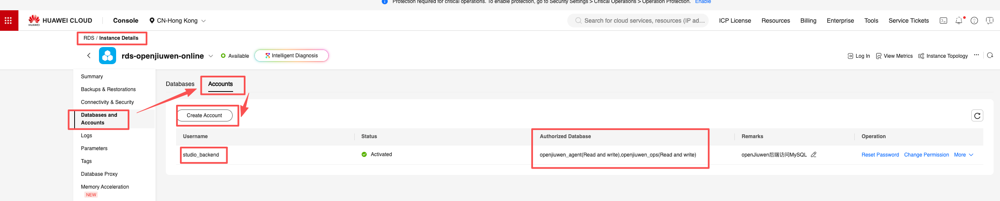
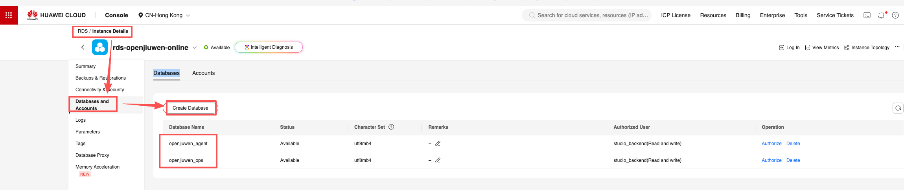
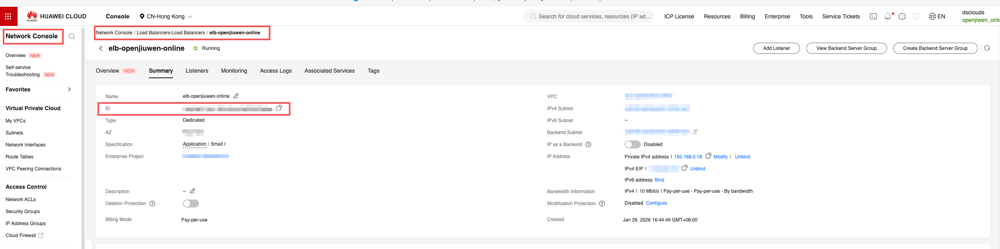
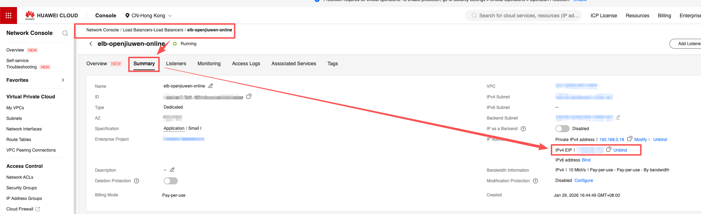
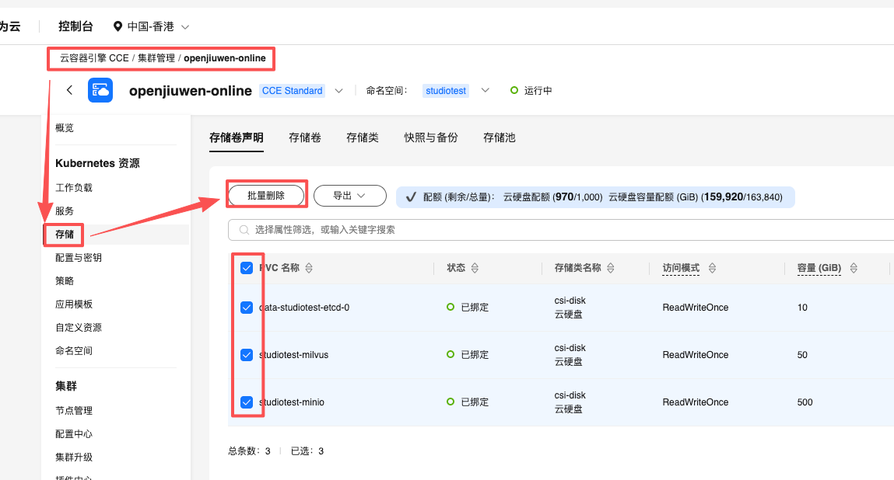

# Distributed Deployment Guide (Kubernetes + Helm)

This guide describes how to deploy **openJiuwen** on **Linux** using **Kubernetes + Helm**, with **Huawei Cloud** as an example (using managed services such as **RDS**, **DCS**, **CCE**, etc.).

---

## 1. Prerequisites

### 1.1 Cloud resources (Huawei Cloud example, Huawei Cloud Official Website: https://www.huaweicloud.com/)

Prepare the following resources in the **same VPC/subnet** to ensure private network connectivity.

- **RDS (MySQL)**
  - Recommended version: MySQL 8.0+
  - Recommended charset: `utf8mb4`
  - Information to record:
    - Private endpoint (Host)
    - Port (Port)
    - Database username/password
    
    - Databases for openJiuwen (e.g. `openjiuwen_agent`, `openjiuwen_ops`)
    - 
  - Notes:
    - Allow MySQL port (default `3306`) from the CCE node CIDR in the security group

- **DCS (Redis)**
  - Recommended version: Redis 6.0+
  - Information to record:
    - Private endpoint (Host)
    - Port (Port)
    - Password (if auth is enabled)

- **OBS (Object Storage, optional but recommended)**
  - Prepare an **OBS bucket** to store business files (e.g. uploads, model files, etc.).
  - Information to record:
    - Bucket name (e.g. `openjiuwen-bucket`)
    - Endpoint/Server (e.g. `obs.cn-north-4.myhuaweicloud.com`)
    - Access keys with bucket permissions:
      - Access Key ID
      - Secret Access Key
  - Recommendation:
    - Create a dedicated AK/SK with **least privilege** (read/write only for the target bucket).

- **CCE (Kubernetes cluster and nodes)**
  - Kubernetes version: use an LTS version (typically 1.24+)
  - Node OS: Linux (EulerOS / CentOS / Ubuntu, etc.)
  - Suggested node spec:
    - CPU: at least 4 cores (adjust based on scale)
    - Memory: at least 8GB (adjust based on scale)
    - Disk: reserve sufficient space for your data
  - Ensure CCE storage add-ons are ready (e.g. StorageClass `csi-disk`).

- **ELB + EIP (public entry for external access, optional; required when the project needs to be exposed to the Internet)**
  - Prepare an ELB instance (shared or dedicated) for the frontend, and bind an **EIP**.
  - Information to record:
    - ELB instance ID
    
    - Bound EIP (public IP)
  - You will access the system via `EIP + frontend exposed port`.
    - Domain DNS records, certificate mounting, and TLS termination can be done by yourself, or refer to:
      - [Encryption and Authentication Guide](./Encryption and Authentication Guide.md)
      - [HTTPS Configuration Guide](./Configure HTTPS.md)

### 1.2 Bastion host / ops machine

Prepare a Linux bastion host in the same VPC as CCE (or any machine that can reach the cluster API server) to run `kubectl` / `helm` commands.

- Installed:
  - `kubectl` (matching the cluster version). See: [Connect to a CCE cluster using kubectl](https://support.huaweicloud.com/usermanual-cce/cce_10_0107.html#section1)
  - `helm` v3+. See: [Deploy applications with Helm v3 client](https://support.huaweicloud.com/usermanual-cce/cce_10_0144.html)
  - `git`

For CentOS / Red Hat family systems, install Git with:

```bash
sudo dnf install git -y
```

- Kubeconfig is configured correctly and you can run:

```bash
kubectl get nodes
```

### 1.3 Other requirements

- Network:
  - Bastion host can reach RDS/DCS private endpoints
  - CCE nodes can reach RDS/DCS/SMTP and image registries
    - If public network access is required, you may use a NAT gateway approach. See: [Access the Internet from a Pod](https://support.huaweicloud.com/bestpractice-cce/cce_bestpractice_10049.html)
- Permissions:
  - Permissions to create namespaces, deploy Helm releases, and manage PVC/PV resources
- Email:
  - If you enable password login/verification, prepare SMTP server address and credentials

---

## 2. Configure storage (StorageClass)

You usually need a **default StorageClass** so that Helm charts can create PVCs automatically.

The following example marks `csi-disk` as the default StorageClass:

```bash
kubectl patch storageclass csi-disk \
  -p '{"metadata": {"annotations":{"storageclass.kubernetes.io/is-default-class":"true"}}}'
```

Verify:

```bash
kubectl get storageclass
```

You should see `(default)` on `csi-disk`.

> If your StorageClass name is different, replace `csi-disk` with the actual one.

---

## 3. Get the project

Clone the repository on the bastion host and enter the project root directory:

```bash
git clone https://gitcode.com/openJiuwen/agent-studio.git
cd agent-studio
```

All Helm commands below are executed under `helm/studio`.

---

## 4. Configure Helm deployment parameters

### 4.1 Copy the production values template

```bash
cd helm/studio
cp values-prod.example.yaml values-prod.yaml
```

### 4.2 Configure MySQL (RDS)

Edit `values-prod.yaml` (some fields such as `DB_USER` have defaults in `values.yaml`; you may omit them in `values-prod.yaml` if they match your configuration). Fill in MySQL parameters based on your Huawei Cloud RDS instance (field names depend on the template; add fields manually if they are missing; common examples include):

- DB endpoint:
  - `DB_HOST: <your-rds-host>`
- Credentials:
  - `DB_USER: <your-rds-user>`
  - `DB_PASSWORD: <your-rds-pwd>`
- Databases:
  - `AGENT_DB_NAME: openjiuwen_agent`
  - `OPS_DB_NAME: openjiuwen_ops`

Make sure:

- The RDS security group / whitelist allows access from the CCE node network
- Charset is `utf8mb4`

### 4.3 Configure Redis (DCS)

Fill in Redis parameters (create them if missing in the file):

- Endpoint and port (if port is the default `6379`, you may omit it):
  - `REDIS_HOST: <your-dcs-host>`
  - `REDIS_PORT: <your-dcs-port>`
- Password (if enabled):
  - `REDIS_PASSWORD: <your-dcs-password>`

### 4.4 Configure OBS (Huawei Cloud OBS integration)

Fill in the following 4 parameters in `values-prod.yaml`:

- `OBS_BUCKET`: bucket name, e.g. `openjiuwen-bucket1`
- `OBS_SERVER`: OBS endpoint (server), e.g. `obs.cn-north-4.myhuaweicloud.com`
- `OBS_ACCESS_KEY_ID`: Access Key ID with bucket permissions
- `OBS_SECRET_ACCESS_KEY`: Secret Access Key

> Recommendation: create a dedicated AK/SK with least privilege and keep it secure.

### 4.5 Configure SMTP (if enabling password login)

If you enable password login (e.g. `VITE_ENABLE_NEW_AUTH=true` and email verification is required), configure SMTP parameters:

- `SMTP_HOST: <smtp-host>`
- `SMTP_PORT: <smtp-port>`
- `SMTP_ALIAS: <smtp-username>`
- `SMTP_PASSWORD: <smtp-password>`
- `SMTP_USER: <noreply@example.com>`

### 4.6 Configure external access (ELB / Service)

Choose an access method and configure it in `values-prod.yaml`.

This guide recommends **ELB + EIP** as the unified public entry for the frontend.

#### 4.6.1 Fill in the ELB ID in values-prod.yaml

Find the frontend service section and set the ELB ID:

```yaml
frontend:
  service:
    elb:
      id: "<your-elb-id>"
```

- Replace `id` with the ELB instance ID from the Huawei Cloud console.
- External users can access the frontend via `EIP + frontend exposed port`.

> Notes:
>
> - DNS records, certificate mounting, and TLS termination on ELB can be done by yourself, or refer to:
>   - [Encryption and Authentication Guide](./Encryption and Authentication Guide.md)
>   - [HTTPS Configuration Guide](./Configure HTTPS.md)
> - If you only need intranet access or prefer another exposure method, adjust Service/Ingress accordingly.

#### 4.6.2 Other access methods (optional)

- If you use an Ingress controller:
  - Enable Ingress
  - Configure domain and TLS parameters
- For intranet testing only:
  - You may use NodePort (intranet access only).

> See `values-prod.example.yaml` for ELB/Service/Ingress examples.

### 4.7 Instances parameter
Parameters related to backend, frontend, and sandbox-gateway instances, including but not limited to the number of instances (replicaCount) and image version (tag), can all be configured in values-prod.yaml:


---

## 5. One-click deployment (Helm)

Before running Helm, you may tune `values-prod.yaml` based on your cluster capacity and expected load, such as:

- replicas (`replicaCount`)
- per-pod resources (`resources.requests` / `resources.limits`)
- image version (`image.tag`)

Then deploy:

```bash
cd helm/studio
helm dependency build
helm upgrade --install studio . -f values-prod.yaml
```

Explanation:

- `helm dependency build`: fetch and update chart dependencies
- `helm upgrade --install studio . -f values-prod.yaml`:
  - Install or upgrade the release named `studio` in the current namespace (default `default`; use `-n <namespace>` to specify). You may use a different release name; this guide uses `studio` as an example.
  - Use parameters from `values-prod.yaml` to override default configuration.

If you want to deploy into a dedicated namespace:

```bash
helm upgrade --install studio . -f values-prod.yaml -n studio --create-namespace
```

Check pods:

```bash
kubectl get pods -n <namespace>
```

When all core component pods are `Running` / `Ready`, the deployment is complete.

---

## 6. Access the system

Depends on your Service/ELB configuration:

- **If ELB is enabled**:
  - Access (default frontend port is `3000` if not changed):
    - `http://<your-eip>:<your-frontend-port>`

  

- **If NodePort is used (intranet access only)**:
  - Check services:

  ```bash
  kubectl get svc -n <namespace>
  ```

  Access via the returned Service type, cluster IP, and port:
  - `http://<your-node-ip>:<your-frontend-service-node-port>`

If you use HTTPS with a self-signed certificate, the browser may warn "Your connection is not private".

- This is expected for self-signed certificates.
- If you confirm you are accessing your own openJiuwen instance, you can proceed via the browser’s advanced options.

---

## 7. FAQ

### Q1: PVC stays in Pending

Check StorageClass:

```bash
kubectl get storageclass
```

Make sure there is a default StorageClass (marked as `(default)`). If not configured or incorrect, you can set `csi-disk` (or another StorageClass) as default:

```bash
kubectl patch storageclass csi-disk \
  -p '{"metadata": {"annotations":{"storageclass.kubernetes.io/is-default-class":"true"}}}'
```

### Q2: Pods cannot connect to MySQL/Redis

- Verify host/port/credentials in `values-prod.yaml`
- Verify security group rules / whitelist for RDS and DCS
- Test connectivity from within the cluster if needed

### Q3: How to upgrade / rollback

- Upgrade after changing `values-prod.yaml`:

```bash
helm upgrade --install studio . -f values-prod.yaml -n <namespace>
```

- View history:

```bash
helm history studio -n <namespace>
```

- Rollback:

```bash
helm rollback studio <revision> -n <namespace>
```

### Q4: How to uninstall

```bash
helm uninstall studio -n <namespace>
```

PVC/PV resources are **not** removed automatically by `helm uninstall`. Delete them carefully if you no longer need the data.

As an example, on **Huawei Cloud CCE**, you can clean up unused PVC/PV from the console (make sure the data is no longer needed before doing this):

1. Log in to the Huawei Cloud console, go to **Cloud Container Engine (CCE)**, and open the target cluster.
2. In the left navigation, go to `Storage` → `PersistentVolumeClaims (PVC)`:
   - In the target namespace (for example, `studio`), locate PVCs related to this deployment.
   - After confirming the associated workloads are removed and data is backed up or no longer required, delete the PVCs you no longer need.
3. If you also want to clean up underlying PVs, go to `Storage` → `PersistentVolumes (PV)`:
   - Check PVs that are associated with the deleted PVCs (typically in `Released` or similar status).
   - Delete the PVs you no longer need to release the underlying cloud disk or storage resources.

Example screenshot (PVC cleanup on Huawei Cloud CCE):



