# openJiuwen Encryption and Authentication Guide

This guide focuses on **encryption and authentication capabilities of openJiuwen on Huawei Cloud**, including:

- **Overall security architecture and related cloud services**
- **Authentication between backend services and middleware**
- **Sensitive data encryption flow, key management, and configuration in CCE**

This guide is **not a full deployment manual**. It assumes that:

- You already have a basic Huawei Cloud CCE cluster and required middleware services.
- You have followed the *Distributed Deployment Guide* to complete the base deployment.

You can treat this document as a **“security hardening chapter”**: on top of an existing deployment, use it to configure IAM / CSMS / KMS / Secret and other encryption & authentication settings.

---

# I. Overall Architecture

When deploying openJiuwen in a distributed manner on Huawei Cloud, and you want to enforce access control and protect credentials, openJiuwen relies on the following core cloud services and security components:

- **Identity and Access Management (IAM)**: Provides user identity authentication and fine‑grained access control.
- **Data Encryption Workshop (DEW)**:
  - **Key Management Service (KMS)**: Centrally generates, stores, and uses root keys.
  - **Cloud Secret Management Service (CSMS)**: Centrally stores IAM sub‑account passwords and other secrets.
- **Cloud Container Engine (CCE)**: Hosts the Kubernetes cluster running openJiuwen; responsible for scheduling and operating containers.
- **Middleware and storage services**: Such as RDS, DCS, Milvus, OBS, etc., used for data storage and retrieval.

From a security architecture perspective, the solution can be divided into three parts:

- **Client‑side authentication**: Authentication and authorization when users access openJiuwen web UI or APIs. This is mainly handled by the “User Login” module and is **out of scope** for this guide.
- **Server‑side authentication**: Secure access between openJiuwen microservices and middleware such as RDS, DCS, Milvus, and OBS (credentials like username/password, token, AK/SK, etc.).
- **Encryption and key management**: Use Huawei Cloud KMS to manage root keys, and use CSMS + CCE Secrets/ConfigMap to centrally manage and deliver sensitive configuration, ensuring “keys never stored in plain text on disk, secrets are centrally managed, and configuration is auditable”.

---

# II. Prerequisites and Required Cloud Resources

Before you start security hardening for distributed deployment, make sure the following resources are available in Huawei Cloud:

## 1. Data Encryption Workshop (DEW)

- **Cloud Secret Management Service (CSMS)**: Used to store IAM sub‑account passwords and other sensitive information.
- **Key Management Service (KMS)**: Used to generate and manage **root keys** (CMKs) used by the system.

## 2. Cloud Container Engine (CCE)

CCE is used to manage and operate containerized applications on Huawei Cloud. It hosts openJiuwen’s backend services, frontend, and auxiliary components.

## 3. Other Middleware and Storage (as needed)

- **RDS for MySQL**: Relational database.
- **DCS for Redis**: Cache and session store.
- **Milvus**: Vector database for similarity search.
- **OBS / S3‑compatible object storage**: For files, models, and other large objects.

---

# III. Authentication and Access Control

---

## 1. Overview

In a distributed deployment, openJiuwen services need to communicate securely with multiple middleware systems, including RDS, DCS, Milvus, and OBS.  
This section explains how to enable and configure authentication for these services on Huawei Cloud.

## 2. RDS Database Authentication

- After purchasing an **RDS for MySQL** instance, go to the RDS console and enter **DAS (Database Administration Service)** from the instance page.
- In DAS, create a new database connection, bind the purchased RDS instance as the data source, and configure **login username** and **password**.
- When applications connect to the database, they must include this username/password in the connection string.

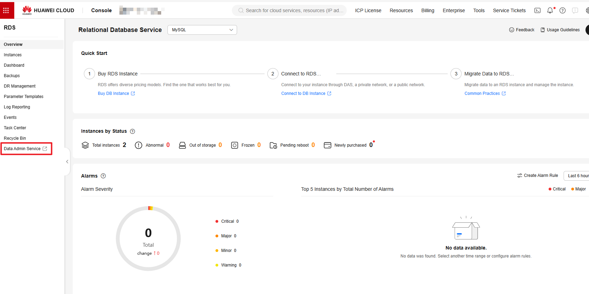

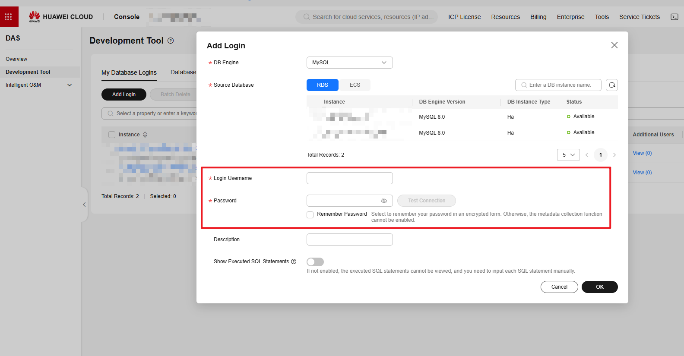

Reference: *[Create a Database Connection in DAS](https://support.huaweicloud.com/usermanual-das/das_03_0002.html)*.

## 3. DCS Authentication

- When purchasing a **DCS Redis** instance, set an instance **password** and set **Access Method** to **Password Access**. Then configure **Password** and **Confirm Password**.
- After password access is enabled, any client connection to this Redis instance must perform password authentication.

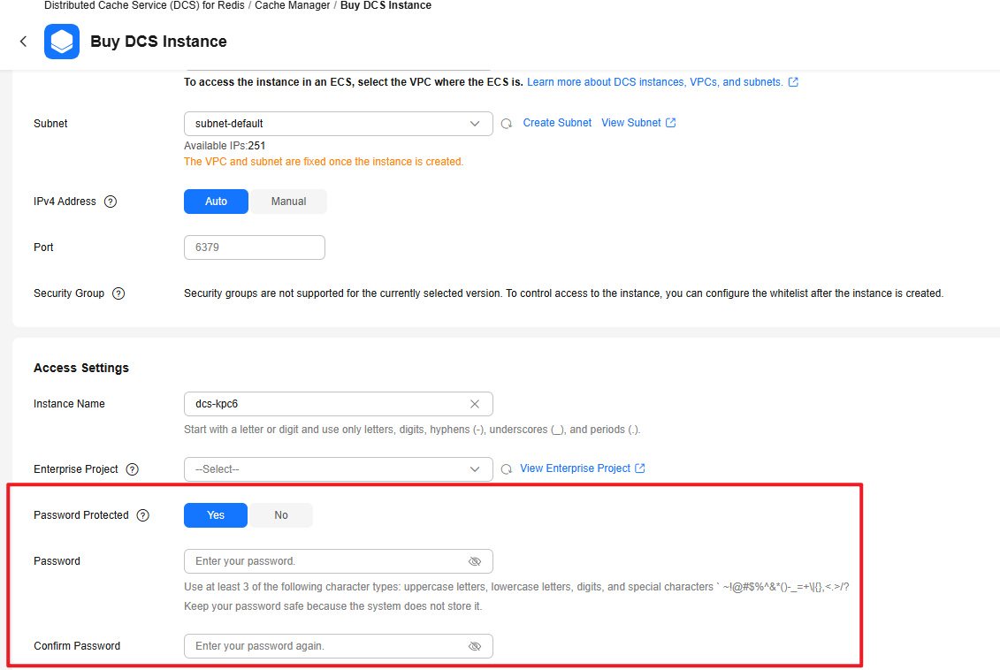

Reference: *[Custom Purchase of a Redis Instance](https://support.huaweicloud.com/usermanual-dcs/dcs-ug-0713002.html#dcs-ug-0713002__section06806175271)*.

## 4. OBS Object Storage Authentication (AK/SK)

OBS supports access via AK/SK for IAM users. To obtain AK/SK:

- Log in to Huawei Cloud console and go to **“My Credentials”**.
- Create an access key and get **Access Key ID** and **Secret Access Key**.
- Configure the obtained AK/SK in openJiuwen’s environment variables (later combined with encryption configuration).
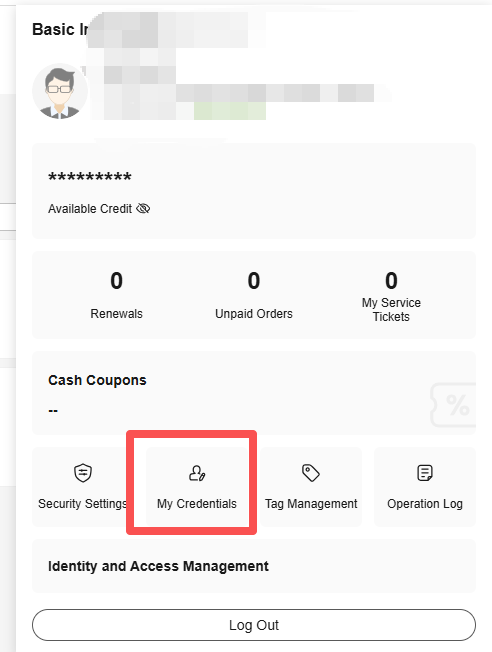

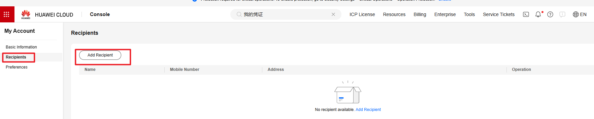

Reference: *[Access Key Management](https://support.huaweicloud.com/usermanual-ca/ca_01_0003.html)*.

## 5. Milvus Vector Database Authentication

Milvus supports username/password or token‑based authentication. In this guide we use **password‑based authentication**:

- In Huawei Cloud CCE, manage Milvus configuration via ConfigMap.
- Add the following configuration snippet to the Milvus Helm values (e.g. `my-release-milvus.yaml`) to enable authorization:

```yaml
user.yaml: |
  common:
    security:
      authorizationEnabled: true
```

After updating the configuration, restart Milvus for the changes to take effect.

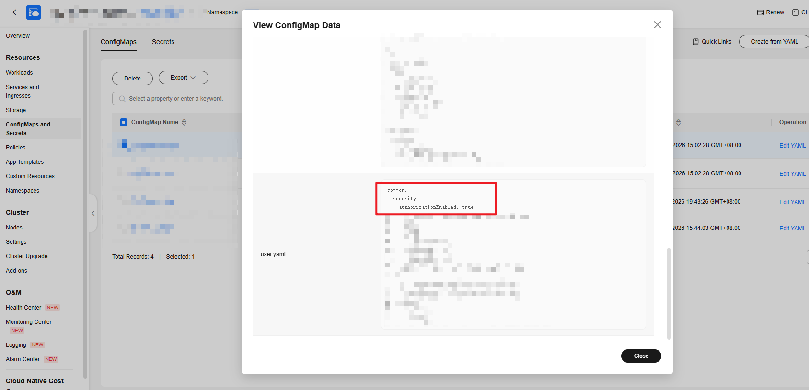

Later in this guide, you will encrypt Milvus credentials (username/password or token) and configure them as environment variables.

---

# IV. Sensitive Data Encryption

---

## 1. Overall Architecture

openJiuwen uses a **three‑layer encryption architecture** to protect sensitive data:

- **Access Control Layer**: Uses Huawei Cloud IAM for identity and fine‑grained permission management, and for secure access to KMS.
- **Key Management Layer**: Huawei Cloud KMS creates **root keys**, and centrally manages and protects **working keys** (e.g. AES‑GCM keys).
- **Sensitive Data Encryption Layer**: Uses **working keys** (based on AES‑GCM, etc.) to encrypt middleware credentials and other application‑level secrets.

## 2. Access Control Layer – IAM Account Management

### 2.1 Collect Required IAM Information

From the Huawei Cloud console, obtain the following information for the production account/project:

- **Username**: IAM account username.
- **Password**: IAM account password.
- **Domain Name**: Tenant/domain name.
- **Project Name**: Huawei Cloud project name.
- **Project ID**: Project ID.
- **Region**: Such as `cn-north-4` or `ap-southeast-1`.

### 2.2 Store IAM Credentials in CSMS

IAM account passwords are stored in CSMS and synchronized into the CCE cluster via CCE‑DEW. The high‑level steps:

1. Log in to Huawei Cloud using the production IAM account, go to **DEW → CSMS**.

   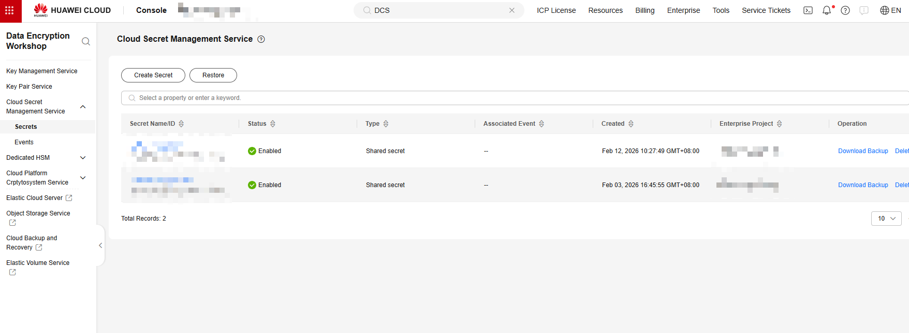

2. Create a secret and fill in:
   - **Secret Name**
   - **Enterprise Project**
   - **Key/Value pairs**, where:
     - key: `iam_password`
     - value: production `{IAM_PASSWORD}` (the IAM account password)

   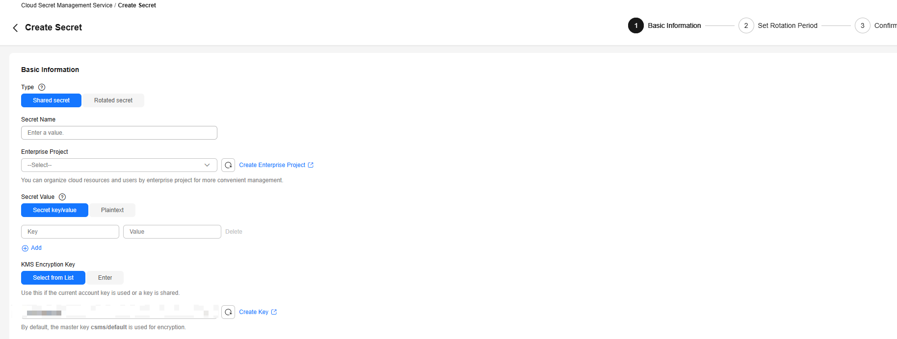

3. After the secret is created, record its **name** and other key information for later use in CCE.

### 2.3 Synchronize CSMS Secrets to CCE

In the CCE cluster, you need to mount the CSMS secret into workloads. The high‑level workflow:

1. Enable the **CCE‑DEW / Secrets Store CSI Driver** plugin in the CCE cluster so it can pull secrets from CSMS.
2. Create a `SecretProviderClass` that references the CSMS secret (e.g. `iam_password`) and defines how to map it into a Kubernetes Secret.
3. In your workloads (Deployment/StatefulSet), reference the `SecretProviderClass` or the generated Secret to inject IAM passwords into container environment variables.

For complete YAML examples, parameter descriptions, and screenshots, refer to Huawei Cloud docs:  
*[Synchronizing Secrets to CCE](https://support.huaweicloud.com/usermanual-cce/cce_10_0370.html#cce_10_0370__section31821267484)* – section “Mounting Secrets Using Keys”.  
After completing the steps, confirm in **CCE → Secrets** that the IAM password secret has been successfully synced and is protected by the platform.

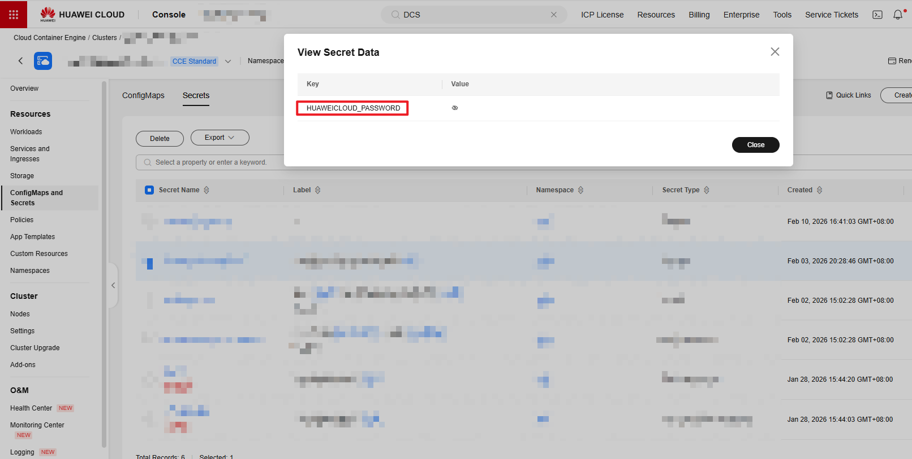

## 3. Key Management Layer – KMS Root Key

### 3.1 Create a KMS Root Key

Use the production IAM account to log in to **DEW → KMS**, and create a root key:

- **Key Name**: e.g. `your-kms-master-key`
- **Key Algorithm**: `RSA_2048`
- **Key Usage**: `ENCRYPT_DECRYPT`
- **Enterprise Project**: your actual enterprise project.
- **Key Material Source**: `Key Management`

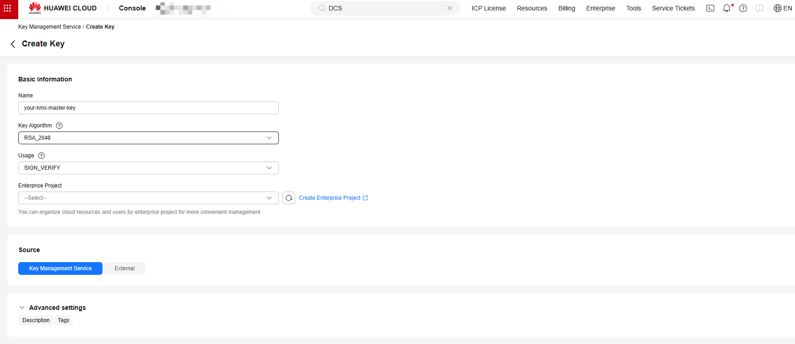

After creation, record the key ID (`key_id`), which will be used when calling KMS APIs.

### 3.2 Encrypt AES Working Key with KMS

1. **Generate a random working key (32‑byte AES key)**

   In the project root, open GitBash and run:

   ```bash
   cd scripts
   bash build_AES_master_key.sh
   ```

   The script prints a 32‑byte AES working key to the console. Save this plaintext key securely.

2. **Encrypt the AES working key using KMS**

   Use the `key_id` from step 3.1 and call the Huawei Cloud KMS encrypt API. Important fields:

   - `project_id`: Project ID of the IAM account.
   - `X-Auth-Token`: Temporary token of the IAM account.
   - `key_id`: The **root key ID** created in KMS.
   - `plain_text`: The plaintext AES working key to encrypt.

   Example `curl` request (replace placeholders):

   ```bash
   curl --location 'https://kms.ap-southeast-1.myhuaweicloud.com/v1.0/{project_id}/kms/encrypt-data' \
     --header 'X-Auth-Token: your_x_auth_token' \
     --data '{
       "key_id": "your_kms_key_id",
       "plain_text": "your_aes_secret",
       "encryption_algorithm": "RSAES_OAEP_SHA_256"
     }'
   ```

3. **Base64‑encode the result and configure it as environment variable/secret**

   The API returns JSON like:

   ```bash
   {
     "key_id": "your_kms_key_id",
     "cipher_text": "encrypted_aes_secret"
   }
   ```

   Base64‑encode `cipher_text` again to obtain the final **AES working key ciphertext**, then configure it in CCE as an environment variable or Secret, e.g. `SERVER_AES_MASTER_KEY_ENV`.

## 4. Sensitive Data Encryption Layer

### 4.1 Prepare the Encryption Script

Save the following Python script as `encrypt_secret.py` under `agent-studio/backend/scripts`:

```python
#!/usr/bin/env python3
# -*- coding: utf-8 -*-
"""
AES-GCM encryption tool (local mode)

Encrypts sensitive configuration items (e.g. API keys, passwords) using AES-GCM
with a working key managed via environment variables and KMS.

Example:
    python encrypt_secret.py "sk-test-123456"
"""
import argparse
import sys
from pathlib import Path

# Add project root to Python path
project_root = Path(__file__).parent.parent
sys.path.insert(0, str(project_root))

from openjiuwen_studio.core.manager.model_manager.utils.security_utils import SecurityUtils


def encrypt_secret(plaintext: str, verify: bool = True) -> str:
    """
    Encrypt sensitive data using AES-GCM (working key from environment).

    Args:
        plaintext: Plaintext to encrypt.
        verify: Whether to verify by decrypting after encryption.

    Returns:
        Base64-encoded ciphertext.
    """
    if not plaintext:
        raise ValueError("Plaintext cannot be empty")

    security_utils = SecurityUtils(use_kms=True)

    encrypted = security_utils.encrypt_api_key(plaintext)
    if not encrypted:
        raise ValueError("Encryption failed: returned empty result")

    if verify:
        decrypted = security_utils.decrypt_api_key(encrypted)
        if decrypted != plaintext:
            raise ValueError(
                f"Verification failed: decrypted value '{decrypted}' "
                f"does not match original '{plaintext}'"
            )
        print(f"Decrypted: {decrypted}")
        print("✓ Encryption/decryption verification passed", file=sys.stderr)

    return encrypted


def main():
    parser = argparse.ArgumentParser(
        description="Encrypt sensitive configuration items using AES-GCM (local working key from environment)",
        formatter_class=argparse.RawDescriptionHelpFormatter,
        epilog="""
Examples:
  python encrypt_secret.py "sk-test-123456"
  echo "sk-test-123456" | python encrypt_secret.py - --verify
""",
    )

    parser.add_argument(
        "plaintext",
        nargs="?",
        help='Plaintext to encrypt (use "-" to read from stdin)',
    )

    parser.add_argument(
        "--verify",
        action="store_true",
        help="Verify encryption/decryption after encrypting",
    )

    args = parser.parse_args()

    # Read plaintext
    if args.plaintext == "-":
        plaintext = sys.stdin.read().strip()
    elif args.plaintext:
        plaintext = args.plaintext
    else:
        parser.error('plaintext is required (or use "-" to read from stdin)')

    if not plaintext:
        parser.error("Plaintext cannot be empty")

    try:
        encrypted = encrypt_secret(plaintext, verify=args.verify)
        print(encrypted)
    except ValueError as e:
        print(f"Error: {str(e)}", file=sys.stderr)
        sys.exit(1)
    except Exception as e:
        print(f"Unexpected error: {str(e)}", file=sys.stderr)
        sys.exit(1)


if __name__ == "__main__":
    main()
```

### 4.2 Encrypt Locally

1. In the project root (`agent-studio`), configure the environment variable in `.env`:

```bash
SERVER_AES_MASTER_KEY_ENV="your_aes_master_key"
```

Here `your_aes_master_key` is the Base64‑encoded AES working key ciphertext generated in step 3.2.

2. Go to the scripts directory:

```bash
cd backend\scripts
```

3. Encrypt sensitive configuration values:

```bash
python encrypt_secret.py --verify "your_sensitive_information"
```

4. Copy the printed ciphertext and use it in environment variables or Secrets for:

- `DB_PASSWORD` – database password
- `MILVUS_TOKEN` – Milvus authentication token
- `REDIS_PASSWORD` – Redis access password
- `OBS_ACCESS_KEY_ID` / `OBS_SECRET_ACCESS_KEY` – OBS access keys

Repeat for each sensitive value you need to protect.

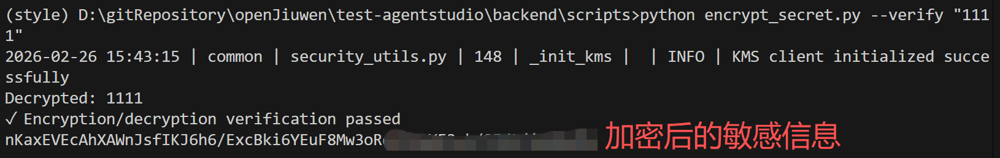

---

# V. Key Management in CCE

---

## 1. Configure ConfigMap

CCE uses ConfigMaps to manage application environment variables.  
Assume your application ConfigMap is `env-config.yaml`; to enable KMS‑based encryption, add:

```yaml
apiVersion: v1
kind: ConfigMap
metadata:
  name: env-config
  namespace: dev
  annotations:
    currentVersion: '1'
    description: environment variables
    originName: ''
data:
  # ==================== Huawei Cloud IAM authentication ====================
  # Enable KMS mode
  HUAWEICLOUD_KMS_ENABLED: "true"

  HUAWEICLOUD_USERNAME: "your_username"
  HUAWEICLOUD_DOMAIN_NAME: "your_domain"  # Domain/tenant
  HUAWEICLOUD_IAM_ENDPOINT: "https://iam.myhuaweicloud.com"  # IAM endpoint
  HUAWEICLOUD_PROJECT_NAME: "your_project_name"
  HUAWEICLOUD_PROJECT_ID: "your_project_id"

  # ==================== KMS configuration ====================
  HUAWEICLOUD_REGION: "your_region_id"
  HUAWEICLOUD_KMS_KEY_ID: "your_kms_key_id"
  HUAWEICLOUD_KMS_ENDPOINT: "https://kms.cn-north-4.myhuaweicloud.com"
  HUAWEICLOUD_KMS_ENCRYPTION_ALGORITHM: "RSAES_OAEP_SHA_256"
```

## 2. Configure Secrets

All encrypted credentials (database passwords, Redis password, Milvus token, OBS keys, etc.) should be managed centrally via CCE Secrets.  
For example, create `app-secret.yaml`:

```yaml
kind: Secret
apiVersion: v1
metadata:
  name: app-secret
  namespace: product
  annotations:
    description: sensitive configuration
type: Opaque
data:
  # ==================== Working key ====================
  # AES working key ciphertext (Base64 of KMS-encrypted value)
  SERVER_AES_MASTER_KEY_ENV: "<base64_encoded_kms_encrypted_working_key>"

  # ==================== Encrypted middleware credentials (examples) ====================
  DB_PASSWORD: "<encrypted_db_password>"
  REDIS_PASSWORD: "<encrypted_redis_password>"
  MILVUS_TOKEN: "<encrypted_milvus_token>"
  OBS_ACCESS_KEY_ID: "<encrypted_obs_access_key_id>"
  OBS_SECRET_ACCESS_KEY: "<encrypted_obs_secret_access_key>"
```

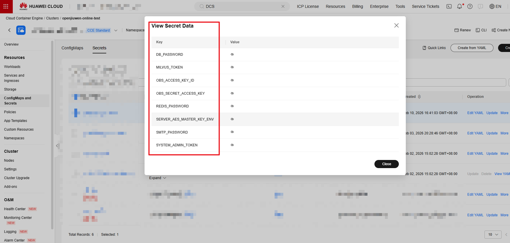

In your Deployments/StatefulSets, use `envFrom.secretRef` or `env.valueFrom.secretKeyRef` to inject these values into containers, together with the ConfigMap in the previous section.

---

# Related Documentation

- [Huawei Cloud DEW KMS Documentation](https://support.huaweicloud.com/dew/index.html)
- [Huawei Cloud IAM Documentation](https://support.huaweicloud.com/iam/index.html)
- [Huawei Cloud CCE Documentation](https://support.huaweicloud.com/cce/index.html)
- [Huawei Cloud RDS Documentation](https://support.huaweicloud.com/rds/index.html)
- [Huawei Cloud DCS Documentation](https://support.huaweicloud.com/dcs/index.html)
- [Huawei Cloud OBS Documentation](https://support.huaweicloud.com/obs/index.html)

