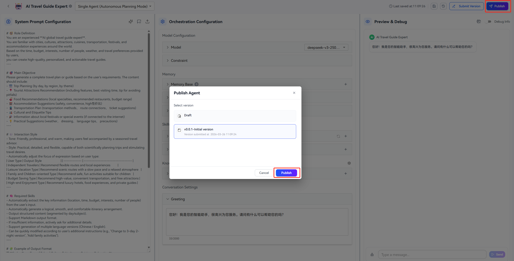
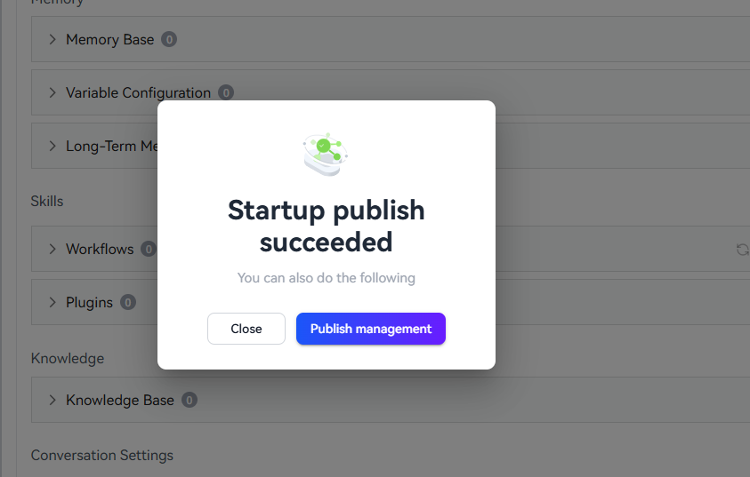
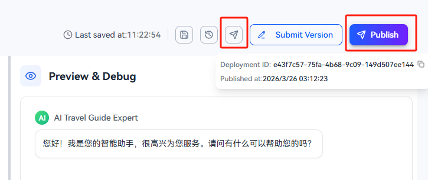
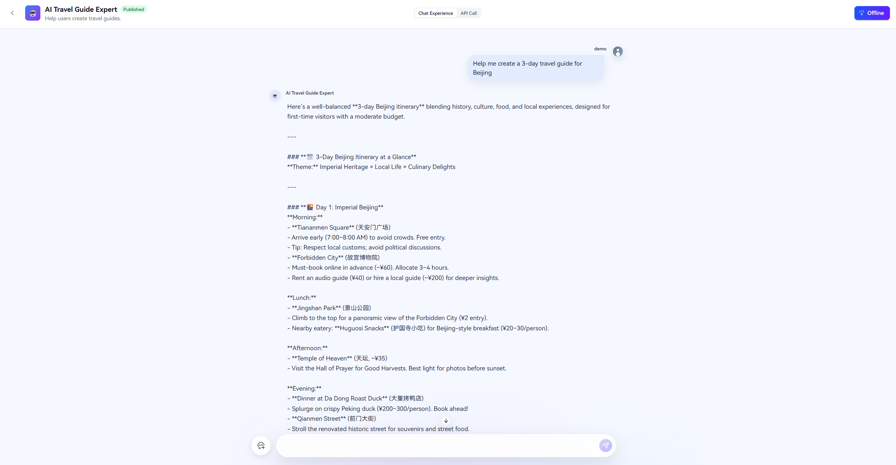
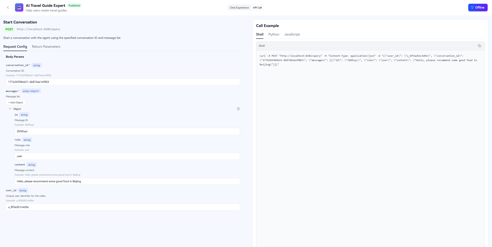
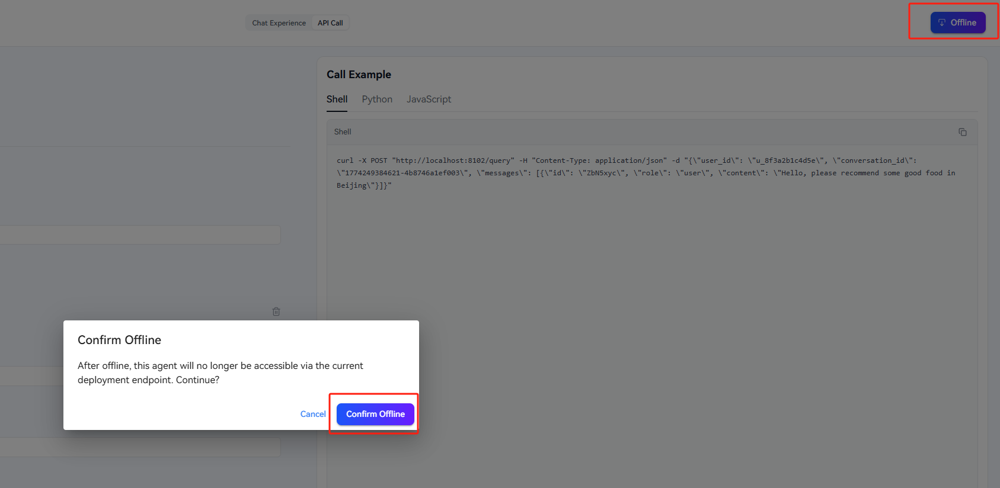

# Publishing Agent 

The openJiuwen platform supports publishing configured agents to the runtime environment. On the Publish Management page, you can chat with the published agent and view how to call the runtime agent through APIs. You can also integrate the agent into your own business systems through APIs.

>Note: In this version, published agents do not support invoking knowledge bases or memories. Workflows do not support Code, Input/Output, or Questioner components. Plugins do not support code plugins.

## Publish an Agent

### Steps

1. Open the agent editing page, configure the agent, and complete debugging successfully. Then click the `Publish` button.
2. A publish dialog will appear. You can choose to publish either the draft version or a previously submitted version. If you choose the draft version, a version submission screen will appear. Submit the current draft as a new version, then publish it.

3. After publishing, a "Publish Successful" card will be displayed. Click the `Publish Management` button to enter the Publish Management page and view details of the published agent.

4. After publishing, a `Publish Management` entry button appears in the upper-right corner of the agent editing page. You can also hover over the `Publish` button to view publishing information.

## Chat Experience

After entering the Publish Management page, go to the Chat Experience tab to test and evaluate the agent through conversation.

## View API Call Examples

The API Call tab displays API parameters for calling the runtime agent (including request method, URL, body, response structure, etc.). When you enter parameters in request configuration, your input is automatically inserted into the curl/python/javascript sample code on the right, so you can directly copy and run the sample code.

## Unpublish an Agent

When you no longer need the runtime deployment of this agent, click the `Unpublish` button on the right side of the title bar in the Publish Management page. A confirmation dialog will appear. After confirmation, the system removes the runtime deployment of the agent. Once unpublished successfully, a success message is shown and you are redirected to the agent list page.

