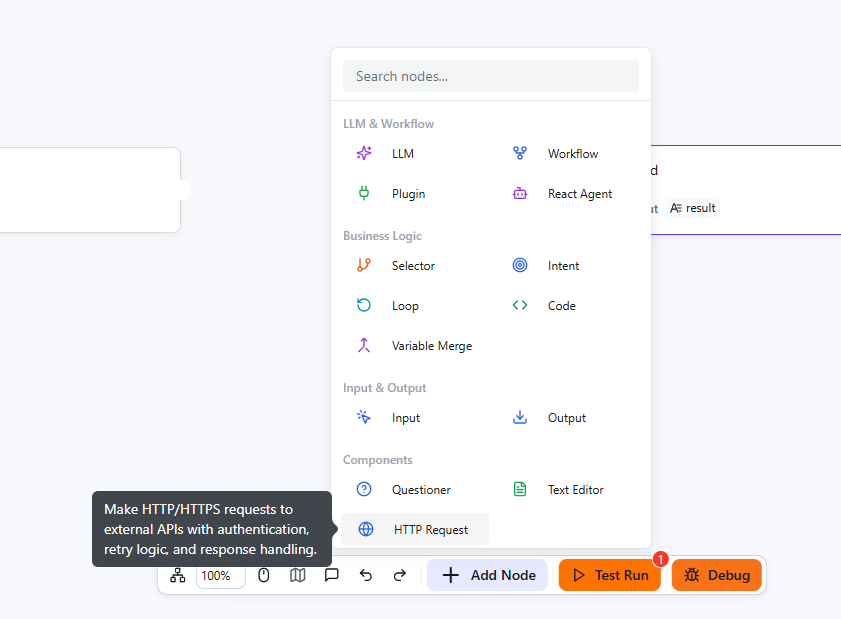

# HTTP Request Component

The HTTP Request node allows you to make HTTP/HTTPS requests to external APIs within your workflow. It supports various HTTP methods (GET, POST, PUT, DELETE, PATCH, HEAD, OPTIONS), authentication mechanisms, retry logic, rate limiting, and flexible response handling. This enables seamless integration with third-party services and APIs in your automation workflows.

# Configure Component

## Prerequisites

- Basic understanding of REST APIs and HTTP protocol
- Knowledge of HTTP methods (GET, POST, PUT, DELETE, etc.) and request/response concepts
- Target API endpoint URL and any required authentication credentials

## Steps

1. Go to the openJiuwen platform homepage.
2. In the left navigation, open the **Workflow Orchestration** module.
3. Click the **Add Component** button at the bottom of the page, then select **HTTP Request**.



4. Configure the URL and HTTP Method. Enter the request URL in the URL field and select the appropriate HTTP method from the dropdown menu (GET, POST, PUT, DELETE, PATCH, HEAD, OPTIONS).

5. Configure Request Headers (Optional). Add custom headers as key-value pairs by clicking the "Add Header" button. Common headers include Content-Type, Authorization, and custom API headers.

6. Configure Query Parameters (Optional). Add URL query parameters as key-value pairs. These will be appended to the request URL.

7. Set the Request Body (For POST, PUT, PATCH methods). 
   Enter the body content in the editor area or choose from the incoming params

8. Configure Authentication (Optional). Select the authentication type:
   - **None**: No authentication (default)
   - **Basic Auth**: Enter username and password
   - **Bearer Token**: Enter the token value
   - **API Key**: Enter the API key, select location (Header, Query, or Body), and specify the parameter name

## Output Structure

The HTTP Request node outputs a JSON object with the following structure:

| Field | Type | Description |
|-------|------|-------------|
| `error_code` | Integer | Error code (0 for success, non-zero for errors) |
| `error_msg` | String | Error message (empty string on success) |
| `data` | Object | Response data (JSON object for successful requests) |

### Success Response Example

```json
{
  "error_code": 0,
  "error_msg": "",
  "data": {
    "id": 123,
    "name": "Example Response",
    "status": "success"
  }
}
```

### Error Response Example

```json
{
  "error_code": 1,
  "error_msg": "HTTP request failed: Connection timeout",
  "data": {}
}
```