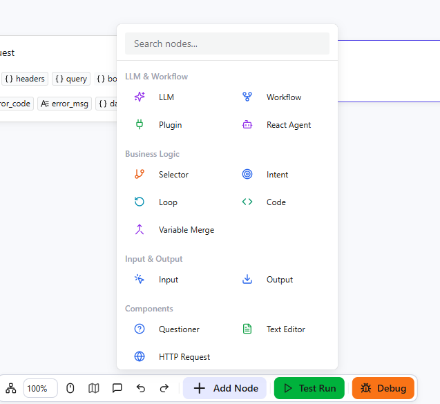
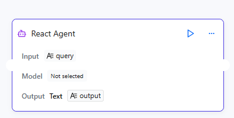
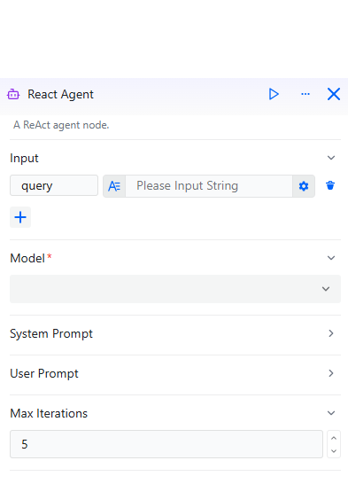
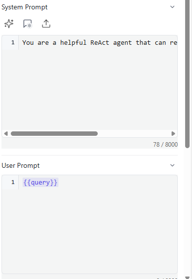

# Configuring ReactAgent Components

The ReactAgent component is an intelligent agent node provided by openJiuwen based on the ReAct (Reasoning + Acting) framework. Unlike a simple LLM component, the ReactAgent can autonomously reason and decide which tools to use, iterating through multiple reasoning-action cycles to solve complex problems. It supports using plugins and workflows as tools, enabling it to handle multi-step tasks that require external capabilities. The configuration process is as follows:

# Configure Component

## Prerequisites

* A model has already been added in Model Management.
* (Optional) Plugins have been configured in Plugin Management if you want the agent to use plugin tools.
* (Optional) Workflows have been created if you want the agent to use workflow tools.

## Steps

1. Go to the openJiuwen platform homepage.
2. Navigate to the Workflow Orchestration module in the left sidebar.
3. Click the Add Component button at the bottom of the page and select ReactAgent.

4. Click the ReactAgent component that appears on the canvas to start configuring it.

The parameters to configure are as follows:

| Parameter | Description |
|------|------|
| Inputs | A collection of variables used to inject dynamic content into prompts. Each input parameter requires a name and a corresponding value. The value can be a fixed value or a reference to the output of upstream components. Both the system prompt and the user prompt can use these parameters via variable reference syntax, enabling dynamic content adjustments. |
| Model Selection | Specifies the large language model used by the agent for reasoning. The model's capabilities directly affect the agent's reasoning quality and tool selection accuracy. Choose a model with strong reasoning capabilities for best results. |
| System Prompt | Defines the agent's role, behavioral guidelines, and response style. The default prompt is "You are a helpful ReAct agent that can reason and use tools to solve problems." Supports dynamically inserting input parameter content via variable reference syntax. |
| User Prompt | Represents the specific instruction or question sent to the agent. This field supports referencing variables from the input parameters, allowing the prompt content to change dynamically based on runtime data. |
| Max Iterations | The maximum number of reasoning-action cycles the agent can perform (range: 1-20, default: 5). Each iteration consists of the agent reasoning about the current state and deciding whether to use a tool. A higher value allows for more complex problem-solving but may increase execution time. |
| Skills | Tools available to the agent, including Plugins and Workflows. The agent will autonomously decide which tools to use based on the task requirements. You can add multiple plugins and workflows as needed. |
| Outputs | Set the names and descriptions of output parameters. The default output parameter is `output` (string type). Clear parameter names and descriptions help the model return matching content accurately. |

5. Configure Inputs and Model. Add input parameters that will be used in the prompts (e.g., add a `query` parameter to receive the user's question). Then select an appropriate LLM from the model list. Models with strong reasoning capabilities are recommended for better tool selection and multi-step problem solving.

6. Configure Prompts. Set the system prompt to define the agent's role and behavior. Set the user prompt to specify the task. You can use `{{variable_name}}` syntax to reference input parameters.

