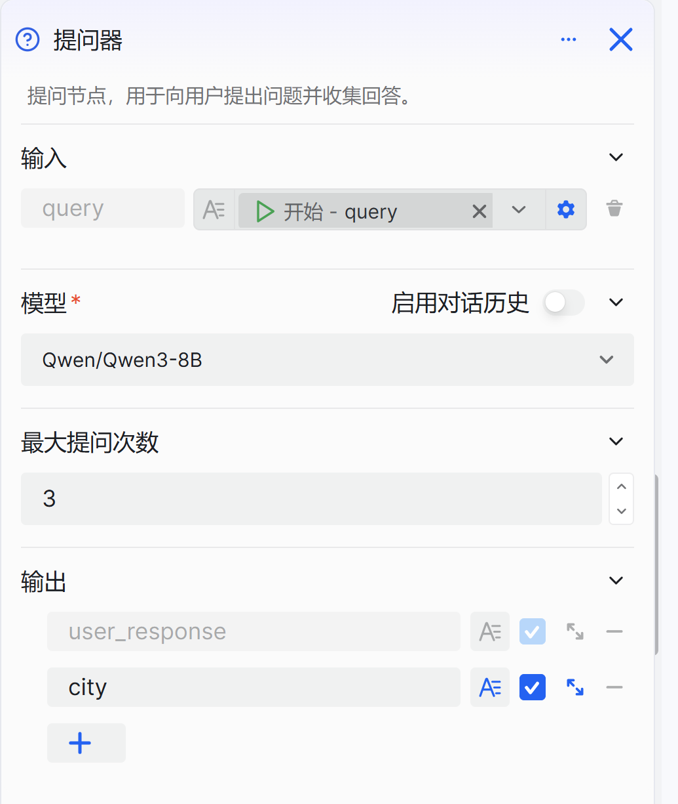
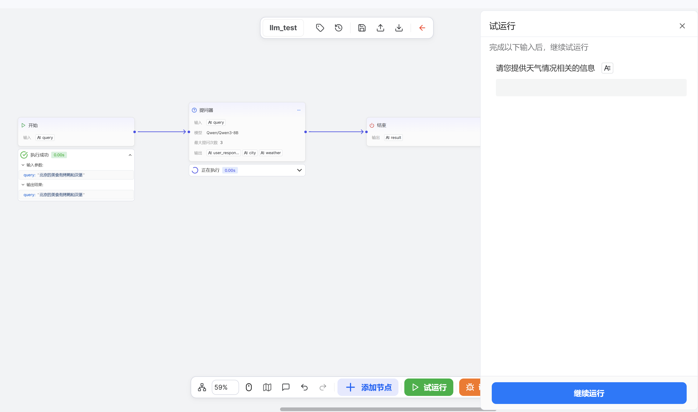

# Configure the Questioner Component

The Questioner component is an intelligent conversational interaction component for workflow design, tailored for developers who need to build smart dialog flows. It solves dependency issues on user information within workflows in scenarios where execution requires user-provided data or clarified intent. It collects information intelligently through the following:

- Preset Description: Extract key content from the input based on the description of the output parameters and output the result.- 
- Smart follow-up: If an output parameter is required, the system will automatically follow up within the maximum number of follow-up attempts until the necessary key information is obtained.

In this way, the Questioner component makes conversational interactions more natural and smooth, ensuring that when a workflow needs user input, it can collect information intelligently and efficiently. For example, in a weather inquiry scenario, the system asks for date and city, and extracts the location field from the user’s reply. If the information is incomplete, the system continues to ask questions to fill in the gaps.

# Configure the Component

## Steps
1. Go to the openJiuwen platform homepage.
2. Open the Workflow Orchestration module from the left navigation.
3. Click the Add Component button at the bottom of the page and select the Questioner component. 

4. Click the Questioner component on the canvas to start configuration. 

5. Configure input parameters. 

6. Configure the model.

7. Configure the maximum number of follow-up attempts

8. Configure output parameters.  

Set a description for the parameter in the output parameters. The large model can extract key content based on the parameter description and use it as the output of the questioner. If an output parameter is set as required, and the large model fails to extract the described content while no default value is set, the follow-up function will be triggered.

The configuration items for the Questioner component are as follows:

| Setting                    | Description                                                                                                                                                                                                                                                                                                                                                                                                                                                                                                                                                                                                                                                                                                                                                                                                                                                                                                                                                                                                                                                                                                                                                                                                                                                                                                                                                                                                                                                                                                                                                                                                                                                                                                                      |
|----------------------------|----------------------------------------------------------------------------------------------------------------------------------------------------------------------------------------------------------------------------------------------------------------------------------------------------------------------------------------------------------------------------------------------------------------------------------------------------------------------------------------------------------------------------------------------------------------------------------------------------------------------------------------------------------------------------------------------------------------------------------------------------------------------------------------------------------------------------------------------------------------------------------------------------------------------------------------------------------------------------------------------------------------------------------------------------------------------------------------------------------------------------------------------------------------------------------------------------------------------------------------------------------------------------------------------------------------------------------------------------------------------------------------------------------------------------------------------------------------------------------------------------------------------------------------------------------------------------------------------------------------------------------------------------------------------------------------------------------------------------------|
| Model                      | Select the model that executes this component; you can adjust parameters such as generation diversity to better fit your needs.                                                                                                                                                                                                                                                                                                                                                                                                                                                                                                                                                                                                                                                                                                                                                                                                                                                                                                                                                                                                                                                                                                                                                                                                                                                                                                                                                                                                                                                                                                                                                                                                  |
| Input                      | Define parameters to be incorporated into the question. Parameter values can reference outputs from upstream components or be fixed text.                                                                                                                                                                                                                                                                                                                                                                                                                                                                                                                                                                                                                                                                                                                                                                                                                                                                                                                                                                                                                                                                                                                                                                                                                                                                                                                                                                                                                                                                                                                                                                                        |
| Maximum Follow-up Attempts | An additional system prompt to improve questioning effectiveness.                                                                                                                                                                                                                                                                                                                                                                                                                                                                                                                                                                                                                                                                                                                                                                                                                                                                                                                                                                                                                                                                                                                                                                                                                                                                                                                                                                                                                                                                                                                                                                                                                                                                |
| Output                     | In direct-response mode, the component outputs the USER_RESPONSE variable by default, representing the user's full reply.    You can add output parameters to have the model automatically extract key information from the user's reply and save them as variables for downstream components.   We recommend using meaningful variable names and providing detailed descriptions to help the model accurately understand and extract the required information.   Variables can be marked as required. If a required field is missing from the user's reply, the workflow will continue to ask follow-up questions until the information is obtained or the maximum number of attempts (default: 3) is reached. The specific follow-up questions are dynamically generated by the model. In direct-response mode, the component outputs the USER_RESPONSE variable by default, representing the user’s full reply.   You can enable the field extraction feature to have the model automatically extract key information from the user’s reply and save it as variables for downstream components.   We recommend using meaningful variable names and providing detailed descriptions to help the model understand the variable definitions and extract information accurately.   Variables can be marked as required. If the user’s reply lacks required fields, the workflow will continue follow-up questions until it obtains the information or reaches the maximum number of inquiries (3 by default). The specific follow-up questions are generated dynamically by the model; you can add system prompts to define the model’s role and reply logic to make follow-ups more natural. |

## Example

Below is an example of the Questioner component. The questioner component is used for city and weather information, providing the necessary parameters for subsequent tool calls. The input to the questioner is: “Beijing’s food includes Peking duck and burgers.” The questioner extracts city: Beijing, but fails to extract any weather-related content, triggering the follow-up function.

