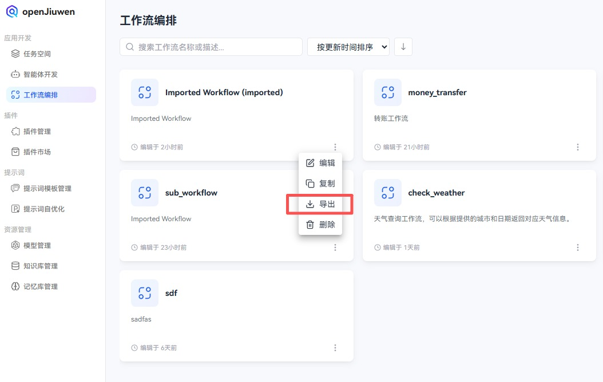
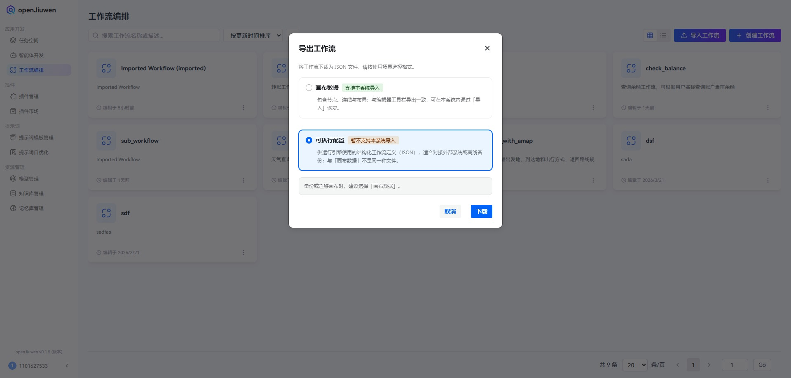

# Importing and Exporting Workflows

Workflows can be exported as JSON text files. After downloading the file locally, developers can import it into the workflow compiler to restore the workflow to the state at the time of import. This feature helps developers efficiently manage workflow history versions and enable cross-domain sharing, suitable for version control, team collaboration, and other scenarios.

## Exporting a Workflow

### Steps

1. Log in to the openJiuwen platform.
2. Go to the Workflow Orchestration module in the left navigation.
3. Open the workflow editor page.
4. Click the "Export" button in the top-right corner of the page. Your browser will automatically download the generated JSON file to your local machine. The exported file is named workflow-export-${current-year-current-month-current-day}.json.
   
   

### Example

The exported workflow file represents the workflow structure in JSON, including definitions for the workflow name, description, mode, icon, syntax version, nodes, and edges. Example:

```json
# Basic information structure
workflow: name: "Workflow Name"
description: "Workflow Description"
version: "1.0"
syntax_version: "v1"

# Node definition
nodes: - id: "Node ID"
type: "Node Type"
title: "Node Title"
config: # Node configuration parameters

# Edge definition
edges: - source: "Source Node ID"
target: "Target Node ID"
# Edge configuration
```

## Importing a Workflow

### Prerequisites

* A workflow JSON file has been saved locally.

### Notes
* **Importing a workflow will overwrite the current workflow. Ensure you have backed up the current workflow before proceeding.**

### Steps

1. Log in to the openJiuwen platform.
2. Go to the Workflow Orchestration module in the left navigation.
3. Open the workflow editor page.
4. Click the "Import" button in the top-right corner of the page.
   
   

5. In the pop-up dialog, select the locally exported workflow JSON file.
   

6. Click "Open" to complete the import. After the import is complete, you will see the imported workflow on the workflow editor page.

## Exporting Workflow DSL (Executable Configuration)

In addition to canvas JSON export, the platform supports exporting a workflow as **executable configuration** (structured DSL in JSON) for the runtime engine or external systems. This format is **not** the same as **Canvas Data** in the workflow editor export flow and **cannot** be restored to the editor canvas via **Import** in this product.

### Canvas Data vs Executable Configuration

| Export mode | Purpose | Import in this product |
| --- | --- | --- |
| Canvas Data | Nodes, edges, and layout; matches the editor | Supported |
| Executable Configuration (DSL) | Structured definition for the execution engine; integration or offline backup | Not supported |

### Steps

1. Log in to the openJiuwen platform.
2. In the left navigation, open **Application Development** → **Workflow Orchestration** to view the workflow list.
3. On the target workflow card, click the **"···"** (more) menu in the lower-right corner and choose **Export**.

   

4. In the **Export Workflow** dialog, select **Executable Configuration**.

   - **Canvas Data**: Use when you need to restore the canvas via **Import** in this system.
   - **Executable Configuration**: This is the DSL, for engine execution, external integration, or offline archiving.

   

5. Click **Download** to save the JSON file locally. The default filename is typically `{workflow-name}-dsl-export-{timestamp}.json` (actual name may vary).

### Notes

* Do not mix **Executable Configuration** with **Canvas Data**; use canvas export/import when you need to restore editable content in this system.
