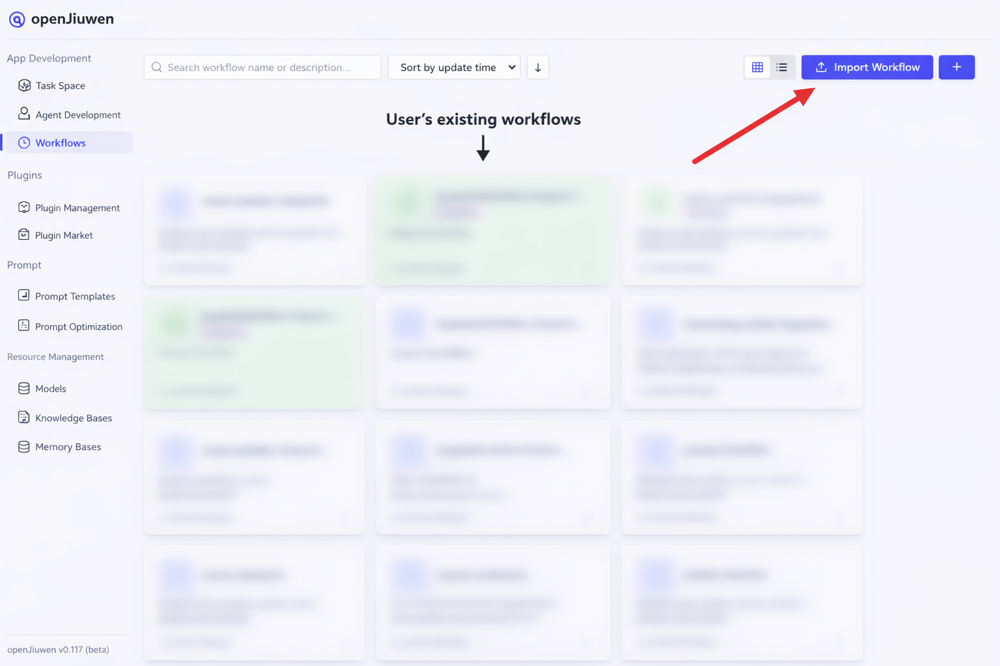
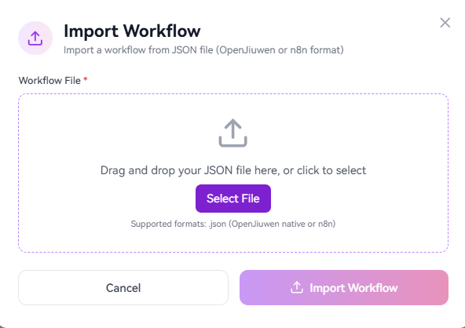
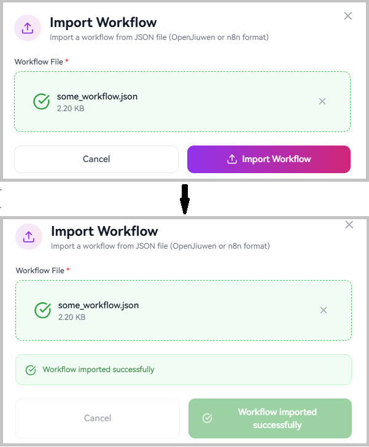
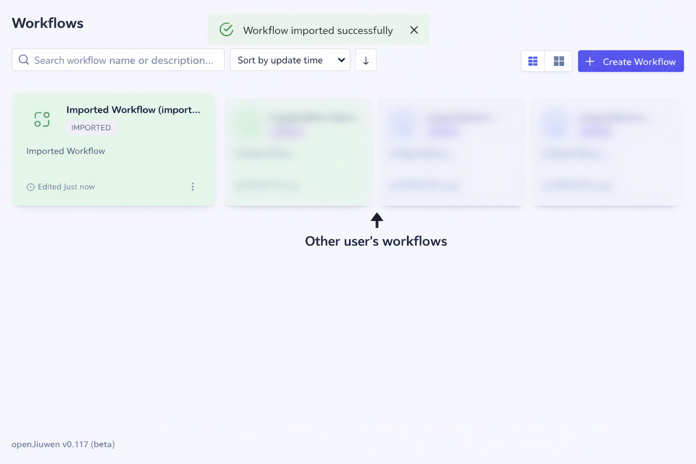

# How to Import an External Workflow

The workflow import feature allows you to bring workflows from external platforms (such as n8n - particularly, version 2.12.x of the n8n JSON format) or previously exported OpenJiuwen workflows into your workspace. The system automatically detects the workflow format, converts it to the OpenJiuwen format, and validates the structure before saving.

## Prerequisites

* The target workspace (space) has been created.
* (For n8n workflows) The n8n workflow has been exported as a JSON file.
* (For OpenJiuwen workflows) The workflow has been exported from OpenJiuwen.
* All plugins referenced in the workflow are installed in the target workspace.

## Steps

1. Navigate to the **Workflow Orchestration** module in the left sidebar.
2. Click the **Import Workflow** button.

3. Select the JSON file you want to import and choose the target workspace.
4. Click **Import** to start the import process.

5. The system will automatically:
   - **Detect the workflow format** (OpenJiuwen native or n8n)
   - **Convert** the workflow to OpenJiuwen format (if needed)
   - **Validate** the workflow structure, edges, and plugin references
   - **Generate new IDs** to avoid conflicts with existing workflows

6. Once the import is successful, the workflow will appear in your workspace with " (imported)" appended to its name.

7. Click the imported workflow to open it in the canvas editor and review the configuration.

## Supported Formats

| Format | Description | Notes |
|--------|-------------|-------|
| **OpenJiuwen Native** | Full or partial workflows exported from OpenJiuwen | Supports canvas-only exports |
| **n8n** | Workflows exported from n8n | Automatically converts nodes to OpenJiuwen components |

## What Gets Converted

When importing an n8n workflow:

- **Trigger nodes** (manual, webhook, schedule) → START node
- **Code/Function nodes** → Code nodes
- **If nodes** → IF condition nodes
- **AI/LLM/Chat Model nodes** → LLM nodes with embedded sub-configurations (see in Appendix supported types)
- **Connections** → Edges between nodes

The system automatically generates START and END nodes if they don't exist, and regenerates all IDs to prevent conflicts.

## Troubleshooting

| Issue | Solution |
|-------|----------|
| **Import fails with "Unsupported format"** | Ensure the JSON file is a valid n8n or OpenJiuwen export |
| **Validation errors about missing plugins** | Install the required plugins in the target workspace before importing |
| **Validation errors about missing nodes** | Check that all edge source/target nodes exist in the workflow |
| **Import succeeds but workflow is empty** | Verify the JSON file contains a valid `schema` or `nodes` field |

## Notes

- The `space_id` in the imported file is ignored; the workflow is imported into the workspace you select.
- All workflow IDs, node IDs, and edge IDs are regenerated to avoid conflicts.
- The workflow is imported as a draft with no version history.
- Timestamps are updated to the current import time.

## Appendix: supported n8n node types

| n8n Node Type                                      | OpenJiuwen Type   | Category         | Status                                                |
| -------------------------------------------------- | ----------------- | ---------------- | ----------------------------------------------------- |
| n8n-nodes-base.manualTrigger                       | Start             | Trigger          | Supported           |
| n8n-nodes-base.webhook                             | Start             | Trigger          | Supported           |
| n8n-nodes-base.scheduleTrigger                     | Start             | Trigger          | Supported           |
| n8n-nodes-base.executeWorkflowTrigger              | Start             | Trigger          | Supported           |
| n8n-nodes-base.formTrigger                         | Start             | Trigger          | Supported           |
| n8n-nodes-base.errorTrigger                        | Start             | Trigger          | Supported           |
| n8n-nodes-base.emailTrigger                        | Start             | Trigger          | Supported           |
| n8n-nodes-langchain.chatTrigger                    | Start             | Trigger          | Supported           |
| n8n-nodes-langchain.agent                          | LLM               | AI / LLM         | Supported           |
| n8n-nodes-langchain.chainLlm                       | LLM               | AI / LLM         | Supported           |
| n8n-nodes-langchain.lmChatOpenAi                   | LLM               | Chat Model       | Supported*          |
| n8n-nodes-langchain.lmChatDeepSeek                 | LLM               | Chat Model       | Supported*          |
| n8n-nodes-base.if                                  | IF / Selector     | Conditional      | Supported           |
| n8n-nodes-base.code                                | Code              | Data Transform   | Supported           |
| n8n-nodes-base.set                                 | Code              | Data Transform   | Supported           |
| n8n-nodes-base.readBinaryFiles                     | Code              | Data Transform   | Supported           |
| n8n-nodes-base.writeBinaryFile                     | Code              | Data Transform   | Supported           |
| n8n-nodes-base.readWriteFile                       | Code              | Data Transform   | Supported           |
| n8n-nodes-base.cron                                | Start             | Trigger          | WIP           |
| n8n-nodes-base.switch                              | IF / Selector     | Conditional      | WIP                  |
| n8n-nodes-base.filter                              | IF / Selector     | Conditional      | WIP                  |
| n8n-nodes-base.splitInBatches                      | Loop              | Loop             | WIP                  |
| n8n-nodes-base.loop                                | Loop              | Loop             | WIP                  |
| n8n-nodes-base.functionItem                        | Code              | Data Transform   | WIP                  |
| n8n-nodes-base.itemLists                           | Code              | Data Transform   | WIP                  |
| n8n-nodes-base.splitOut                            | Code              | Data Transform   | WIP                  |
| n8n-nodes-base.aggregate                           | Code              | Data Transform   | WIP                  |
| n8n-nodes-base.removeDuplicates                    | Code              | Data Transform   | WIP                  |
| n8n-nodes-base.sort                                | Code              | Data Transform   | WIP                  |
| n8n-nodes-base.limit                               | Code              | Data Transform   | WIP                  |
| n8n-nodes-base.compareDatasets                     | Code              | Data Transform   | WIP                  |
| n8n-nodes-base.noOp                                | Code              | Data Transform   | WIP                  |
| n8n-nodes-base.wait                                | Code              | Data Transform   | WIP                  |
| n8n-nodes-base.respondToWebhook                    | Code              | Data Transform   | WIP                  |
| n8n-nodes-base.stopAndError                        | Code              | Data Transform   | WIP                  |
| n8n-nodes-base.html                                | Code              | Data Transform   | WIP                  |
| n8n-nodes-base.markdown                            | Code              | Data Transform   | WIP                  |
| n8n-nodes-base.xml                                 | Code              | Data Transform   | WIP                  |
| n8n-nodes-base.crypto                              | Code              | Data Transform   | WIP                  |
| n8n-nodes-base.dateTime                            | Code              | Data Transform   | WIP                  |
| n8n-nodes-base.compression                         | Code              | Data Transform   | WIP                  |
| n8n-nodes-base.spreadsheetFile                     | Code              | Data Transform   | WIP                  |
| n8n-nodes-base.convertToFile                       | Code              | Data Transform   | WIP                  |
| n8n-nodes-base.extractFromFile                     | Code              | Data Transform   | WIP                  |
| n8n-nodes-base.httpRequest                         | HTTP Request      | HTTP / API       | WIP                  |
| n8n-nodes-base.merge                               | Variable Merge    | Merge            | WIP                  |
| n8n-nodes-base.executeWorkflow                     | Sub Workflow      | Workflow         | WIP                  |
| n8n-nodes-langchain.chainRetrievalQa               | LLM               | AI / LLM         | Unsupported        |
| n8n-nodes-langchain.chainSummarization             | LLM               | AI / LLM         | Unsupported        |
| n8n-nodes-langchain.informationExtractor           | LLM               | AI / LLM         | Unsupported        |
| n8n-nodes-langchain.textClassifier                 | LLM               | AI / LLM         | Unsupported        |
| n8n-nodes-langchain.sentimentAnalysis              | DB                | DB               | Unsupported        |
| n8n-nodes-langchain.vectorStoreInMemory            | DB                | DB               | Unsupported        |
| n8n-nodes-langchain.vectorStorePinecone            | DB                | DB               | Unsupported        |
| n8n-nodes-langchain.vectorStoreSupabase            | DB                | DB               | Unsupported        |
| n8n-nodes-langchain.vectorStoreQdrant              | DB                | DB               | Unsupported        |
| n8n-nodes-langchain.vectorStorePgVector            | DB                | DB               | Unsupported        |
| n8n-nodes-langchain.lmChatGoogleGemini             | Unmapped          | Chat Model       | Unmapped           |
| n8n-nodes-langchain.lmChatAzureOpenAi              | Unmapped          | Chat Model       | Unmapped           |
| n8n-nodes-langchain.lmChatOllama                   | Unmapped          | Chat Model       | Unmapped           |
| n8n-nodes-langchain.lmChatGroq                     | Unmapped          | Chat Model       | Unmapped           |
| n8n-nodes-langchain.lmChatMistralCloud             | Unmapped          | Chat Model       | Unmapped           |
| n8n-nodes-langchain.lmChatAnthropic                | Unmapped          | Chat Model       | Unmapped           |
| n8n-nodes-langchain.lmChatCohere                   | Unmapped          | Chat Model       | Unmapped           |
| n8n-nodes-langchain.lmChatAwsBedrock               | Unmapped          | Chat Model       | Unmapped           |
| n8n-nodes-langchain.lmChatGoogleVertex             | Unmapped          | Chat Model       | Unmapped           |
| n8n-nodes-langchain.lmChatOpenRouter               | Unmapped          | Chat Model       | Unmapped           |
| n8n-nodes-langchain.lmCohere                       | Unmapped          | Chat Model       | Unmapped           |
| n8n-nodes-langchain.lmOllama                       | Unmapped          | Chat Model       | Unmapped           |
| n8n-nodes-langchain.memoryBufferWindow             | Unmapped          | Memory           | Unmapped           |
| n8n-nodes-langchain.memoryRedisChat                | Unmapped          | Memory           | Unmapped           |
| n8n-nodes-langchain.memoryPostgresChat             | Unmapped          | Memory           | Unmapped           |
| n8n-nodes-langchain.memoryMongoChat                | Unmapped          | Memory           | Unmapped           |
| n8n-nodes-langchain.memoryXata                     | Unmapped          | Memory           | Unmapped           |
| n8n-nodes-langchain.memoryZep                      | Unmapped          | Memory           | Unmapped           |
| n8n-nodes-langchain.embeddingsOpenAi               | Unmapped          | Embeddings       | Unmapped           |
| n8n-nodes-langchain.embeddingsAzureOpenAi          | Unmapped          | Embeddings       | Unmapped           |
| n8n-nodes-langchain.embeddingsGoogleGemini         | Unmapped          | Embeddings       | Unmapped           |
| n8n-nodes-langchain.embeddingsCohere               | Unmapped          | Embeddings       | Unmapped           |
| n8n-nodes-langchain.embeddingsOllama               | Unmapped          | Embeddings       | Unmapped           |
| n8n-nodes-langchain.toolCalculator                 | Unmapped          | Tool             | Unmapped           |
| n8n-nodes-langchain.toolCode                       | Unmapped          | Tool             | Unmapped           |
| n8n-nodes-langchain.toolHttpRequest                | Unmapped          | Tool             | Unmapped           |
| n8n-nodes-langchain.toolWorkflow                   | Unmapped          | Tool             | Unmapped           |
| n8n-nodes-langchain.toolWikipedia                  | Unmapped          | Tool             | Unmapped           |
| n8n-nodes-langchain.toolSerpApi                    | Unmapped          | Tool             | Unmapped           |
| n8n-nodes-langchain.toolWolframAlpha               | Unmapped          | Tool             | Unmapped           |
| n8n-nodes-langchain.toolVectorStore                | Unmapped          | Tool             | Unmapped           |
| n8n-nodes-langchain.toolMcp                        | Unmapped          | Tool             | Unmapped           |
| n8n-nodes-langchain.documentDefaultDataLoader      | Unmapped          | Document Loader  | Unmapped           |
| n8n-nodes-langchain.documentGithubLoader           | Unmapped          | Document Loader  | Unmapped           |
| n8n-nodes-langchain.textSplitterCharacter          | Unmapped          | Text Splitter    | Unmapped           |
| n8n-nodes-langchain.textSplitterRecursiveCharacter | Unmapped          | Text Splitter    | Unmapped           |
| n8n-nodes-langchain.outputParserStructured         | Unmapped          | Output Parser    | Unmapped           |
| n8n-nodes-langchain.outputParserAutofixing         | Unmapped          | Output Parser    | Unmapped           |
| (any other unknown type)                           | Code (fallback)   | Unknown          | Fallback            |

\* - the LLM node itself is supported, but setting its memory or tools is WIP.