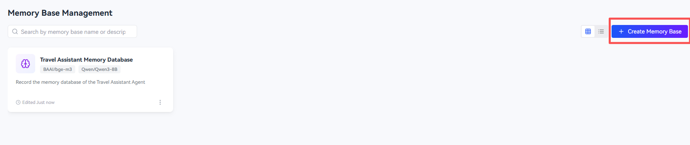
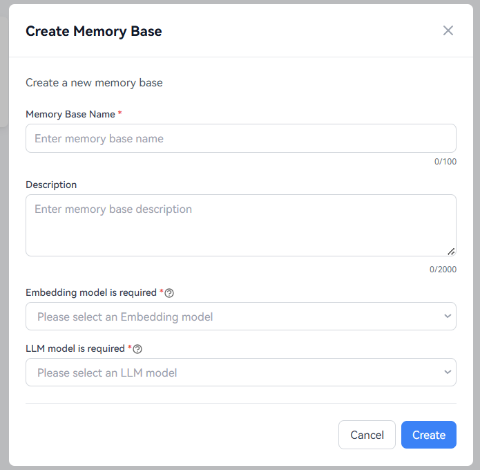
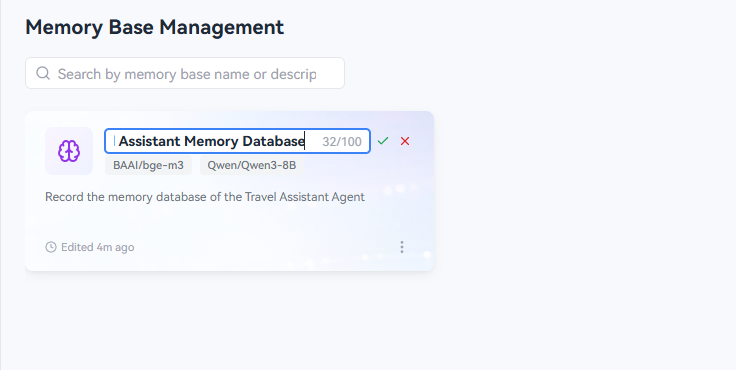
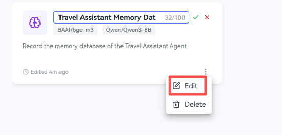
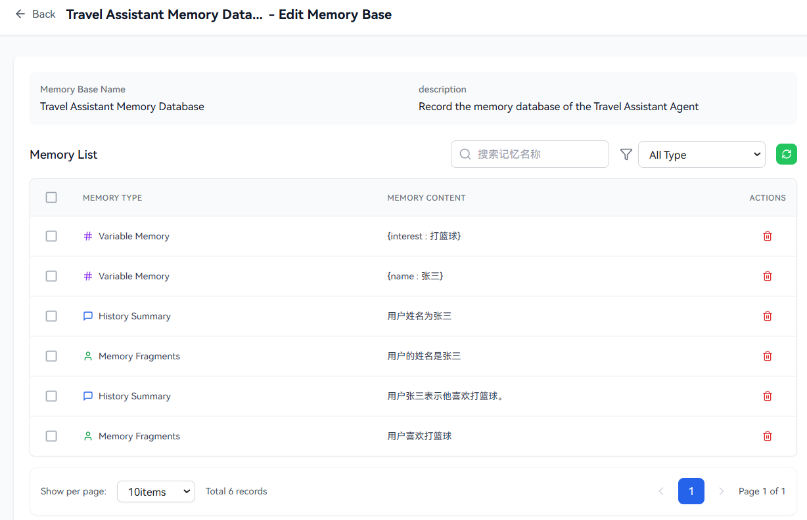

# Memory Base Management

Memory base is an important way for the openJiuwen platform to manage local memory. Users can use the agent's memory capabilities by managing local memory bases.

# Create memory Base

## Prerequisites

A usable model has been configured in the **Embedding Model** tab and the **LLM Model** tab of the **Model Management** module. For how to configure these models, please refer to the Model Management related sections.

## Operation Steps

1. Log in to the openJiuwen platform.

2. Navigate to the **Memory Base Management** module in the left sidebar of the platform.

3. Click **Create Memory Base** button.

   

4. In the create memory base dialog, enter the **Memory Base Name** and **Description** (optional), select a model from the **Embedding Model** and the **LLM Model** dropdown (Note: The Embedding model of a memory base cannot be changed after the memory base is created), and click **Create**.
   
   

5. Double click on the created memory bank name or description on the business card to edit it.

   

6. Click on the created memory card or click **Edit** to enter the edit memory page.
   
   

7. On the edit memory page, you can see different categories of stored memories, including Memory Fragments, Variable Memory, and History Summary.

   
