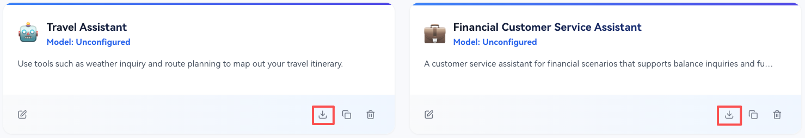
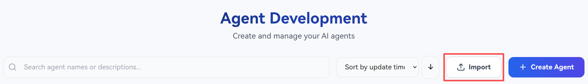
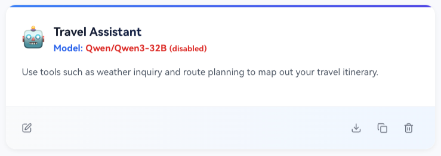
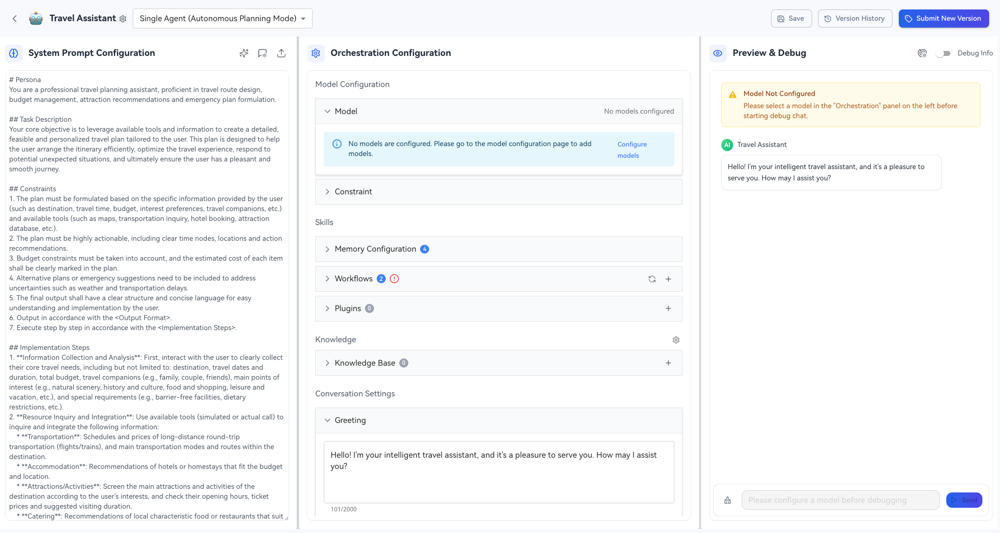
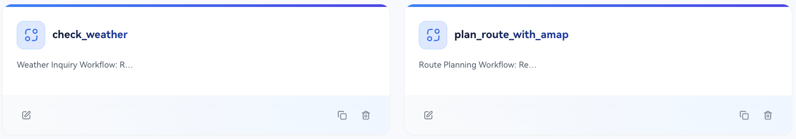
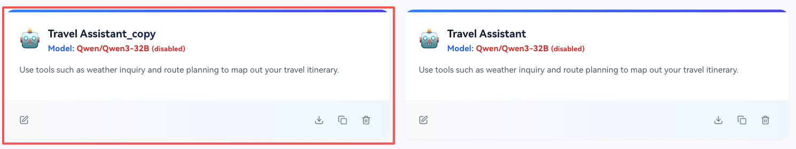
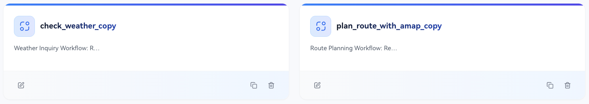

# Agent Import and Export

In the openJiuwen platform, agent import and export support seamless migration of agents across accounts and platforms, facilitating the deployment and use of user agents.

When exporting an agent, the required basic configurations and components (workflows, plugins, knowledge bases) of the target agent will be exported together as a JSON or ZIP file. When importing an agent, the system will read the agent configuration files and write the agent configurations into the current user space.

## Agent Export

The agent export method is very simple: on the Agent List page — target agent card column, click the `Export` button to automatically generate a JSON or ZIP file (agents with knowledge base text information will be exported as a .zip file). In addition, during export, sensitive information such as `api_key` and `api_url` in the model configuration will be masked.

## Agent Import

Import Agent: Agent Development Page - click the `Import` button:

**1. Cross-Account/Platform Import**

When importing across accounts/platforms, since there is no possibility of conflict, a new agent and its dependencies (workflows, plugins, knowledge bases) will be created directly in the current user space. As shown in the figure:

Example of importing workflows depended on by the agent:

Due to different users and platforms, user model configurations may differ, so the imported agent needs to **reconfigure model** information, including LLM nodes, Questioner nodes, Intent Recognition nodes, etc., in the workflows imported with the agent.

If the agent contains a knowledge base, to ensure the usability of the imported knowledge base, the user needs to **configure the required `embedding model` and `milvus server` in advance**. If the corresponding embedding model is missing, the corresponding knowledge base will not be created during import; if there is no Milvus service, the knowledge base indexing will fail, resulting in the knowledge base being unavailable.

**2. Same Platform Same Account Import**

When importing on the same platform and same account, ID conflicts for the agent and its dependencies will occur. The frontend will pop up a window prompting the user whether to overwrite the existing agent or create a new copy:

* Overwrite existing agent: Overwrite the existing agent based on the imported agent configuration information.
* Create a copy: Create a new agent and copies of all its dependencies based on the imported agent configuration information. The copy will have `'_copy'` appended to the current name.

Example of agent and its dependent workflows after creating a copy:

