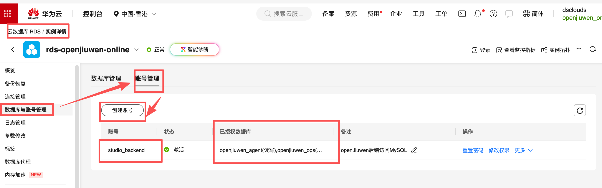
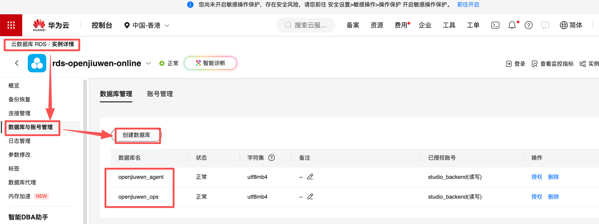
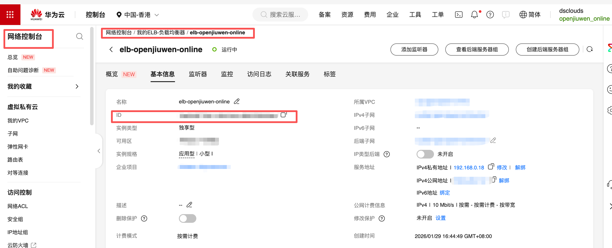
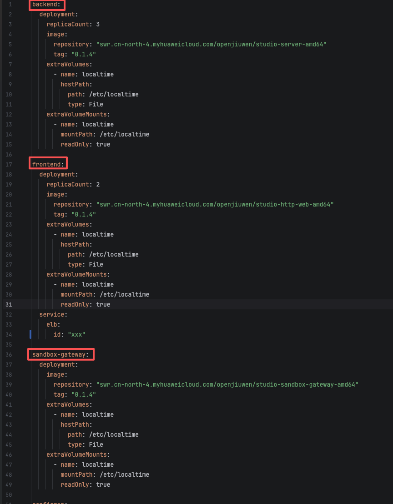
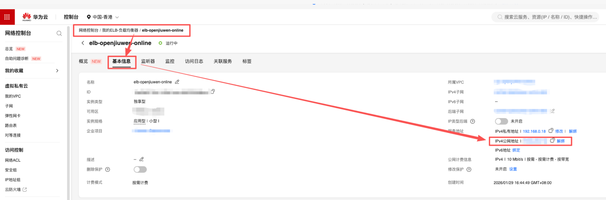
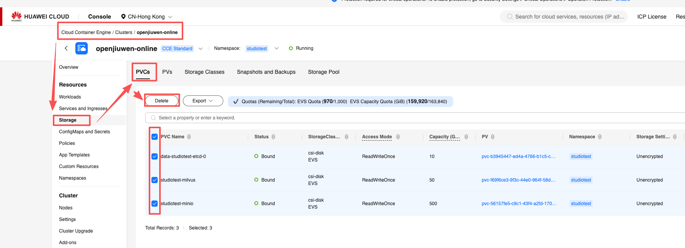

本指南介绍在 Linux 系统下，采用 **Kubernetes + Helm** 方式部署 openJiuwen，示例环境以 **华为云** 为例（使用 RDS、DCS、CCE 等托管服务）。

## 一、环境准备

### 1. 云上基础资源（以华为云为例，华为云官网：https://www.huaweicloud.com/）

请在同一 VPC / 子网下准备好以下资源，保证彼此可以通过内网互通：

- **RDS（MySQL 服务）**
  - 建议版本：MySQL 8.0 及以上
  - 建议字符集：`utf8mb4`
  - 需要记录的信息：
    - 内网访问地址（Host）
    - 端口（Port）
    - 数据库用户名、密码
    
    - 为 openJiuwen 准备的数据库名（如：`openjiuwen_agent、openjiuwen_ops`）
    
  - 注意：
    - 安全组放通来自 CCE 节点网段的 MySQL 端口（默认 3306）
    - 应对创建的账号授权相应的数据库权限

- **DCS（Redis 服务）**
  - 建议版本：Redis 6.0 及以上
  - 需要记录的信息：
    - 内网访问地址（Host）
    - 端口（Port）
    - 访问密码（如已开启认证）

- **OBS（对象存储，用于文件/模型等持久化存储，可选但推荐）**
  - 在华为云上准备一个 **OBS 存储桶（Bucket）**，用于存放业务相关的文件（如上传文件、模型文件等）。
  - 需要记录的信息：
    - OBS 存储桶名称（Bucket Name），例如：`openjiuwen-bucket`
    - OBS 访问域名（Endpoint/Server），例如：`obs.cn-north-4.myhuaweicloud.com`
    - 具备访问该桶权限的 **访问密钥对**：
      - Access Key ID
      - Secret Access Key
  - 建议为 openJiuwen 单独创建一个拥有最小访问权限（仅限目标 Bucket 读写）的访问密钥，避免使用账号的全局密钥。

- **CCE（Kubernetes 集群与节点）**
  - 集群版本：使用官方长期支持版本（一般 1.24+）
  - 节点操作系统：Linux（如 EulerOS / CentOS / Ubuntu 等）
  - 节点规格建议：
    - CPU：至少 4 核，根据集群部署规模自行调整
    - 内存：至少 8GB，根据集群部署规模自行调整
    - 磁盘：根据实际数据量预留充足空间
  - 确保集群已安装并启用了云厂商提供的存储插件（例如华为云的 `csi-disk`）。

- **ELB + EIP（对外访问入口，可选，项目需要对外网开放访问时需要）**
  - 在华为云上准备一个用于前端访问的 **共享型 / 独享型 ELB 实例**，并为其绑定一个 **弹性公网 IP（EIP）**。
  - 需要记录的信息：
    - ELB 实例 ID（例如：`xxx-xxx-xxx`）
    
    - 绑定的 EIP 地址（公网 IP）
  - 后续将通过 `EIP + frontend 暴露的端口号` 作为外部访问入口。域名解析、证书挂载、TLS 卸载等操作可由用户在华为云 ELB / 域名服务 / 证书管理服务中自行完成，或参考 [加密和鉴权](./加密和鉴权.md) 与 [配置 HTTPS](./配置https.md) 文档进行配置。

### 2. 跳板机 / 运维机

建议在与 CCE 集群同一 VPC 内，准备一台 Linux 跳板机（也可以是能够直连集群 API 的本地机器），用于执行 kubectl / helm 命令，要求：

- 已安装：
  - `kubectl`（版本与集群匹配），安装与配置 kubeconfig 请参考：[通过 kubectl 连接集群](https://support.huaweicloud.com/usermanual-cce/cce_10_0107.html#section1)
  - `helm` v3+，安装请参考：[通过 Helm v3 客户端部署应用](https://support.huaweicloud.com/usermanual-cce/cce_10_0144.html)
  - `git`

CentOS / Red Hat 系列系统可使用如下命令安装 Git：

```bash
sudo dnf install git -y
```
- 已配置好访问 CCE 集群的 `kubeconfig`，可以正常执行：

```bash
kubectl get nodes
```

确保可以列出集群中的节点。

### 3. 其他前置条件

- 网络要求：
  - 跳板机可以访问华为云 RDS / DCS 内网地址
  - 集群节点可以访问 RDS / DCS / SMTP 服务以及外网镜像仓库（如使用公共镜像、访问公网模型服务，推荐通过配置NAT网关的方式）：[从Pod访问公网](https://support.huaweicloud.com/bestpractice-cce/cce_bestpractice_10049.html)
- 账号权限：
  - 拥有在 CCE 集群中创建命名空间、部署 Helm Release、创建 PVC/PV 等资源的权限
- 邮件通知：
  - 如需使用邮箱验证码通知功能，请准备好 SMTP 服务地址、账号和密码信息。

## 二、配置存储（StorageClass）

在大多数场景下，需要先为集群配置一个 **默认的 StorageClass**，以便 Helm Chart 能够自动创建 PVC 并绑定到云硬盘存储。

以下示例以华为云 CCE 集群中的 `csi-disk` 存储类为例，将其标记为默认 StorageClass，请在跳板机上执行：

```bash
kubectl patch storageclass csi-disk \
  -p '{"metadata": {"annotations":{"storageclass.kubernetes.io/is-default-class":"true"}}}'
```

执行完成后，可以通过以下命令确认：

```bash
kubectl get storageclass
```

应当可以看到 `csi-disk` 前带有 `(default)` 标记。

> **说明**：如果你的集群默认的 StorageClass 名称不同，请将 `csi-disk` 替换为实际名称，或根据企业规范选择合适的默认存储类型。

## 三、获取项目代码

在跳板机上获取 openJiuwen 项目代码，并进入项目根目录（以下命令仅为示例，请根据实际仓库地址调整）：

```bash
git clone https://gitcode.com/openJiuwen/agent-studio.git
cd agent-studio    # 进入项目根目录
```

后续 Helm 部署命令均在项目根目录下的 `helm/studio` 目录中执行。

## 四、配置 Helm 部署参数

### 1. 复制生产环境配置模板

进入 Helm Chart 目录，并从示例文件复制出实际使用的 `values-prod.yaml`：

```bash
cd helm/studio
cp values-prod.example.yaml values-prod.yaml
```

`values-prod.example.yaml` 为示例配置文件，`values-prod.yaml` 则是实际部署时使用的配置文件。

### 2. 配置 MySQL（RDS）

使用你熟悉的编辑器打开 `values-prod.yaml`（部分字段在values.yaml有默认值如DB_USER，如果跟自行配置字段值一致可不在values-prod.yaml中配置），根据华为云 RDS 的实例信息，填写 MySQL 相关配置字段（字段名称以实际文件为准，如字段不在可自行增加字段行，一般包括但不限于）：

- 数据库地址：根据在华为云上配置的信息填写 RDS 的内网地址等，例如：
  - `DB_HOST: <your-rds-host>`
- 账号信息：
  - `DB_USER: <your-rds-user>`
  - `DB_PASSWORD <your-rds-pwd>`
- 数据库名称：
  - `AGENT_DB_NAME: openjiuwen_agent`（或你创建的对应库名）
  - `OPS_DB_NAME: openjiuwen_ops`（或你创建的对应库名）

请确保：

- RDS 安全组 / 白名单已允许来自 CCE 节点所在子网或 VPC 的访问；
- 字符集使用 `utf8mb4`，避免字符集不兼容问题。

### 3. 配置 Redis（DCS）

在同一 `values-prod.yaml` 中，找到或新建 Redis 配置相关字段，根据华为云 DCS 实例信息填写：

- 连接地址和端口（端口默认6379的话可不填）：
  - `REDIS_HOST: <your-dcs-host>`
  - `REDIS_PORT: <your-dcs-port>`
- 认证信息（如开启密码）：
  - `REDIS_PASSWORD: <your-dcs-password>`

请确认 DCS 安全组规则允许来自 CCE 集群的访问。

### 4. 配置 OBS（对象存储，对接华为云 OBS）

在 `values-prod.yaml` 中补充或修改以下参数，用于连接华为云 OBS：

- `OBS_BUCKET`: OBS 存储桶名称，例如：`openjiuwen-bucket1`
- `OBS_SERVER`: OBS 访问域名（Endpoint），例如：`obs.cn-north-4.myhuaweicloud.com`
- `OBS_ACCESS_KEY_ID`: 具有访问该 Bucket 权限的 Access Key ID
- `OBS_SECRET_ACCESS_KEY`: 对应的 Secret Access Key

> **建议**：为 openJiuwen 独立创建一对仅具备目标 Bucket 读写权限的密钥，避免使用账号的全局高权限密钥；妥善保管密钥信息，避免泄露。

### 5. 配置 SMTP（如开启用户密码登录功能）

如需启用开启用户密码登录功能（VITE_ENABLE_NEW_AUTH为true，会涉及到注册验证码邮件发送），请在 `values-prod.yaml` 中填写 SMTP 相关配置（字段名称以实际文件为准），例如：

- `SMTP_HOST: <smtp-host>`
- `SMTP_PORT: <smtp-port>`
- `SMTP_ALIAS: <smtp-username>`
- `SMTP_PASSWORD: <smtp-password>`
- `SMTP_USER: <noreply@example.com>`

如果暂时不需要邮件功能，可以保持默认关闭或留空。

### 6. 配置访问方式（ELB / Service）

根据你的访问需求，选择合适的访问方式并在 `values-prod.yaml` 中配置。

本部署方案推荐使用 **ELB + EIP** 作为统一的对外访问入口，前端服务通过 ELB 暴露。域名解析、证书挂载和 TLS 卸载等操作可由用户在华为云 ELB / 域名服务 / 证书管理服务中自行完成，或参考 [加密和鉴权](./加密和鉴权.md) 与 [配置 HTTPS](./配置https.md) 文档进行配置。

#### 6.1 在 values-prod.yaml 中回填 ELB ID

在 `values-prod.yaml` 中找到前端服务相关配置（字段名称以实际文件为准），例如：

```yaml
frontend:
  service:
    elb:
      id: "<your-elb-id>"
```

- 将 `id` 字段的值替换为你在华为云 ELB 控制台中创建的 **ELB 实例 ID**。
- 前端 Service 将使用该 ELB 实例作为对外入口，外部用户通过 `EIP + 前端服务暴露的端口号` 访问 openJiuwen 前端页面。

> **说明**：\n> - ELB 侧的 **域名解析（DNS 记录）**、**证书挂载**、**TLS 卸载（HTTPS 终止）** 等操作，可由用户在华为云 ELB / 域名服务 / 证书管理服务中自行完成，或参考 [加密和鉴权](./加密和鉴权.md) 与 [配置 HTTPS](./配置https.md) 文档进行配置。\n> - 如仅需内网访问或使用其他方式暴露服务，可根据企业规范调整 Service / Ingress 配置。

#### 6.2 其他访问方式（可选）

- 如需要通过 Ingress 控制器暴露服务：
  - 启用 Ingress；
  - 配置域名、TLS 证书等字段。
- 如仅在内网调试或体验：
  - 可以选择 NodePort / LoadBalancer 等方式暴露服务端口。

> **提示**：请参考 `values-prod.example.yaml` 中关于 **ELB / Service / Ingress** 的示例配置，按需开启和调整相关字段。

### 7. 实例相关参数配置

backend、frontend、sandbox-gateway实例相关参数，包含但不限于实例数量（replicaCount）、镜像版本（tag）等都可以在 `values-prod.yaml` 中配置：



## 五、一键部署 openJiuwen（Helm）

完成 `values-prod.yaml` 配置后，在 `helm/studio` 目录中执行以下命令，一键式部署整个项目：

> **提示**：根据你实际的 Kubernetes 集群规格和业务压力情况，可在 `values-prod.yaml` 中自行调整各组件的 **副本数（replicaCount）**、**单实例资源规格（requests/limits）**、**镜像版本（image.tag）** 等参数，再执行以下部署命令。

```bash
cd helm/studio
helm dependency build
helm upgrade --install studio . -f values-prod.yaml
```

说明：

- `helm dependency build`：拉取并更新当前 Chart 所需的依赖 Charts。
- `helm upgrade --install studio . -f values-prod.yaml`：
  - 在当前命名空间（默认 `default`，如需可通过 `-n <namespace>` 指定）安装或升级名为 `studio`（也可自行起其他的名字部署，以下以名字为studio举例） 的 Release；
  - 使用 `values-prod.yaml` 中的参数覆盖默认配置。

例如，如需将应用部署到 `studio` 命名空间且在不存在时自动创建，可以执行：

```bash
helm upgrade --install studio . -f values-prod.yaml -n studio --create-namespace
```

部署完成后，可通过以下命令查看 Pod 状态：

```bash
kubectl get pods -n <namespace>
```

当所有核心组件的 Pod 状态为 `Running` / `Ready` 时，说明部署基本完成。

## 六、访问系统

访问方式取决于你在 `values-prod.yaml` 中的 Service / ELB 配置：

- **如果启用了 ELB：**
  - 使用配置好的域名在浏览器中访问，例如（不单独配置的话前端端口号为3000）：
    - `http://<your-eip>:<your-frontend-port>`
    
    
- **如果使用 NodePort(仅支持内网访问)：**
  - 可以通过以下命令查看暴露的服务：

  ```bash
  kubectl get svc -n <namespace>
  ```

  根据返回的 Service 类型、集群外网 IP / 端口，在浏览器中访问对应地址:
      - `http://<your-node-ip>:<your-frontend-service-node-port>`

如果使用的是 HTTPS 并且首次通过 HTTPS 访问时，如果使用的是自签名证书，浏览器可能会提示 “您的连接不是私密连接”：

- 这是因为证书未经过第三方权威机构签发；
- 如你确认访问的是自己部署的 openJiuwen 服务，可在浏览器中点击“高级”并选择“继续前往”。

## 七、常见问题（FAQ）

### 问题一：PVC 一直处于 Pending 状态怎么办？

- 使用以下命令检查 StorageClass：

```bash
kubectl get storageclass 
```

- 确认是否已有 **默认 StorageClass**（`(default)` 标记）。
- 如未配置或默认存储类型不正确，可参考本文前文，通过如下命令将 `csi-disk`（或其他 StorageClass）设置为默认：

```bash
kubectl patch storageclass csi-disk \
  -p '{"metadata": {"annotations":{"storageclass.kubernetes.io/is-default-class":"true"}}}'
```

### 问题二：应用容器无法连接 MySQL / Redis？

- 检查 `values-prod.yaml` 中填写的 RDS / DCS 地址、端口、用户名、密码是否正确。
- 检查华为云 RDS / DCS 实例的安全组 / 访问白名单：
  - 是否已放通来自 CCE 集群所在子网 / VPC 的访问。
- 在集群 Pod 内执行简单网络连通性测试（例如 `ping`、`telnet`、`mysql` / `redis-cli` 等）。

### 问题三：如何升级或回滚？

- **升级配置**：
  - 修改 `values-prod.yaml` 中需要调整的参数；
  - 再次执行：

```bash
helm upgrade --install studio . -f values-prod.yaml -n <namespace>
```

- **查看历史版本**：

```bash
helm history studio -n <namespace>
```

- **回滚到某个版本**（以 `revision` 为示例）：

```bash
helm rollback studio <revision> -n <namespace>
```

### 问题四：如何卸载 openJiuwen？

如需卸载当前通过 Helm 部署的 openJiuwen 实例，可以执行：

```bash
helm uninstall studio -n <namespace>
```

绑定的 PVC / PV 并不会随 helm unintall 命令清理，如需清理，请根据业务需要谨慎删除对应的存储资源，避免误删数据。

以 **华为云 CCE 控制台** 为例，您可以按以下步骤清理不再使用的 PVC / PV（操作前请务必确认数据已不再需要）：

1. 登录华为云控制台，进入 **云容器引擎 CCE**，点击目标集群名称进入集群详情页。
2. 在左侧导航中依次选择：`存储` → `持久化存储卷 PVC`：
   - 在命名空间下查找与当前部署（例如 `studio` 命名空间）相关的 PVC；
   - 确认对应业务已下线/数据已备份后，选择不再需要的 PVC 执行 **删除**。
3. 如需同时清理底层 PV，可在左侧导航中选择：`存储` → `持久化存储卷 PV`：
   - 检查与上一步删除 PVC 关联的 PV 状态（通常为 `Released` 等）；
   - 确认不再需要后执行 **删除**，释放底层云硬盘等存储资源。

示意截图如下（以 PVC 清理为例）：


