# openJiuwen 加密与鉴权指南

本指南专注于介绍 **openJiuwen 在华为云环境下的加密与鉴权相关能力**，包括：

- **整体安全架构与涉及的云服务组件**
- **服务端与中间件之间的鉴权配置方式**
- **敏感信息的加密流程、密钥托管与在 CCE 中的落地配置**

本指南默认你已经具备基础的 CCE 集群与中间件环境，并结合《分布式部署文档》完成了基础部署。  
你可以将本文作为“安全加固章节”使用，在已有部署的基础上，补齐 IAM / CSMS / KMS / Secret 等加密和鉴权配置。

---

# 一、整体概览

在华为云上进行分布式部署时，为了进行权限控制并保证鉴权信息的安全，openJiuwen 依赖以下核心云服务和安全组件共同工作：

- **统一身份认证服务（IAM）**：提供用户身份认证与细粒度访问控制
- **密码安全中心（DEW）**：
  - **密钥管理服务（KMS）**：统一生成、托管和使用根密钥
  - **凭据管理（CSMS）**：集中托管 IAM 子账号密码等敏感凭据
- **云容器引擎（CCE）**：承载 openJiuwen 的 Kubernetes 集群，负责容器编排与运行
- **中间件与存储服务**：如 RDS、DCS、Milvus、OBS 等，提供数据存储与检索能力

从安全架构视角，可以将整体方案拆分为三大部分：

- **客户端鉴权**：用户访问 openJiuwen Web 页面或 API 接口时的身份认证与授权控制。客户端鉴权主要由“用户登录模块”进行管理，本指南不展开介绍，重点关注“服务端鉴权”和“加解密与密钥管理”。
- **服务端鉴权**：openJiuwen 各微服务与 RDS、DCS、Milvus、OBS 等中间件之间的安全访问（账号、密码、Token、AK/SK 等）。
- **加解密与密钥管理**：基于华为云 KMS 管理根密钥，结合 CSMS 与 CCE Secret/ConfigMap，统一管理和下发敏感配置，实现“密钥不落盘、凭据集中托管、配置可回溯”。
---

# 二、前置条件与云资源准备

在进行分布式部署的安全加固之前，请先在华为云中准备好以下资源：

## 1. 密码安全中心(DEW)

- **凭据管理(CSMS)**：用于托管 IAM 子账号密码等敏感信息
- **密钥管理服务(KMS)**：用于生成和管理系统使用的**根密钥**（CMK）

## 2. 云容器引擎(CCE)

用于管理、调度和运维运行在云上的容器化应用，承载 openJiuwen 的后端服务、前端和辅助组件。

## 3. 其他中间件与存储（按业务需要）

- **RDS for MySQL**：作为关系型数据库
- **DCS for Redis**：作为缓存与会话存储
- **Milvus**：向量数据库，用于向量检索
- **OBS / 兼容 S3 的对象存储**：用于存放文件与模型等大对象

---
# 三、鉴权与访问控制
---

## 1. 概述

在分布式部署场景下，openJiuwen 的微服务需要与多种中间件进行安全通信，包括 RDS、DCS、Milvus、OBS 等。此处主要说明如何在华为云上开启和使用这些服务的鉴权能力。

## 2. RDS 数据库鉴权配置

- 购买 RDS for MySQL 实例后，从云数据库 RDS 页面进入数据管理服务 DAS。
- 在数据管理服务 DAS 中新增数据库实例连接，在数据库来源中绑定新购买的数据库实例，并设置“登录用户名”和“密码”。
- 后续应用访问数据库时，需要在数据库连接串中携带上述账号密码。

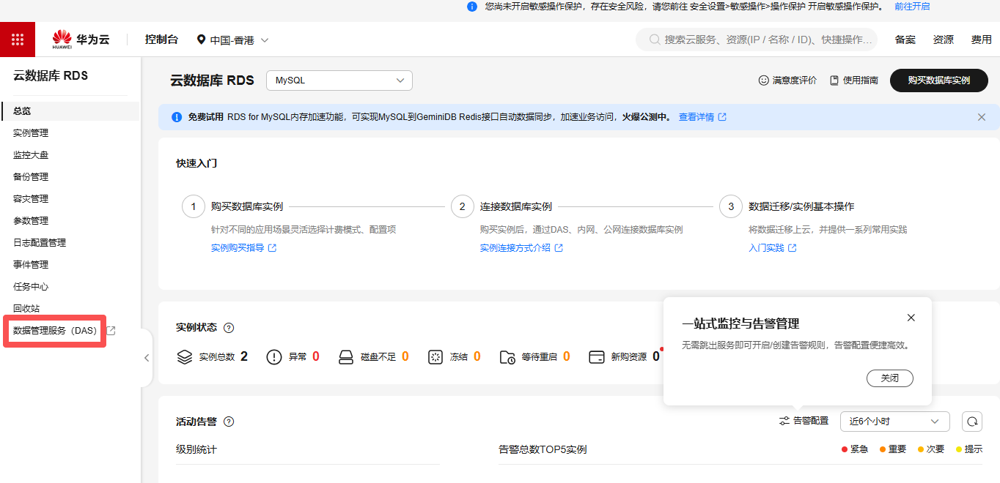

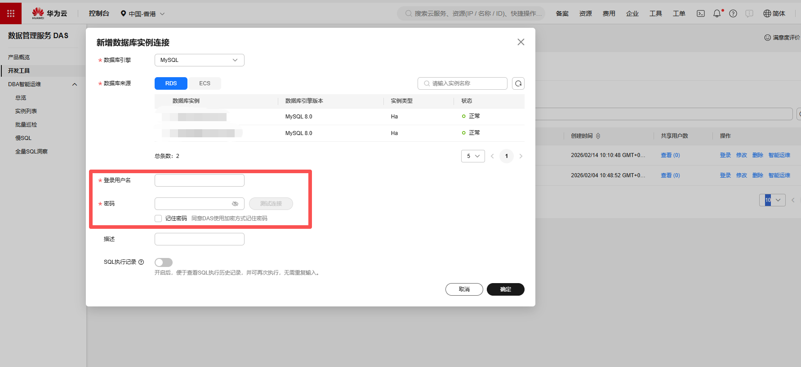

参考文档：[RDS新增数据库实例登录信息](https://support.huaweicloud.com/usermanual-das/das_03_0002.html)

## 3. DCS 鉴权配置

- 购买 DCS Redis 实例时，设置实例密码，并将 **“访问方式”** 设置为 **“密码访问”**。配置 **“密码”** 和 **“确认密码”**。
- 在开启密码访问后，后续客户端连接 Redis 实例时必须进行密码认证。

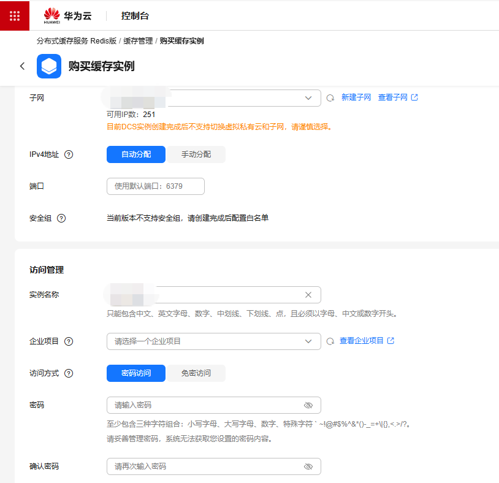

参考文档：[自定义购买Redis实例](https://support.huaweicloud.com/usermanual-dcs/dcs-ug-0713002.html#dcs-ug-0713002__section06806175271)

## 4. OBS 对象存储鉴权配置（AK/SK）

OBS 支持通过华为云 IAM 用户的 AK/SK 进行访问，获取方式：

- 登录华为云控制台，进入 **“我的凭证”**
- 创建访问秘钥，获取 Access Key ID 与 Secret Access Key
- 在 openJiuwen 的环境变量中配置对应的 AK/SK（配合后文的加密配置使用）

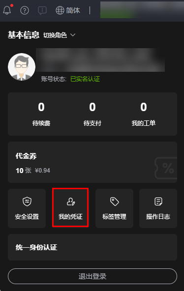

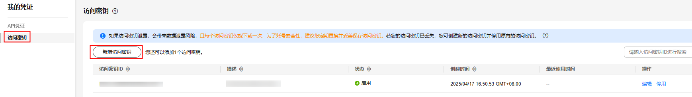

参考文档：[华为云访问密钥管理指南](https://support.huaweicloud.com/usermanual-ca/ca_01_0003.html)

## 5. Milvus 向量库鉴权配置

Milvus 支持用户名/密码或 Token 鉴权，本方案采用**密码鉴权**。在华为云 CCE 中通过 ConfigMap 管理 Milvus 的配置项，在 Milvus 的配置文件 `my-release-milvus.yaml` 中新增如下配置以开启鉴权：

```yaml
user.yaml: |
  common:
    security:
      authorizationEnabled: true
```

配置完成后，重启 Milvus 服务使配置生效。

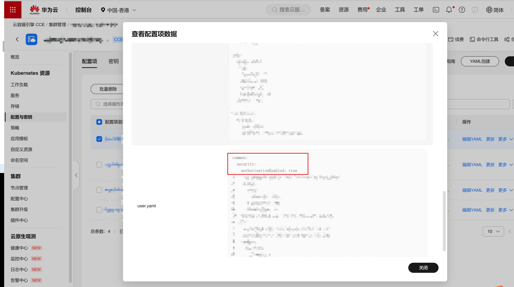

后续将 Milvus 的访问凭据（用户名/密码或 Token）通过加密方式配置到环境变量中，具体加密与配置方式见后文“敏感信息加解密”章节。

---
# 四、敏感信息加解密
---

## 1. 总体架构

openJiuwen 采用三层加密架构保护敏感数据：

- **访问控制层**：基于华为云 IAM 实现身份认证与细粒度权限管控，用于安全访问 KMS 服务。
- **密钥管理层**：华为云 KMS 平台创建根密钥，统一托管与保护AES-GCM算法的工作密钥。
- **敏感数据加密层**：使用由KMS加密的 **工作密钥**（基于 AES-GCM 等算法）加密存储中间件鉴权信息等应用敏感配置。
  
## 2. 访问控制层——IAM 账号管理
### 2.1 准备华为云凭证

在华为云控制台获取以下信息（对应实际部署的账号与项目）：

- **用户名(Username)**：华为云IAM账号用户名
- **密码(Password)**：华为云IAM账号密码
- **域名(Domain Name)**：租户/域名
- **项目名称(Project Name)**：华为云项目名称
- **项目ID(Project ID)**：华为云项目 ID
- **区域(Region)**：如 `cn-north-4`、`ap-southeast-1` 等

### 2.2 IAM 信息托管至 CSMS
IAM账号的密码信息托管在凭据管理微服务 CSMS 中，并通过CCE的同步机制，同步到CCE集群容器的环境变量中。

  (1) 使用生产IAM账号登入密码安全中心 DEW 服务，进入凭据管理 CSMS 页面。

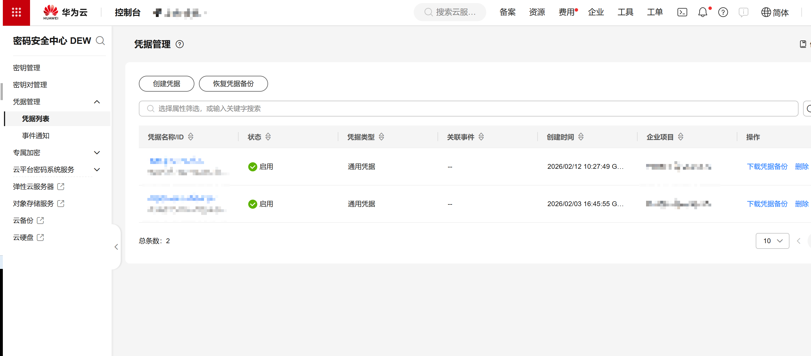

  (2) 填写“凭据名称”、“企业项目”、“凭据键值”等基本信息，其中键填写 `iam_password`，值填写生产环境 `{IAM_PASSWORD}`，确认后创建凭据。

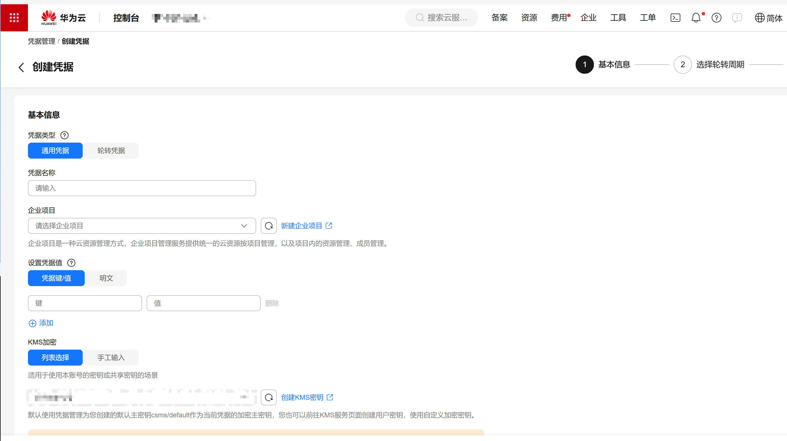

  (3) 创建凭据完成后，记录凭据名称等关键信息，供后续在 CCE 中引用。

### 2.3 CCE 集群同步 CSMS 凭据信息
在 CCE 集群中，需要将前面在 CSMS 中创建的凭据挂载到工作负载中，整体流程可以概括为：

  (1) 在 CCE 集群中安装并启用 **CCE-DEW/Secrets Store CSI Driver** 插件，使集群具备从 CSMS 同步凭据的能力。
  
  (2) 创建 `SecretProviderClass` 资源，引用前文创建的 CSMS 凭据名称（如 `iam_password`），并声明如何将其映射为 Kubernetes Secret。
  
  (3) 在工作负载（Deployment/StatefulSet 等）的 Pod 模板中，引用该 `SecretProviderClass` 或生成的 Secret，将 IAM 密码等敏感信息注入到容器环境变量中。

具体 YAML 示例、参数说明和完整操作截图，请参考华为云官方文档： [CCE 集群同步凭据信息](https://support.huaweicloud.com/usermanual-cce/cce_10_0370.html#cce_10_0370__section31821267484) 中 “使用密钥挂载凭据” 的操作步骤。操作完成后可以在华为云控制台的 **CCE → 密钥** 页面，确认密钥已成功同步并受到平台保护。
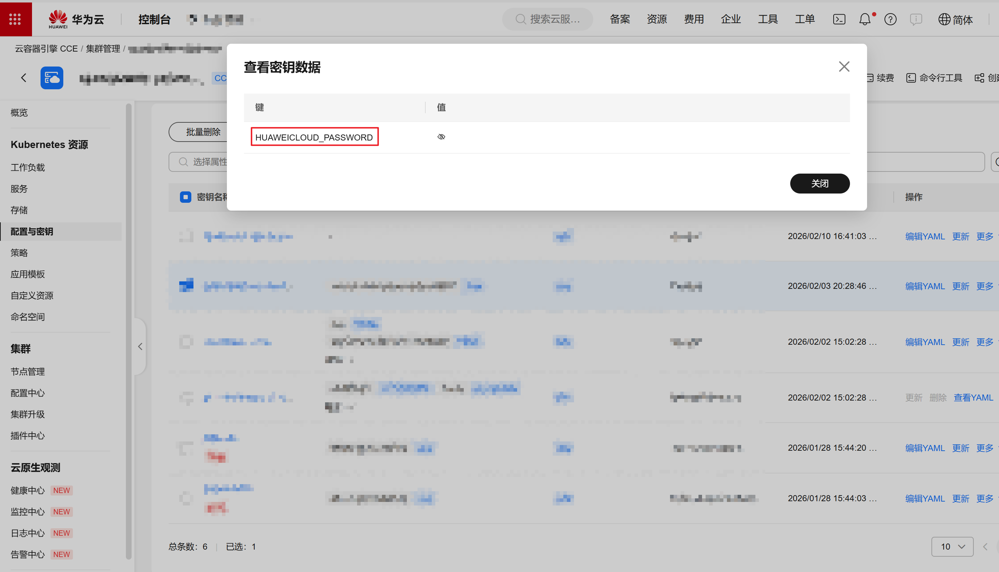

## 3. 密钥管理层——KMS 根密钥管理

### 3.1 创建 KMS 根密钥

使用生产环境 IAM 账号登录密码安全中心（DEW）服务，在密钥管理（KMS）中创建根密钥，按如下示例填写关键信息（具体以实际控制台为准）：

- **密钥名称**：如 `your-kms-master-key`
- **密钥算法**：选择 `RSA_2048`
- **密钥用途**：选择 `ENCRYPT_DECRYPT`
- **企业项目**：选择实际所属企业项目
- **密钥材料来源**：选择 `密钥管理`

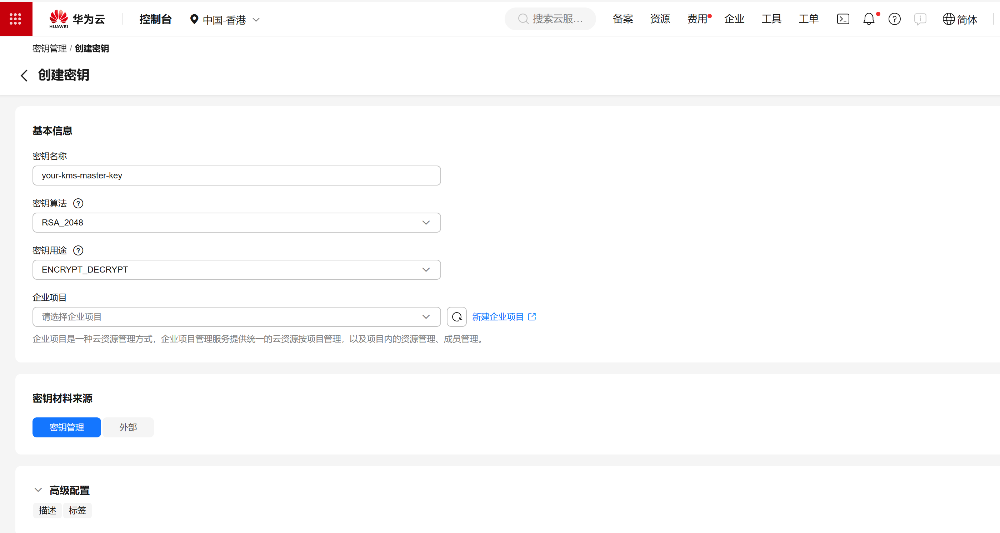

完成创建后，请记录生成的密钥 ID（`key_id`），用于后续调用 KMS 接口进行加解密操作。

### 3.2 使用 KMS 对 AES 工作密钥加密

  （1） **生成一条随机工作密钥（32 字节 AES 密钥）**

   在源码根目录打开 Git Bash，运行以下命令生成工作密钥（示例）：

   ```bash
   cd scripts
   bash build_AES_master_key.sh
   ```

   脚本执行完成后，会在终端打印生成的 AES 工作密钥明文，请妥善保存并确保不泄露。

  （2） **使用 KMS 对 AES 工作密钥进行加密**

   使用步骤 3.1 中记录的 `key_id`，调用华为云 KMS 加密接口，对上述 AES 工作密钥明文进行加密。调用时需要关注以下关键字段：

   - `project_id`：填写 IAM 账号对应的华为云项目 ID  
   - `X-Auth-Token`：填写 IAM 账号的临时 Token  
   - `key_id`：填写步骤 3.1 中记录的 KMS 根密钥 ID  
   - `plain_text`：填写待加密的 AES 工作密钥明文

   示例 `curl` 请求如下（注意替换其中的占位符）：

   ```bash
   curl --location 'https://kms.ap-southeast-1.myhuaweicloud.com/v1.0/{project_id}/kms/encrypt-data' \
     --header 'X-Auth-Token: your_x_auth_token' \
     --data '{
       "key_id": "your_kms_key_id",
       "plain_text": "your_aes_secret",
       "encryption_algorithm": "RSAES_OAEP_SHA_256"
     }'
   ```

  （3）**对返回结果进行 Base64 编码并配置到环境变量/密钥中**

   调用接口后会返回如下结构的 JSON，其中 `cipher_text` 为经过 KMS 加密后的 AES 工作密钥密文：

   ```bash
   {
     "key_id": "your_kms_key_id",
     "cipher_text": "encrypted_aes_secret"
   }
   ```

   将返回的 `cipher_text` 再进行一次 Base64 编码，得到最终的 AES 工作密钥密文值，后续可配置到 CCE 的密钥或环境变量中，例如：`SERVER_AES_MASTER_KEY_ENV`。


## 4. 敏感信息加密层
### 4.1 准备加密脚本

将以下 Python AES 加密脚本保存为 `encrypt_secret.py`，放置到项目目录 `agent-studio/backend/scripts` 目录下：

```python
#!/usr/bin/env python3
# -*- coding: utf-8 -*-
"""
AES-GCM 加密工具（本地模式）

用于加密敏感配置项（如 API Key、密码等），内部使用 AES-GCM 算法和工作密钥。

使用示例:
    # 直接传入明文
    python encrypt_secret.py "sk-test-123456"
"""
import argparse
import sys
from pathlib import Path

# 添加项目根目录到 Python 路径
project_root = Path(__file__).parent.parent
sys.path.insert(0, str(project_root))

from openjiuwen_studio.core.manager.model_manager.utils.security_utils import SecurityUtils


def encrypt_secret(plaintext: str, verify: bool = True) -> str:
    """
    使用 AES-GCM 加密敏感信息（使用环境变量中的工作密钥）

    Args:
        plaintext: 要加密的明文
        verify: 是否验证加密/解密

    Returns:
        Base64 编码的加密密文
    """
    if not plaintext:
        raise ValueError("Plaintext cannot be empty")

    security_utils = SecurityUtils(use_kms=True)

    encrypted = security_utils.encrypt_api_key(plaintext)
    if not encrypted:
        raise ValueError("Encryption failed: returned empty result")

    if verify:
        decrypted = security_utils.decrypt_api_key(encrypted)
        if decrypted != plaintext:
            raise ValueError(
                f"Verification failed: decrypted value '{decrypted}' "
                f"does not match original '{plaintext}'"
            )
        print(f"Decrypted: {decrypted}")
        print("✓ Encryption/decryption verification passed", file=sys.stderr)

    return encrypted


def main():
    parser = argparse.ArgumentParser(
        description="Encrypt sensitive configuration items using AES-GCM (local working key from environment)",
        formatter_class=argparse.RawDescriptionHelpFormatter,
        epilog="""

    parser.add_argument(
        "plaintext",
        nargs="?",
        help='Plaintext to encrypt (use "-" to read from stdin)',
    )

    parser.add_argument(
        "--verify",
        action="store_true",
        help="Verify encryption/decryption after encrypting",
    )

    args = parser.parse_args()

    # 读取明文
    if args.plaintext == "-":
        plaintext = sys.stdin.read().strip()
    elif args.plaintext:
        plaintext = args.plaintext
    else:
        parser.error('plaintext is required (or use "-" to read from stdin)')

    if not plaintext:
        parser.error("Plaintext cannot be empty")

    try:
        encrypted = encrypt_secret(plaintext, verify=args.verify)
        print(encrypted)
    except ValueError as e:
        print(f"Error: {str(e)}", file=sys.stderr)
        sys.exit(1)
    except Exception as e:
        print(f"Unexpected error: {str(e)}", file=sys.stderr)
        sys.exit(1)

if __name__ == "__main__":
    main()
```

### 4.2 本地环境进行加密
在本地的 `agent-studio` 项目中，在根目录 `.env` 文件中设置环境变量，例如：

```bash
SERVER_AES_MASTER_KEY_ENV="your_aes_master_key"
```

其中 `your_aes_master_key` 为 3.2 步骤中获得并经 KMS 加密、Base64 编码后的 AES 工作密钥密文。

然后进入到 `agent-studio/backend/scripts` 目录：
```bash
cd backend\scripts
```

执行加密命令，对待加密的敏感信息进行加密：
```bash
python encrypt_secret.py --verify "your_sensitive_infomation"
```

从屏幕中获取打印出来的敏感信息密文，记录并用于后续敏感信息配置项的环境变量配置。


需要对所有待加密的敏感信息重复执行上述操作，并记录生成的密文。在 **KMS 模式** 下，以下敏感配置项可以以密文形式存储，系统会在运行时自动解密：

- `DB_PASSWORD`：数据库密码
- `MILVUS_TOKEN`：Milvus 向量数据库认证 Token
- `REDIS_PASSWORD`：Redis访问密钥
- `OBS_ACCESS_KEY_ID` / `OBS_SECRET_ACCESS_KEY`：OBS 对象存储密钥

---
# 五、密钥管理
---
## 1. 配置 ConfigMap

CCE 集群通过 ConfigMap 进行环境变量配置，应用的环境变量配置在 ConfigMap 文件 `env-config.yaml` 中，如果要开启KMS鉴权模式，需要在其中增加如下配置：

```yaml
apiVersion: v1
kind: ConfigMap
metadata:
  name: env-config
  namespace: dev
  annotations:
    currentVersion: '1'
    description: 环境变量
    originName: ''
data:
  # 在 data 中原有配置项基础上新增如下配置：
  # ==================== 华为云 IAM 认证配置 ====================
  # 启用 KMS 模式
  HUAWEICLOUD_KMS_ENABLED: "true"
  
  HUAWEICLOUD_USERNAME: "your_username"
  HUAWEICLOUD_DOMAIN_NAME: "your_domain"  # 租户
  HUAWEICLOUD_IAM_ENDPOINT: "https://iam.myhuaweicloud.com"  # IAM 端点  
  HUAWEICLOUD_PROJECT_NAME: "your_project_name"  # 项目名称
  HUAWEICLOUD_PROJECT_ID: "your_project_id" # 项目ID 
  
  # ==================== KMS 配置 ====================
  HUAWEICLOUD_REGION: "your_region_id"
  HUAWEICLOUD_KMS_KEY_ID: "your_kms_key_id"
  HUAWEICLOUD_KMS_ENDPOINT: "https://kms.cn-north-4.myhuaweicloud.com"
  HUAWEICLOUD_KMS_ENCRYPTION_ALGORITHM: "RSAES_OAEP_SHA_256"
```

## 2. 配置 Secret
所有中间件鉴权秘钥在经过加密后，推荐统一在 CCE 集群的 Secret 中进行管理。例如，可以创建一个 `app-secret.yaml`：

```yaml
kind: Secret
apiVersion: v1
metadata:
  name: app-secret
  namespace: product
  annotations:
    description: 敏感配置
type: Opaque
data:
  # ==================== 工作密钥配置 ====================
  # 将 KMS 加密后的 AES 工作密钥（Base64 编码后的密文）配置到此处
  SERVER_AES_MASTER_KEY_ENV: "<base64_encoded_kms_encrypted_root_key>"

  # ==================== 中间件敏感信息（示例） ====================
  DB_PASSWORD: "<encrypted_db_password>"
  REDIS_PASSWORD: "<encrypted_redis_password>"
  MILVUS_TOKEN: "<encrypted_milvus_token>"
  OBS_ACCESS_KEY_ID: "<encrypted_obs_access_key_id>"
  OBS_SECRET_ACCESS_KEY: "<encrypted_obs_secret_access_key>"

```

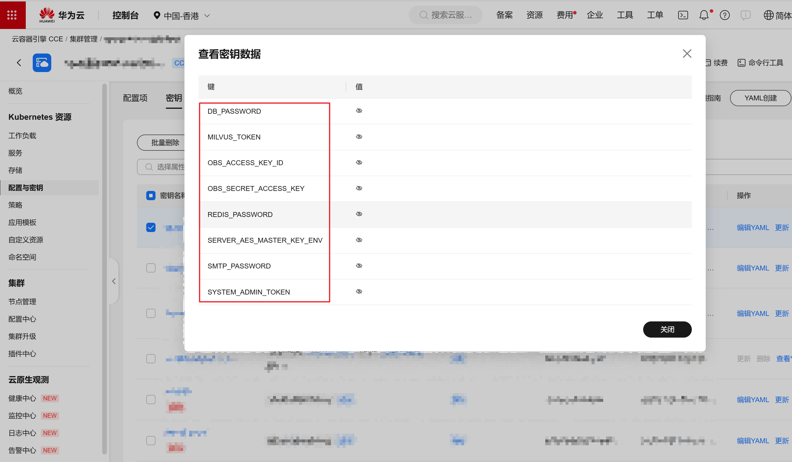

---

# 相关文档
- [华为云 DEW KMS 文档](https://support.huaweicloud.com/dew/index.html)
- [华为云 IAM 文档](https://support.huaweicloud.com/iam/index.html)
- [华为云 CCE 文档](https://support.huaweicloud.com/cce/index.html)
- [华为云 RDS 文档](https://support.huaweicloud.com/rds/index.html)
- [华为云 DCS 文档](https://support.huaweicloud.com/dcs/index.html)
- [华为云 OBS 文档](https://support.huaweicloud.com/obs/index.html)

