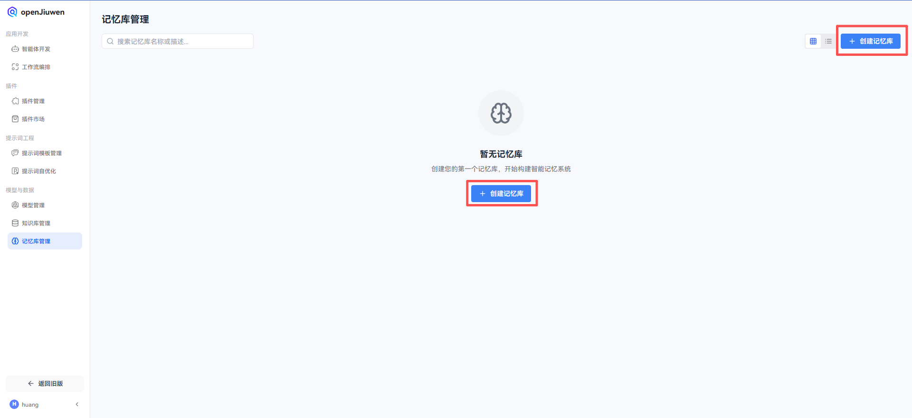
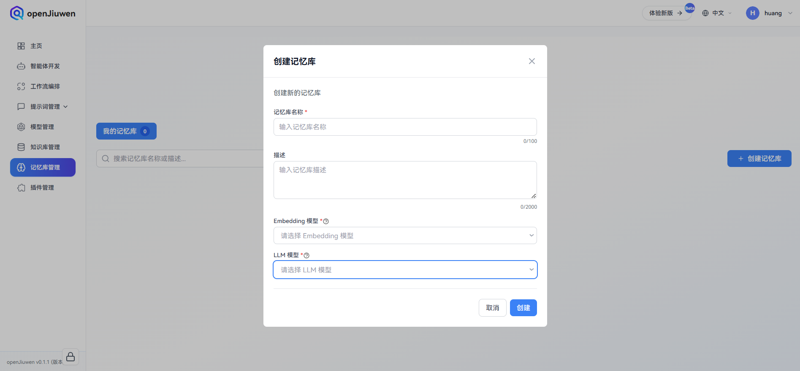
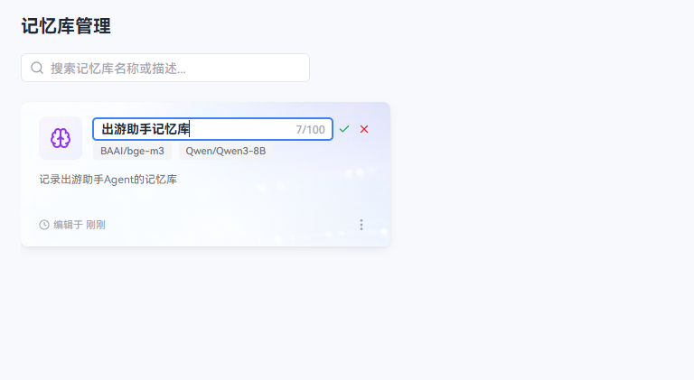
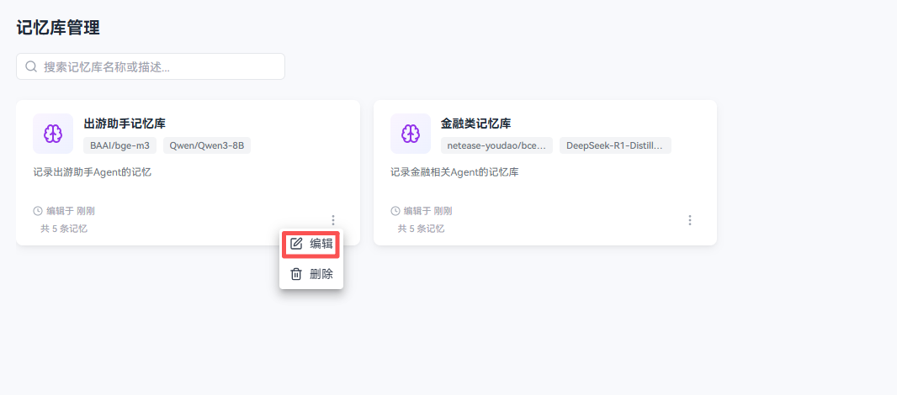
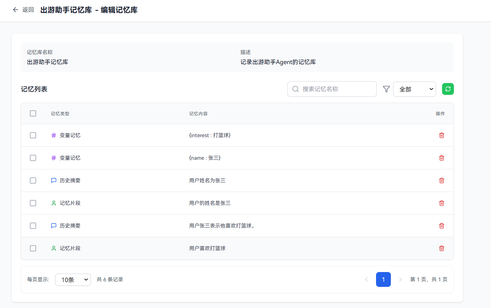

# 记忆库管理

记忆库是openJiuwen平台进行本地记忆管理的重要方式，用户可以通过管理本地记忆库使用智能体的记忆能力。

# 创建记忆库

## 前提条件

在**模型管理**模块的**LLM模型**分页和**Embedding模型**分页配置了可用的模型。如何配置模型请参考模型管理相关章节。

## 操作步骤

1. 登录openJiuwen平台。

2. 进入平台左侧导航栏的**记忆库管理**模块。

3. 单击 **创建记忆库** 按钮。

   

4. 在创建记忆库弹窗中输入**记忆库名称**与**描述**(可选)，在**Embedding模型**和**LLM模型**下拉各选择一个模型（注意，记忆库构建后该记忆库的Embedding模型不可更改），单击**创建**。
   
   

5. 双击创建完毕的记忆库名片上的记忆库名称或描述可以进行编辑

   

6. 单击创建完毕的记忆库名片或单击**编辑**，可进入编辑记忆库页面。
   
   

7. 在编辑记忆库页面，可以看到存储的不同类别的记忆，包括记忆片段、变量记忆和历史摘要。

   
