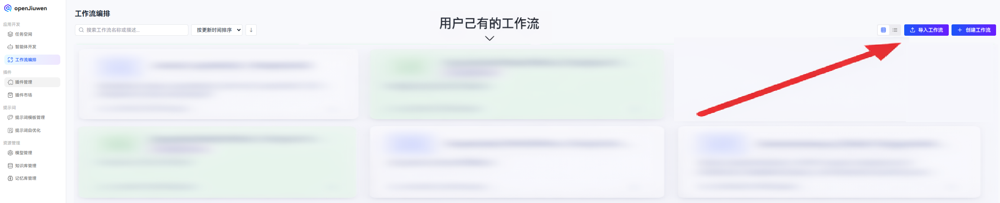
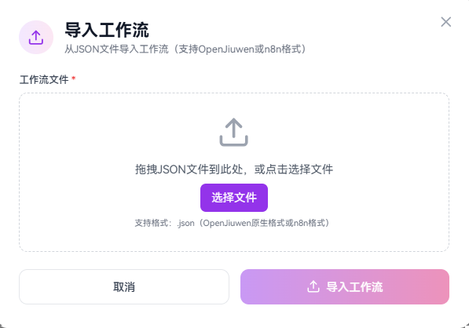
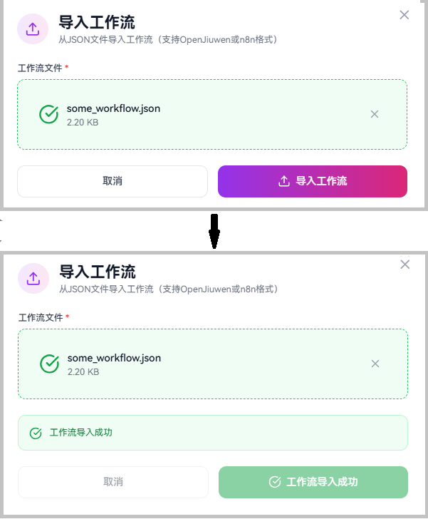
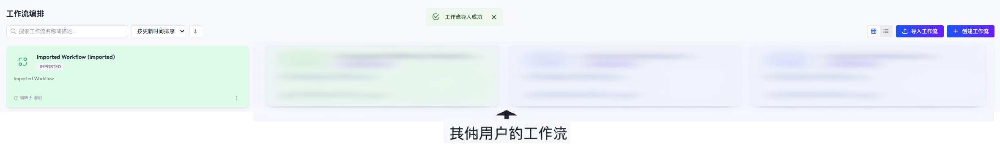

# 如何导入外部工作流

工作流导入功能允许您将来自外部平台（如 n8n——特别是 n8n JSON 格式 2.12.x 版本）或之前导出的 OpenJiuwen 工作流引入到您的工作空间中。系统会自动检测工作流格式，将其转换为 OpenJiuwen 格式，并在保存前验证结构。

## 前置条件

* 已创建目标工作空间（空间）。
* （对于 n8n 工作流）n8n 工作流已导出为 JSON 文件。
* （对于 OpenJiuwen 工作流）工作流已从 OpenJiuwen 导出。
* 工作流中引用的所有插件已安装在目标工作空间中。

## 操作步骤

1. 在左侧导航栏中，导航到**工作流编排**模块。
2. 点击**导入工作流**按钮。

3. 选择要导入的 JSON 文件，并选择目标工作空间。
4. 点击**导入**以启动导入过程。

5. 系统将自动：
   - **检测工作流格式**（OpenJiuwen 原生格式或 n8n）
   - **转换**工作流为 OpenJiuwen 格式（如需要）
   - **验证**工作流结构、边和插件引用
   - **生成新 ID**以避免与现有工作流冲突

6. 导入成功后，工作流将出现在您的工作空间中，名称后附加"（已导入）"。

7. 点击已导入的工作流，在画布编辑器中打开它并检查配置。

## 支持的格式

| 格式 | 描述 | 备注 |
|--------|-------------|-------|
| **OpenJiuwen 原生格式** | 从 OpenJiuwen 导出的完整或部分工作流 | 支持仅画布导出 |
| **n8n** | 从 n8n 导出的工作流 | 自动将节点转换为 OpenJiuwen 组件 |

## 转换内容

导入 n8n 工作流时：

- **触发器节点**（手动、Webhook、定时）→ START 节点
- **代码/函数节点** → Code 节点
- **如果节点** → IF 条件节点
- **AI/LLM/聊天模型节点** → 带有嵌入子配置的 LLM 节点（参见附录支持的类型）
- **连接** → 节点之间的边

如果 START 和 END 节点不存在，系统会自动生成它们，并重新生成所有 ID 以防止冲突。

## 故障排除

| 问题 | 解决方案 |
|-------|----------|
| **导入失败，提示"不支持的格式"** | 确保 JSON 文件是有效的 n8n 或 OpenJiuwen 导出文件 |
| **关于缺少插件的验证错误** | 在导入前，在目标工作空间中安装所需的插件 |
| **关于缺少节点的验证错误** | 检查所有边的源/目标节点是否存在于工作流中 |
| **导入成功但工作流为空** | 验证 JSON 文件包含有效的 `schema` 或 `nodes` 字段 |

## 注意事项

- 导入文件中的 `space_id` 将被忽略；工作流将导入到您选择的工作空间中。
- 所有工作流 ID、节点 ID 和边 ID 都会重新生成以避免冲突。
- 工作流作为草稿导入，没有版本历史。
- 时间戳会更新为当前导入时间。

## 附录：支持的 n8n 节点类型

| n8n 节点类型                                      | OpenJiuwen 类型   | 类别         | 状态                                                |
| -------------------------------------------------- | ----------------- | ---------------- | ----------------------------------------------------- |
| n8n-nodes-base.manualTrigger                       | Start             | 触发器          | 支持           |
| n8n-nodes-base.webhook                             | Start             | 触发器          | 支持           |
| n8n-nodes-base.scheduleTrigger                     | Start             | 触发器          | 支持           |
| n8n-nodes-base.executeWorkflowTrigger              | Start             | 触发器          | 支持           |
| n8n-nodes-base.formTrigger                         | Start             | 触发器          | 支持           |
| n8n-nodes-base.errorTrigger                        | Start             | 触发器          | 支持           |
| n8n-nodes-base.emailTrigger                        | Start             | 触发器          | 支持           |
| n8n-nodes-langchain.chatTrigger                    | Start             | 触发器          | 支持           |
| n8n-nodes-langchain.agent                          | LLM               | AI / LLM         | 支持           |
| n8n-nodes-langchain.chainLlm                       | LLM               | AI / LLM         | 支持           |
| n8n-nodes-langchain.lmChatOpenAi                   | LLM               | 聊天模型       | 支持*          |
| n8n-nodes-langchain.lmChatDeepSeek                 | LLM               | 聊天模型       | 支持*          |
| n8n-nodes-base.if                                  | IF / 选择器     | 条件          | 支持           |
| n8n-nodes-base.code                                | Code              | 数据转换   | 支持           |
| n8n-nodes-base.set                                 | Code              | 数据转换   | 支持           |
| n8n-nodes-base.readBinaryFiles                     | Code              | 数据转换   | 支持           |
| n8n-nodes-base.writeBinaryFile                     | Code              | 数据转换   | 支持           |
| n8n-nodes-base.readWriteFile                       | Code              | 数据转换   | 支持           |
| n8n-nodes-base.cron                                | Start             | 触发器          | 开发中           |
| n8n-nodes-base.switch                              | IF / 选择器     | 条件          | 开发中                  |
| n8n-nodes-base.filter                              | IF / 选择器     | 条件          | 开发中                  |
| n8n-nodes-base.splitInBatches                      | Loop              | 循环             | 开发中                  |
| n8n-nodes-base.loop                                | Loop              | 循环             | 开发中                  |
| n8n-nodes-base.functionItem                        | Code              | 数据转换   | 开发中                  |
| n8n-nodes-base.itemLists                           | Code              | 数据转换   | 开发中                  |
| n8n-nodes-base.splitOut                            | Code              | 数据转换   | 开发中                  |
| n8n-nodes-base.aggregate                           | Code              | 数据转换   | 开发中                  |
| n8n-nodes-base.removeDuplicates                    | Code              | 数据转换   | 开发中                  |
| n8n-nodes-base.sort                                | Code              | 数据转换   | 开发中                  |
| n8n-nodes-base.limit                               | Code              | 数据转换   | 开发中                  |
| n8n-nodes-base.compareDatasets                     | Code              | 数据转换   | 开发中                  |
| n8n-nodes-base.noOp                                | Code              | 数据转换   | 开发中                  |
| n8n-nodes-base.wait                                | Code              | 数据转换   | 开发中                  |
| n8n-nodes-base.respondToWebhook                    | Code              | 数据转换   | 开发中                  |
| n8n-nodes-base.stopAndError                        | Code              | 数据转换   | 开发中                  |
| n8n-nodes-base.html                                | Code              | 数据转换   | 开发中                  |
| n8n-nodes-base.markdown                            | Code              | 数据转换   | 开发中                  |
| n8n-nodes-base.xml                                 | Code              | 数据转换   | 开发中                  |
| n8n-nodes-base.crypto                              | Code              | 数据转换   | 开发中                  |
| n8n-nodes-base.dateTime                            | Code              | 数据转换   | 开发中                  |
| n8n-nodes-base.compression                         | Code              | 数据转换   | 开发中                  |
| n8n-nodes-base.spreadsheetFile                     | Code              | 数据转换   | 开发中                  |
| n8n-nodes-base.convertToFile                       | Code              | 数据转换   | 开发中                  |
| n8n-nodes-base.extractFromFile                     | Code              | 数据转换   | 开发中                  |
| n8n-nodes-base.httpRequest                         | HTTP Request      | HTTP / API       | 开发中                  |
| n8n-nodes-base.merge                               | Variable Merge    | 合并            | 开发中                  |
| n8n-nodes-base.executeWorkflow                     | Sub Workflow      | 工作流         | 开发中                  |
| n8n-nodes-langchain.chainRetrievalQa               | LLM               | AI / LLM         | 不支持        |
| n8n-nodes-langchain.chainSummarization             | LLM               | AI / LLM         | 不支持        |
| n8n-nodes-langchain.informationExtractor           | LLM               | AI / LLM         | 不支持        |
| n8n-nodes-langchain.textClassifier                 | LLM               | AI / LLM         | 不支持        |
| n8n-nodes-langchain.sentimentAnalysis              | DB                | 数据库               | 不支持        |
| n8n-nodes-langchain.vectorStoreInMemory            | DB                | 数据库               | 不支持        |
| n8n-nodes-langchain.vectorStorePinecone            | DB                | 数据库               | 不支持        |
| n8n-nodes-langchain.vectorStoreSupabase            | DB                | 数据库               | 不支持        |
| n8n-nodes-langchain.vectorStoreQdrant              | DB                | 数据库               | 不支持        |
| n8n-nodes-langchain.vectorStorePgVector            | DB                | 数据库               | 不支持        |
| n8n-nodes-langchain.lmChatGoogleGemini             | 未映射          | 聊天模型       | 未映射           |
| n8n-nodes-langchain.lmChatAzureOpenAi              | 未映射          | 聊天模型       | 未映射           |
| n8n-nodes-langchain.lmChatOllama                   | 未映射          | 聊天模型       | 未映射           |
| n8n-nodes-langchain.lmChatGroq                     | 未映射          | 聊天模型       | 未映射           |
| n8n-nodes-langchain.lmChatMistralCloud             | 未映射          | 聊天模型       | 未映射           |
| n8n-nodes-langchain.lmChatAnthropic                | 未映射          | 聊天模型       | 未映射           |
| n8n-nodes-langchain.lmChatCohere                   | 未映射          | 聊天模型       | 未映射           |
| n8n-nodes-langchain.lmChatAwsBedrock               | 未映射          | 聊天模型       | 未映射           |
| n8n-nodes-langchain.lmChatGoogleVertex             | 未映射          | 聊天模型       | 未映射           |
| n8n-nodes-langchain.lmChatOpenRouter               | 未映射          | 聊天模型       | 未映射           |
| n8n-nodes-langchain.lmCohere                       | 未映射          | 聊天模型       | 未映射           |
| n8n-nodes-langchain.lmOllama                       | 未映射          | 聊天模型       | 未映射           |
| n8n-nodes-langchain.memoryBufferWindow             | 未映射          | 记忆           | 未映射           |
| n8n-nodes-langchain.memoryRedisChat                | 未映射          | 记忆           | 未映射           |
| n8n-nodes-langchain.memoryPostgresChat             | 未映射          | 记忆           | 未映射           |
| n8n-nodes-langchain.memoryMongoChat                | 未映射          | 记忆           | 未映射           |
| n8n-nodes-langchain.memoryXata                     | 未映射          | 记忆           | 未映射           |
| n8n-nodes-langchain.memoryZep                      | 未映射          | 记忆           | 未映射           |
| n8n-nodes-langchain.embeddingsOpenAi               | 未映射          | 嵌入       | 未映射           |
| n8n-nodes-langchain.embeddingsAzureOpenAi          | 未映射          | 嵌入       | 未映射           |
| n8n-nodes-langchain.embeddingsGoogleGemini         | 未映射          | 嵌入       | 未映射           |
| n8n-nodes-langchain.embeddingsCohere               | 未映射          | 嵌入       | 未映射           |
| n8n-nodes-langchain.embeddingsOllama               | 未映射          | 嵌入       | 未映射           |
| n8n-nodes-langchain.toolCalculator                 | 未映射          | 工具             | 未映射           |
| n8n-nodes-langchain.toolCode                       | 未映射          | 工具             | 未映射           |
| n8n-nodes-langchain.toolHttpRequest                | 未映射          | 工具             | 未映射           |
| n8n-nodes-langchain.toolWorkflow                   | 未映射          | 工具             | 未映射           |
| n8n-nodes-langchain.toolWikipedia                  | 未映射          | 工具             | 未映射           |
| n8n-nodes-langchain.toolSerpApi                    | 未映射          | 工具             | 未映射           |
| n8n-nodes-langchain.toolWolframAlpha               | 未映射          | 工具             | 未映射           |
| n8n-nodes-langchain.toolVectorStore                | 未映射          | 工具             | 未映射           |
| n8n-nodes-langchain.toolMcp                        | 未映射          | 工具             | 未映射           |
| n8n-nodes-langchain.documentDefaultDataLoader      | 未映射          | 文档加载器  | 未映射           |
| n8n-nodes-langchain.documentGithubLoader           | 未映射          | 文档加载器  | 未映射           |
| n8n-nodes-langchain.textSplitterCharacter          | 未映射          | 文本分割器    | 未映射           |
| n8n-nodes-langchain.textSplitterRecursiveCharacter | 未映射          | 文本分割器    | 未映射           |
| n8n-nodes-langchain.outputParserStructured         | 未映射          | 输出解析器    | 未映射           |
| n8n-nodes-langchain.outputParserAutofixing         | 未映射          | 输出解析器    | 未映射           |
| （任何其他未知类型）                           | Code（回退）   | 未知          | 回退            |

\* - LLM 节点本身受支持，但设置其记忆或工具功能仍在开发中。
