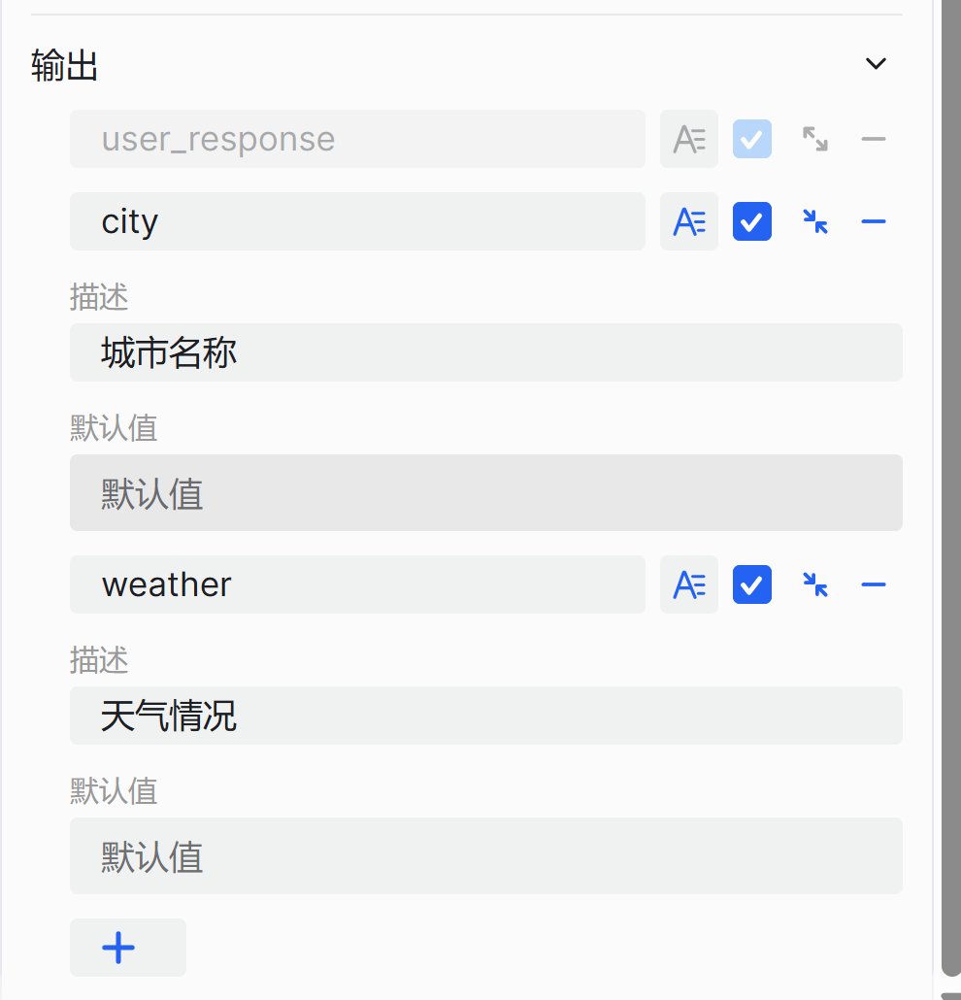

# 配置提问器组件

提问器组件是工作流设计中的智能对话交互组件，专为需要构建智能对话流程的开发者设计，用于在工作流执行需要依赖用户提供信息或明确意图的场景下，解决工作流中组件执行对用户信息的依赖问题。它通过以下方式实现智能信息收集：

- **预设描述**：基于输出参数的描述对输入进行关键内容提炼并输出
- **智能追问**：如果输出参数为必选，在不超过最大追问次数的前提下会自动进行追问，直至获取所需关键信息

通过这种方式，提问器组件能让对话交互更加流畅自然，确保工作流在需要用户输入时能智能、高效地收集信息。例如，在天气查询场景中，系统会询问日期和城市信息，并从用户回复中提取位置字段。如果用户提供的信息不完整，系统会继续询问以补充缺失的信息。

# 配置组件

## 操作步骤
1. 进入openJiuwen平台主页。
2. 进入平台左侧导航栏的工作流编排模块。
3. 单击页面下方的添加组件按钮并单击提问器组件。 

4. 单击在画布上出现的提问器组件即可开始配置提问器组件。 

5. 配置输入参数。 

6. 配置模型。

7. 设置最大追问次数。

8. 配置输出参数。

输出参数中设置关于参数的描述，大模型可根据参数描述进行关键内容提取作为提问器的输出。如果输出参数设置为**必选**，大模型未提取到描述内容且**未设置默认值**时，会执行追问功能。

提问器组件的配置项说明如下：

| 配置项    | 说明                                                                                                                                                                                                                                                         |
|--------|------------------------------------------------------------------------------------------------------------------------------------------------------------------------------------------------------------------------------------------------------------|
| 模型     | 选择执行此组件的模型，支持调整生成多样性等参数，使组件效果更符合您的具体需求。                                                                                                                                                                                                                    |
| 最大提问次数 | 设定的最大询问次数（默认3次）。追问时的具体问题由模型动态生成。 |
| 输入     | 设置需要集成到问题中的参数，参数值可以引用前置组件的输出，或设置为固定文本内容。                                                                                                                                                                                                                   |
| 输出     | 组件默认输出 `USER_RESPONSE` 变量，表示用户的完整回复内容。  添加其他输出参数，让模型自动从用户回复中提取关键信息并保存为变量，供下游组件使用。  建议使用有意义的变量名并添加详细描述，帮助模型准确理解变量定义并正确提取信息。  变量可以设置为必填项。如果用户回复中缺少必填字段，工作流会持续追问，直到成功获取信息或达到设定的最大询问次数（默认3次）。追问时的具体问题由模型动态生成。 |

## 示例

下面给出提问器组件的示例。提问器组件用于城市和天气信息，为后续的工具调用提供必要参数，提问器的输入为：“北京的美食有烤鸭和汉堡”，提问器提取到city:北京，未提取到天气的内容，开启追问功能。

