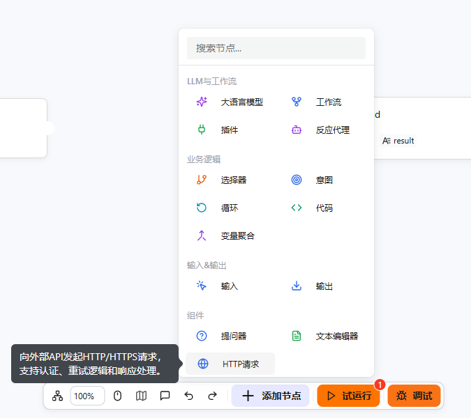
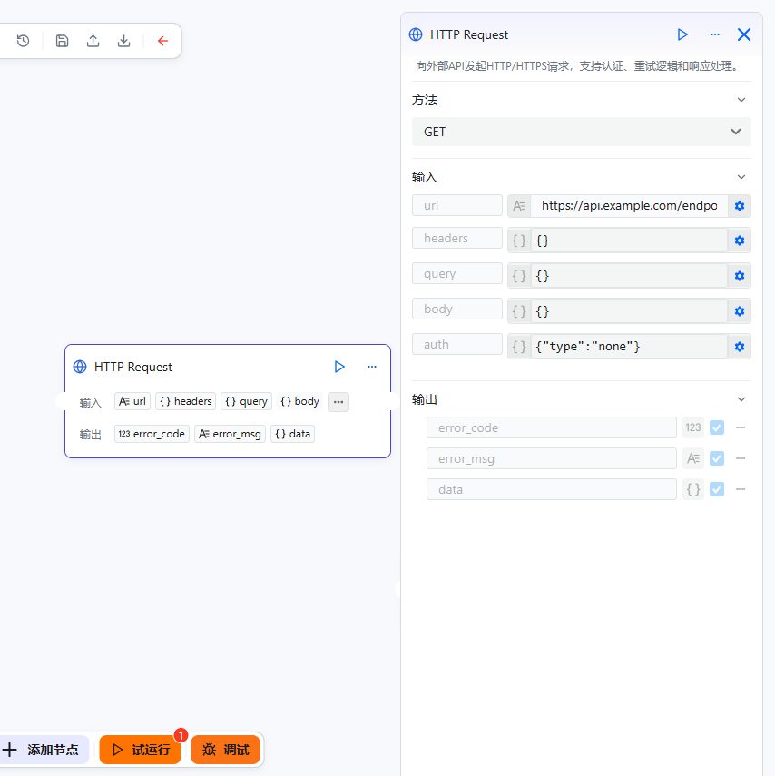

# HTTP请求组件

HTTP请求节点允许您在工作流中向外部API发起HTTP/HTTPS请求。该组件支持多种HTTP方法（GET、POST、PUT、DELETE、PATCH、HEAD、OPTIONS），以及身份认证、重试逻辑、速率限制和灵活的响应处理等功能，可帮助您在自动化工作流中无缝集成第三方服务和API。

# 配置组件

## 前提条件

- 了解REST API和HTTP协议的基本概念
- 了解HTTP方法（GET、POST、PUT、DELETE等）以及请求/响应的概念
- 已获取目标API端点URL和所需的身份认证凭据

## 操作步骤

1. 进入openJiuwen平台主页。
2. 进入平台左侧导航栏的**工作流编排**模块。
3. 单击页面下方的**添加组件**按钮，然后选择**HTTP请求**。



4. 配置URL和HTTP方法。在URL字段中输入请求地址，从下拉菜单中选择合适的HTTP方法（GET、POST、PUT、DELETE、PATCH、HEAD、OPTIONS）。

5. 配置请求头（可选）。点击"添加请求头"按钮，以键值对形式添加自定义请求头。常用的请求头包括Content-Type、Authorization以及自定义API请求头。

6. 配置查询参数（可选）。以键值对形式添加URL查询参数，这些参数将被附加到请求URL后面。

7. 配置请求体（适用于POST、PUT、PATCH方法）。从下拉菜单中选择内容类型：
   - **JSON** (`application/json`)：用于JSON数据负载
   - **表单URL编码** (`application/x-www-form-urlencoded`)：用于表单提交
   - **多部分表单数据** (`multipart/form-data`)：用于文件上传和混合内容
   - **文本** (`text/plain`)：用于纯文本内容
   - **二进制** (`application/octet-stream`)：用于二进制数据

   在编辑区域输入请求体内容。

8. 配置身份认证（可选）。选择认证类型：
   - **无**：不使用认证（默认）
   - **基础认证**：输入用户名和密码
   - **Bearer令牌**：输入令牌值
   - **API密钥**：输入API密钥，选择位置（请求头、查询参数或请求体），并指定参数名称



9. 配置响应处理（可选）。设置以下选项：
   - **响应格式**：自动检测、JSON、文本或二进制
   - **响应模式**：完整响应、仅成功时或仅失败时

10. 配置高级选项（可选）：
    - **超时时间**：请求超时时间（秒），默认60秒
    - **跟随重定向**：启用/禁用自动跟随重定向
    - **忽略SSL问题**：跳过SSL证书验证（请谨慎使用）
    - **重试**：启用重试逻辑，可配置最大重试次数、触发重试的状态码、延迟时间和退避策略（固定、线性、指数）
    - **速率限制**：配置单位时间内的请求数（秒、分钟、小时）

## 输出结构

HTTP请求节点输出一个JSON对象，结构如下：

| 字段 | 类型 | 描述 |
|------|------|------|
| `error_code` | 整数 | 错误码（成功时为0，失败时为非零值） |
| `error_msg` | 字符串 | 错误消息（成功时为空字符串） |
| `data` | 对象 | 响应数据（请求成功时返回JSON对象） |

### 成功响应示例

```json
{
  "error_code": 0,
  "error_msg": "",
  "data": {
    "id": 123,
    "name": "示例响应",
    "status": "success"
  }
}
```

### 失败响应示例

```json
{
  "error_code": 1,
  "error_msg": "HTTP请求失败：连接超时",
  "data": {}
}
```