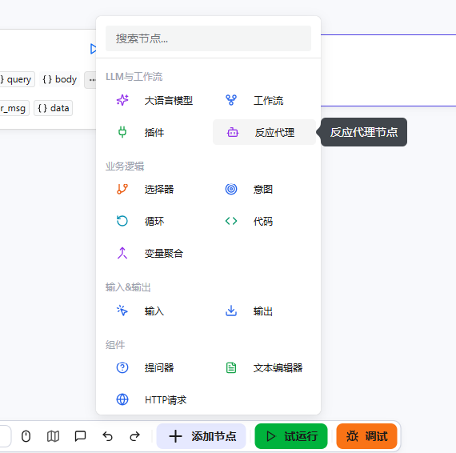
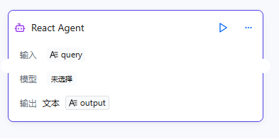
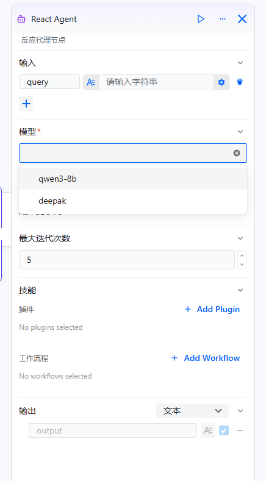
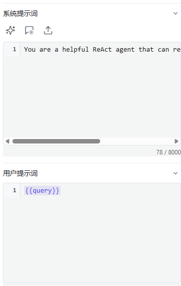

# 配置ReAct代理组件

ReAct代理组件是 openJiuwen 基于ReAct（Reasoning + Acting）框架提供的智能代理节点。与简单的大模型组件不同，ReAct代理能够自主推理并决定使用哪些工具，通过多次"推理-行动"循环来解决复杂问题。它支持将插件和工作流作为工具使用，能够处理需要外部能力的多步骤任务。具体配置过程如下：

# 配置组件

## 前提条件

* 已在模型管理中添加了模型。
* （可选）如需代理使用插件工具，需在插件管理中完成插件配置。
* （可选）如需代理使用工作流工具，需提前创建好工作流。

## 操作步骤

1. 进入openJiuwen平台主页。
2. 进入平台左侧导航栏的**工作流编排**模块。
3. 单击页面下方的**添加组件**按钮并单击**ReAct代理**。

4. 单击在画布上出现的ReAct代理组件即可开始配置。

需要配置的参数如下所示：

| 参数 | 说明 |
|------|------|
| 输入 | 用于向提示词中注入动态内容的变量集合。每个输入参数需指定参数名和对应的变量值，变量值可以是固定值，也可以引用上游组件的输出结果。系统提示词和用户提示词均可通过变量引用语法使用这些参数，从而实现内容的动态调整。 |
| 模型选择 | 指定代理用于推理的大语言模型。模型的能力直接影响代理的推理质量和工具选择的准确性。建议选择具有强推理能力的模型以获得最佳效果。 |
| 系统提示词 | 用于定义代理的角色定位、行为准则和回复风格。默认提示词为"You are a helpful ReAct agent that can reason and use tools to solve problems."支持使用变量引用语法动态插入输入参数的内容。 |
| 用户提示词 | 表示发送给代理的具体指令或问题。该字段支持引用输入参数中的变量，使提示内容能够根据运行时数据动态变化。 |
| 最大迭代次数 | 代理可执行的"推理-行动"循环的最大次数（范围：1-20，默认：5）。每次迭代包括代理对当前状态进行推理并决定是否使用工具。数值越高可处理越复杂的问题，但可能增加执行时间。 |
| 技能 | 代理可使用的工具，包括插件和工作流。代理会根据任务需求自主决定使用哪些工具。可根据需要添加多个插件和工作流。 |
| 输出 | 设置输出的参数名和描述。默认输出参数为`output`（字符串类型）。清晰的参数名称和描述有助于模型准确返回匹配的内容。 |

5. 配置输入和模型。添加将在提示词中使用的输入参数（例如，添加`query`参数来接收用户的问题），然后从模型列表中选择合适的大语言模型。建议选择具有强推理能力的模型，以获得更好的工具选择和多步骤问题解决效果。

6. 配置提示词。设置系统提示词定义代理的角色和行为。设置用户提示词指定具体任务。可使用`{{变量名}}`语法引用输入参数。

