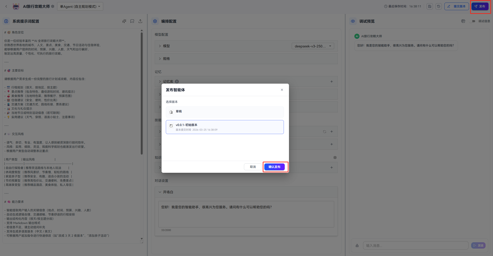
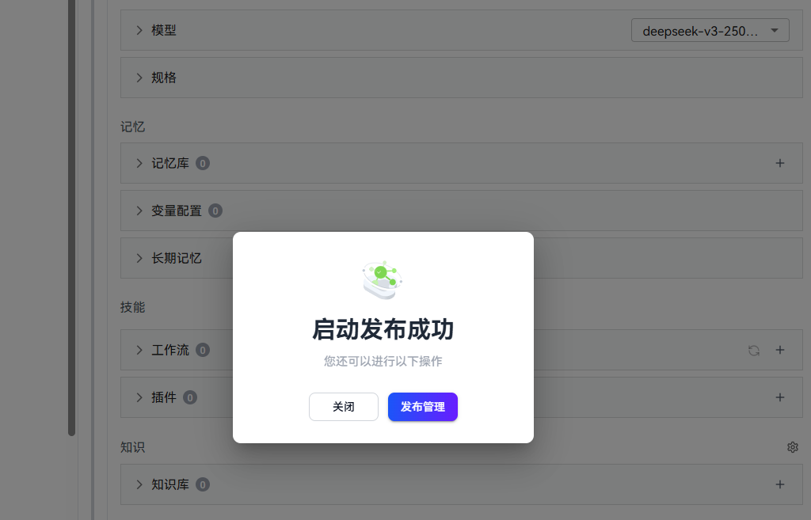
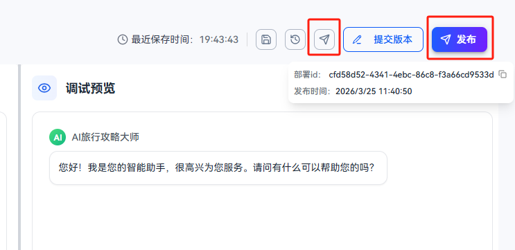
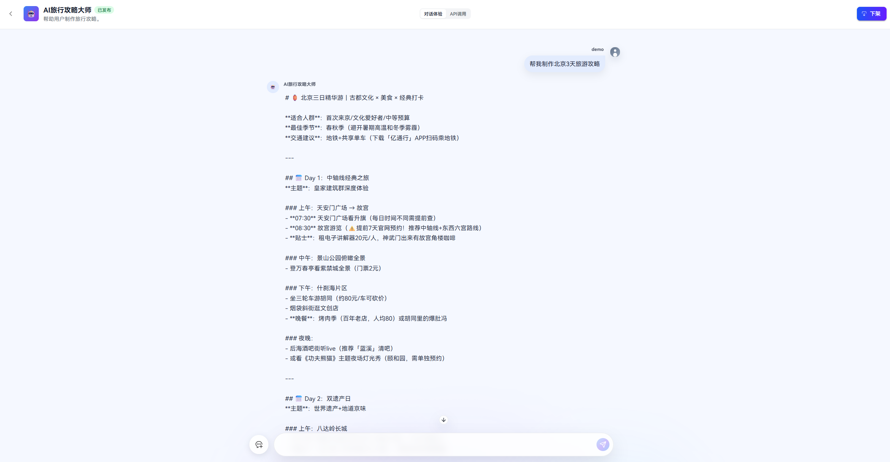
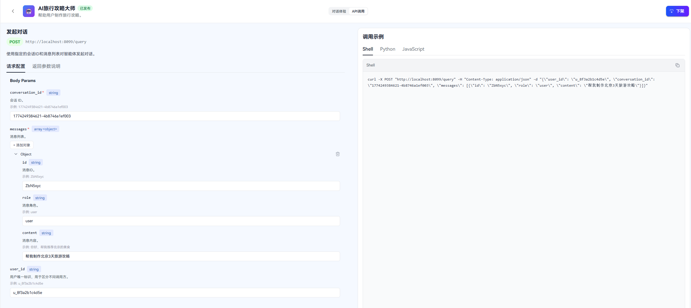
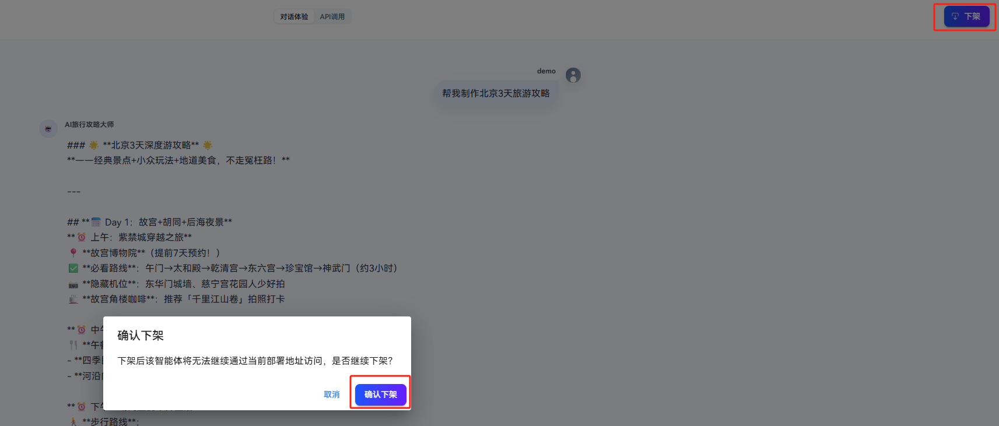

# 智能体发布

openJiuwen平台支持把已配置完成的智能体发布到运行态，并在发布管理页中进行对话，和查看API调用运行态智能体的方式。用户可以通过API将智能体集成到自己的业务系统中。

>说明：本版本发布的智能体不支持知识库和记忆的调用。工作流中不支持代码组件、输入-输出组件、提问器组件。插件中不支持代码插件。

## 发布智能体

### 操作步骤

1. 进入智能体编辑页面，配置好智能体的信息并调试成功，点击 `发布` 按钮。
2. 页面将打开发布弹窗，可选择草稿版本或之前已经提交的版本发布。如果选择草稿版本，会弹出版本提交界面，把当前草稿提交为新版本后发布。

3. 发布完成后，会展示“发布成功卡片”，可点击`发布管理`按钮进入发布管理页面查看发布的智能体的详情。

4. 发布后，在智能体编辑页面右上角有`发布管理`入口按钮。鼠标悬浮在`发布`按钮上，也能看到发布信息。

## 对话体验

进入发布管理页面后，在对话体验页签下，可以进行对话体验测试智能体的效果。

## 查看API调用示例

api调用页签展示调用运行态智能体的API参数（包括请求方式、url、body、返回结构等）。在请求配置里输入参数，会把你输入的参数自动放入右侧curl/python/javascript示例代码中，便于你直接复制样例代码运行。

## 下架智能体

当你不需要该运行态的智能体时，可以在发布管理页标题栏右侧点击 `下架` 按钮， 页面会弹出确认框，点击确认后，系统将移除该智能体的运行态部署。下架成功后，会提示成功并跳转回智能体列表页。

