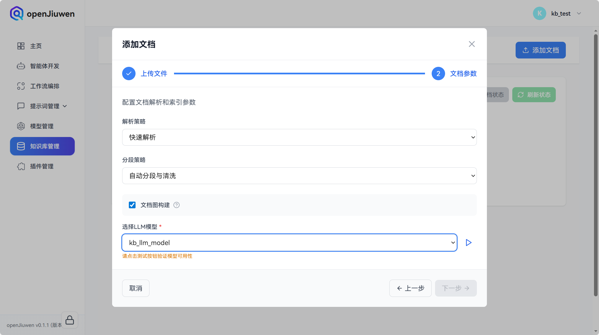

# 知识库管理

知识库是openJiuwen平台进行本地知识管理的重要方式，用户可以通过管理本地知识库增强智能体知识检索RAG能力。

## 知识库类型

openJiuwen 支持多种知识库类型：

| 类型     | 说明                                                         |
|----------|--------------------------------------------------------------|
| 文档型   | 通过上传本地文件（如 PDF、Word、TXT 等）构建知识库           |
| 网页链接型 | 通过添加网页 URL（如普通网页、微信公众号文章等）构建知识库   |

创建知识库时需选择类型，创建后不可更改。

# 创建知识库

## 前提条件

在**模型管理**模块的**Embedding模型**分页配置了可用的模型。如何配置Embedding模型请参考模型管理相关章节。

## 操作步骤

1. 登录openJiuwen平台。

2. 进入平台左侧导航栏的**知识库管理**模块。

3. 单击 **创建知识库** 按钮。

   

4. 在创建知识库弹窗中：
   - 输入**知识库名称**与**描述**（可选）
   - 选择**知识库类型**：**文档型** 或 **网页链接型**
   - 在**Embedding模型**下拉选择一个模型（注意：知识库构建后 Embedding 模型不可更改）
   - 点击**创建**
   
   

5. **文档型**知识库：在创建完毕的知识库名片，点击**编辑**按钮。
   
   

6. 在编辑知识库页面，点击**添加文档**。

   

7. 在添加文档弹窗中，通过拖拽或者点击**选择文件**选择想要上传到知识库的文件（支持选择多个文件）后，点击**下一步**。

   

8. 在文档参数界面，配置文档解析和索引参数后，点击**下一步**。

   

   文档参数配置说明如下：

   | 参数名称     | 描述                  | 配置说明                                                                                                                                    |
   |----------|---------------------|-----------------------------------------------------------------------------------------------------------------------------------------|
   | 解析策略     | 控制文档的解析方式           | - **快速解析**：使用默认解析策略快速处理文档，适合大多数场景 - **注意**：当前仅支持快速解析模式                                                                               |
   | 分段策略     | 控制文档文本的分段方式         | - **自动分段与清洗**：系统自动进行文本分段和清洗，适合大多数场景 - **自定义**：手动配置分段参数，可精确控制分段效果 - **注意**：选择"自定义"后，需要配置子参数最大Token数与分段重叠百分比                        |
   | 最大Token数 | 单个分段的最大Token数量（子参数） | - **作用**：控制每个文本分段的长度 - **范围**：16-1024 - **默认值**：512 - **显示条件**：仅在分段策略选择"自定义"时显示 - **建议**：根据文档类型和检索需求设置，过小可能丢失上下文，过大可能影响检索精度 |
   | 分段重叠百分比  | 相邻分段之间的重叠比例（子参数）    | - **作用**：控制分段之间的重叠程度，保持上下文连贯性 - **范围**：0-50 - **默认值**：10 - **显示条件**：仅在分段策略选择"自定义"时显示 - **建议**：通常设置为 10-20，可根据文档特点调整         |
   | 文档图构建    | 是否构建文档图             | - **作用**：启用后可以构建文档图索引，提升复杂关系检索效果 - **注意**：启用文档图会增加索引构建时间以及消耗额外的大模型Token - **注意**：启用后，需要配置子参数LLM模型                                 |
   | LLM模型    | 用于文档图构建的大语言模型（子参数）  | - **作用**：文档图索引构建过程中用于提取实体和关系的模型 - **显示条件**：仅在启用文档图构建时显示此参数，且必须选择 - **建议**：选择性能稳定、支持长文本的模型                                         |                         |

9. 之后文档会逐个进行处理，可以点击**刷新状态**来获取文档最新状态，同时页面会自动刷新文档状态，可以通过**停止自动刷新文档状态**取消自动刷新。

   

10. 索引完毕的文档会显示**已索引**，启用了文档图构建索引的文档会带有**图增强**标签，未启用则不带。如果仍需要上传文档，可以通过右上角的**添加文档**继续操作。

   

# 网页链接型知识库

网页链接型知识库支持通过添加网页 URL 构建知识库，适用于普通网页、微信公众号文章等在线内容。系统会抓取网页内容并进行解析、分段和索引构建，供智能体检索使用。

## 创建网页链接型知识库

1. 登录 openJiuwen 平台，进入**知识库管理**模块。

2. 单击 **创建知识库** 按钮。

3. 在创建知识库弹窗中：
   - 输入**知识库名称**与**描述**（可选）
   - 选择**知识库类型**为 **网页链接**
   - 选择 **Embedding模型**
   - 点击**创建**

4. 在创建完毕的知识库卡片上，点击**编辑**按钮进入编辑页面。

## 添加网页链接

1. 在编辑知识库页面，点击 **添加链接** 按钮。

2. 在“添加网页链接”弹窗中，每行输入一个 URL，支持 http:// 和 https:// 链接（如普通网页、微信公众号文章等）。

   - **格式要求**：URL 需以 `http://` 或 `https://` 开头
   - **数量限制**：单次最多添加 50 个 URL
   - 输入完成后点击 **添加并下一步**

3. 在“链接参数”界面配置解析和索引参数，点击完成开始处理。

   | 参数名称     | 描述                  | 配置说明                                                                                                                                     |
   |----------|---------------------|------------------------------------------------------------------------------------------------------------------------------------------|
   | 解析策略     | 控制网页的解析方式           | - **快速解析**：使用默认解析策略快速处理网页，适合大多数场景 - **注意**：当前仅支持快速解析模式                                                                    |
   | 分段策略     | 控制文本的分段方式         | - **自动分段与清洗**：系统自动进行文本分段和清洗，适合大多数场景 - **自定义**：手动配置分段参数，需配置最大Token数与分段重叠百分比                                  |
   | 最大Token数 | 单个分段的最大Token数量（子参数） | - **范围**：16-1024 - **默认值**：512                                                                                                  |
   | 分段重叠百分比  | 相邻分段之间的重叠比例（子参数）    | - **范围**：0-50 - **默认值**：10                                                                                                      |
   | 文档图构建    | 是否构建文档图             | - **作用**：启用后可构建文档图索引，提升复杂关系检索效果 - **注意**：启用文档图会增加索引构建时间以及消耗额外的大模型 Token - **注意**：启用后需选择 LLM 模型 |
   | LLM模型    | 用于文档图构建的大语言模型（子参数）  | - **作用**：文档图索引构建过程中用于提取实体和关系的模型 - **显示条件**：仅在启用文档图构建时显示，且必须选择                                                       |

4. 链接会逐个进行处理。可以点击**刷新状态**获取最新状态，页面也会自动刷新。可通过**停止自动刷新链接状态**取消自动刷新。

5. 索引完毕的链接会显示**已索引**，启用了文档图构建的链接会带有**图增强**标签。若需继续添加，可点击 **添加链接** 继续操作。

## 管理链接

- **重命名**：在链接列表中点击链接名称可进行编辑。
- **删除**：可单选或多选链接后进行删除。
- **刷新**：点击**刷新**可更新单个链接状态；点击**全部刷新**可批量更新。首次加载或刷新时会尝试从 URL 解析网页标题并更新链接名称。

## 注意事项

- 网页链接型知识库创建后类型不可更改。
- 确保目标 URL 可公开访问，否则可能无法抓取内容。
- 微信公众号文章等需在浏览器中可正常打开，系统会按网页方式解析。
- 链接处理为异步执行，处理时间取决于网页大小和复杂度。

# 同步至 Deep Search

将 openJiuwen 知识库同步到 Deep Search 后，可在 Deep Search 服务中复用同一份知识内容，并由 Deep Search 提供更高级的检索能力。**文档型** 与 **网页链接型** 两种知识库均支持同步。

同步完成后，会在知识库列表中额外出现一份独立的**镜像知识库**，它可以像普通知识库一样进行增删改查，并独立保留索引。

## 前提条件

- Deep Search 服务已经部署并可被 openJiuwen 后端访问。
- 在 openJiuwen 平台的 **模型管理 → Embedding 模型** 中已配置至少一个可用的嵌入模型。

## 操作步骤

1. 进入需要同步的知识库的 **编辑** 页面（文档型或网页链接型均可）。

2. 点击页面右上角的 **同步至 Deep Search** 按钮，弹出同步对话框。

3. 在 **第一步：创建知识库并上传文档** 中：
   - 选择一个 **Deep Search 嵌入模型**。
   - 点击 **下一步**，系统会：
     - **首次同步**：在 Deep Search 中创建一个名为 `deepsearch_<原知识库名>` 的新知识库，并将当前知识库下的全部内容上传过去。
     - **再次同步**：本步骤不会立即上传，待第二步提交时再覆盖式重传，避免取消时丢失 Deep Search 已有内容。
   - 不同类型的上传内容如下：

     | 知识库类型     | 上传内容                                                          |
     |----------------|-------------------------------------------------------------------|
     | 文档型         | 直接读取每个文档的本地原始文件并上传                              |
     | 网页链接型     | 按链接重新抓取并解析为合成的 Markdown 文件后上传，文件名取自网页标题 |

4. 在 **第二步：创建索引** 中：
   - 配置 Deep Search 端的解析、分段、图增强等参数（与本地知识库一致）。
   - 点击 **完成** 提交建索任务，Deep Search 会异步处理上传的文件。

5. 同步成功后，可在知识库列表中看到对应的 **镜像知识库**。

## 镜像知识库的行为

- **独立存在**：镜像知识库在前端列表中作为独立卡片展示，拥有独立的文档/链接列表与索引状态。
- **可独立操作**：在镜像知识库的编辑页可以继续添加/删除/重命名文档或链接、查看处理状态、配置图增强等。
- **网页链接型镜像知识库**：在镜像 KB 中新增链接为**追加（append）**语义，不会覆盖镜像中已有的链接。链接会被重新抓取并以合成 Markdown 形式存入 Deep Search。
- **再次同步**：在 **源知识库** 的编辑页再次点击 **同步至 Deep Search**，会以源知识库的当前全部内容**覆盖**镜像知识库的文档列表。
